# 🏗️ Arquitectura del Sistema - MH-Next

## 📋 **Resumen Ejecutivo**

**MH-Next** implementa una arquitectura moderna de **Single Page Application (SPA)** construida sobre **Next.js 15 App Router**, diseñada para manejar las operaciones complejas de gestión de supermercados. El sistema sigue patrones arquitectónicos establecidos con separación clara de responsabilidades y escalabilidad horizontal.

---

## 🎯 **Principios Arquitectónicos**

### **1. Separation of Concerns (SoC)**
- **Presentación**: Componentes React puros
- **Lógica de Negocio**: Custom Hooks especializados  
- **Acceso a Datos**: Servicios centralizados
- **Estado**: Gestión híbrida (Server/Client State)

### **2. Composition over Inheritance**
- Componentes modulares y reutilizables
- Hooks composables para lógica compartida
- Providers especializados por dominio

### **3. Single Responsibility Principle**
- Un hook por funcionalidad específica
- Servicios especializados por módulo
- Componentes con propósito único

### **4. Dependency Injection**
- Context API para dependencias globales
- Servicios inyectables via hooks
- Configuración centralizada

---

## 🏛️ **Arquitectura de Alto Nivel**


---

## 📊 **Patrones Arquitectónicos Implementados**

### **1. Model-View-Controller (MVC) Adaptado**

```typescript
// Model: Types + Services
interface NominaCantera {
  id: number;
  numero_nomina: string;
  // ... más propiedades
}

// View: React Components
export default function NominasPage() {
  // UI Logic only
}

// Controller: Custom Hooks
export const useNominasCheque = () => {
  // Business logic
  // State management
  // Service orchestration
}
```

### **2. Repository Pattern**

```typescript
// Abstract Service Interface
interface INominaChequeService {
  getNominas(filtros: FiltrosNominas): Promise<NominasResponse>;
  crearNomina(data: CrearNominaRequest): Promise<NominaCantera>;
}

// Concrete Implementation
class NominaChequeService implements INominaChequeService {
  // Implementation details
}
```

### **3. Observer Pattern (React Context)**

```typescript
// Observable State
export const AuthContext = createContext<AuthContextType>();

// Observers (Components)
const Dashboard = () => {
  const { usuario } = useAuth(); // Observes auth changes
}
```

### **4. Command Pattern (Actions)**

```typescript
// Commands encapsulated in hooks
const { crearNomina, eliminarNomina, actualizarTracking } = useNominasCheque();

// Each action is a command with specific responsibility
```

---

## 🔄 **Flujo de Datos**

### **1. Flujo de Lectura (Query)**

```mermaid
sequenceDiagram
    participant U as Usuario
    participant C as Componente
    participant H as Hook
    participant TQ as TanStack Query
    participant S as Service
    participant API as Backend API
    
    U->>C: Interacción
    C->>H: useNominas()
    H->>TQ: useQuery()
    TQ->>S: nominaService.getNominas()
    S->>API: GET /api/nominas
    API-->>S: Response Data
    S-->>TQ: Processed Data
    TQ-->>H: Cached Data
    H-->>C: State + Actions
    C-->>U: UI Update
```



### **2. Flujo de Escritura (Mutation)**

```mermaid
sequenceDiagram
    participant U as Usuario
    participant C as Componente
    participant H as Hook
    participant TQ as TanStack Query
    participant S as Service
    participant API as Backend API
    
    U->>C: Acción (crear/editar)
    C->>H: crearNomina()
    H->>TQ: useMutation()
    TQ->>S: nominaService.crearNomina()
    S->>API: POST /api/nominas
    API-->>S: Success Response
    S-->>TQ: Updated Data
    TQ->>TQ: Invalidate Cache
    TQ-->>H: Success State
    H-->>C: UI Feedback
    C-->>U: Success Message
```



---

## 📁 **Arquitectura por Capas**

### **Layer 1: Presentation (UI)**
```
src/app/                    # Next.js App Router Pages
src/components/            # React Components
├── dashboard/            # Business Components  
├── ui/                  # Generic UI Components
├── landing/             # Marketing Components
└── shared/              # Cross-cutting Components
```

### **Layer 2: Business Logic**
```
src/hooks/                 # Custom Business Hooks
├── useNominasCheque.ts   # Nominas domain logic
├── useFacturas.ts        # Facturas domain logic
├── useCajaChica.ts       # Caja Chica domain logic
└── useAuth.ts            # Authentication logic
```

### **Layer 3: Data Access**
```
src/services/             # API Service Layer
├── nominaChequeService.ts
├── facturaService.ts
├── authService.ts
└── apiConfig.ts          # HTTP Configuration
```

### **Layer 4: Infrastructure**
```
src/utils/                # Utilities & Helpers
src/types/                # TypeScript Definitions
src/constants/            # Application Constants
src/providers/            # Global Providers
```

---

## 🎨 **Gestión de Estado**

### **1. Server State (TanStack Query)**

```typescript
// Cached, synchronized with backend
const { data: nominas, isLoading, error } = useQuery({
  queryKey: ['nominas', filtros],
  queryFn: () => nominaService.getNominas(filtros),
  staleTime: 5 * 60 * 1000, // 5 minutes
});
```

**Características:**
- ✅ Cache automático con TTL
- ✅ Background refetch
- ✅ Optimistic updates
- ✅ Error boundary integration
- ✅ Pagination support

### **2. Client State (React Context + useState)**

```typescript
// Local UI state
const [modalOpen, setModalOpen] = useState(false);
const [selectedItem, setSelectedItem] = useState(null);

// Global app state
const { usuario, login, logout } = useAuth();
```

**Características:**
- ✅ Minimal global state
- ✅ Component-local state preferred
- ✅ Context for cross-cutting concerns
- ✅ No unnecessary re-renders

### **3. Persistent State (localStorage)**

```typescript
// Authentication tokens
localStorage.setItem('authToken', token);

// User preferences
localStorage.setItem('theme', 'dark');
```

---

## 🔐 **Arquitectura de Autenticación**

### **⚠️ Estado Actual (Requiere Refactorización)**

El sistema implementa **múltiples patrones de autenticación** que necesitan unificación:

```mermaid
graph TD
    A[Usuario Login] --> B{Múltiples Paths}
    
    B --> C[AuthContext.tsx]
    B --> D[useAuth.ts]  
    B --> E[useAuthStatus.ts]
    B --> F[middleware.ts]
    
    C --> G[localStorage authToken]
    D --> H[localStorage usuario]
    E --> I[API /me endpoint]
    F --> J[cookies authToken]
    
    G --> K[Axios interceptors]
    H --> K
    I --> K
    J --> L[Next.js middleware]
    
    K --> M[Backend Validation]
    L --> M
```



**Problemas Identificados:**
- 🔴 **Duplicación de lógica** en múltiples hooks
- 🔴 **Inconsistencia** entre localStorage y cookies
- 🔴 **Complejidad** de mantenimiento
- 🔴 **Falta de centralización** de tokens

### **🎯 Arquitectura Objetivo (NextAuth.js)**


---

## 🧩 **Patrones de Componentes**

### **1. Container/Presentational Pattern**

```typescript
// Container (Smart Component)
export default function NominasPage() {
  const { nominas, loading, crearNomina } = useNominasCheque();
  
  return (
    <NominasList 
      nominas={nominas}
      loading={loading}
      onCrear={crearNomina}
    />
  );
}

// Presentational (Dumb Component)  
export function NominasList({ nominas, loading, onCrear }) {
  // Only UI logic, no business logic
}
```

### **2. Compound Components Pattern**

```typescript
// Main component with sub-components
export function Modal({ children }) {
  return <div className="modal">{children}</div>;
}

Modal.Header = function ModalHeader({ children }) {
  return <div className="modal-header">{children}</div>;
};

Modal.Body = function ModalBody({ children }) {
  return <div className="modal-body">{children}</div>;
};
```

### **3. Render Props Pattern (via Hooks)**

```typescript
// Custom hook as render prop alternative
export function useAnimations(config) {
  // Animation logic
  return { animate, controls, variants };
}

// Usage in component
export function AnimatedComponent() {
  const { animate } = useAnimations({ preset: 'fade' });
  return <div {...animate}>Content</div>;
}
```

---

## 🎯 **Módulos del Sistema**

### **1. Dashboard Core**
```
Responsabilidad: Navegación, métricas, layout principal
Componentes: Sidebar, AppBar, MetricsDashboard
Hooks: useAuthStatus, usePrefetch, useMetrics
```

### **2. Gestión de Nóminas**
```
Responsabilidad: Cheques, facturas, tracking
Componentes: NominasPage, FacturasAsignadasView
Hooks: useNominasCheque, useNominasGastos
Services: nominaChequeService, nominasGastosService
```

### **3. Control Financiero**
```
Responsabilidad: Caja chica, facturas, gastos
Componentes: CajaChicaPage, FacturasPage
Hooks: useCajaChica, useFacturas, useGastos
```

### **4. Gestión de Inventario**
```
Responsabilidad: Stock, productos, movimientos
Componentes: BodegaPages, StockComponents
Hooks: useStock, useProductos
```

### **5. Administración**
```
Responsabilidad: Usuarios, configuración, reportes
Componentes: UsuariosPage, ConfiguracionPage
Hooks: useUsuarios, useAuth
```

---

## ⚡ **Optimizaciones de Performance**

### **1. Code Splitting**
```typescript
// Route-based splitting (automatic with App Router)
// Component-based splitting
const HeavyComponent = lazy(() => import('./HeavyComponent'));

// Dynamic imports for large libraries
const { jsPDF } = await import('jspdf');
```

### **2. Data Fetching Optimization**
```typescript
// Parallel queries
const queries = useQueries([
  { queryKey: ['nominas'], queryFn: getNominas },
  { queryKey: ['usuarios'], queryFn: getUsuarios },
  { queryKey: ['facturas'], queryFn: getFacturas }
]);

// Prefetching critical data
usePrefetch(['nominas', 'usuarios']);
```

### **3. Re-render Optimization**
```typescript
// Memoized components
const ExpensiveComponent = memo(({ data }) => {
  return <ComplexVisualization data={data} />;
});

// Memoized callbacks
const handleClick = useCallback((id) => {
  onItemClick(id);
}, [onItemClick]);
```

---

## 🔧 **Configuración y Setup**

### **1. Build Configuration**
```typescript
// next.config.ts
export default {
  experimental: {
    turbopack: true, // Development speed
  },
  compiler: {
    emotion: true, // MUI optimization
  },
  webpack: (config) => {
    // Custom optimizations
    return config;
  }
};
```

### **2. TypeScript Configuration**
```json
// tsconfig.json
{
  "compilerOptions": {
    "strict": true,
    "noUncheckedIndexedAccess": true,
    "exactOptionalPropertyTypes": true
  }
}
```

### **3. ESLint Configuration**
```javascript
// eslint.config.mjs
export default [
  ...nextConfig,
  {
    rules: {
      "@typescript-eslint/no-unused-vars": "error",
      "react-hooks/exhaustive-deps": "error"
    }
  }
];
```

---

## 📊 **Métricas y Monitoreo**

### **1. Performance Monitoring**
```typescript
// Vercel Speed Insights
import { SpeedInsights } from '@vercel/speed-insights/next';

// Custom metrics
const useMetrics = () => {
  const trackEvent = (name: string, data: object) => {
    // Analytics tracking
  };
};
```

### **2. Error Boundary**
```typescript
// Global error handling
export function GlobalErrorBoundary({ children }) {
  return (
    <ErrorBoundary
      fallback={<ErrorFallback />}
      onError={(error, errorInfo) => {
        console.error('Global error:', error, errorInfo);
      }}
    >
      {children}
    </ErrorBoundary>
  );
}
```

---

## 🚀 **Escalabilidad y Mantenimiento**

### **1. Horizontal Scaling**
- **Modular architecture**: Nuevos módulos independientes
- **Service isolation**: Servicios desacoplados
- **Component reusability**: UI components reutilizables

### **2. Vertical Scaling**
- **Performance optimization**: Bundle splitting, lazy loading
- **Memory management**: Proper cleanup, memoization
- **Network optimization**: Query deduplication, caching

### **3. Code Maintainability**
- **TypeScript strict mode**: Type safety garantizada
- **Consistent patterns**: Architectural guidelines
- **Documentation**: Inline docs + external docs
- **Testing strategy**: Unit + integration tests

---

## 📋 **Próximos Pasos Arquitectónicos**

### **1. Refactorización Crítica**
- [ ] **Unificar autenticación** → NextAuth.js
- [ ] **Centralizar estado global** → Zustand/Redux Toolkit
- [ ] **Optimizar bundle size** → Tree shaking mejorado

### **2. Mejoras de Performance**
- [ ] **Implementar PWA** → Service Workers
- [ ] **Server-side rendering** → Páginas críticas
- [ ] **Database optimization** → Query optimization

### **3. Developer Experience**
- [ ] **Testing framework** → Vitest + Testing Library
- [ ] **Storybook integration** → Component documentation
- [ ] **CI/CD pipeline** → Automated deployment

---

*Documento actualizado: Septiembre 2024*
*Próxima revisión: Diciembre 2024*
