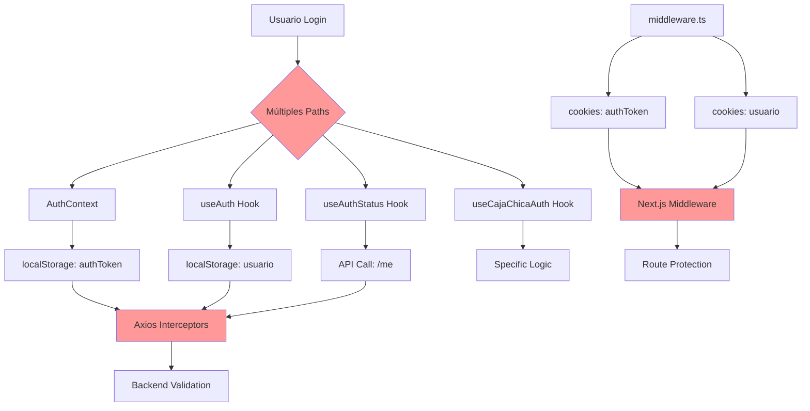
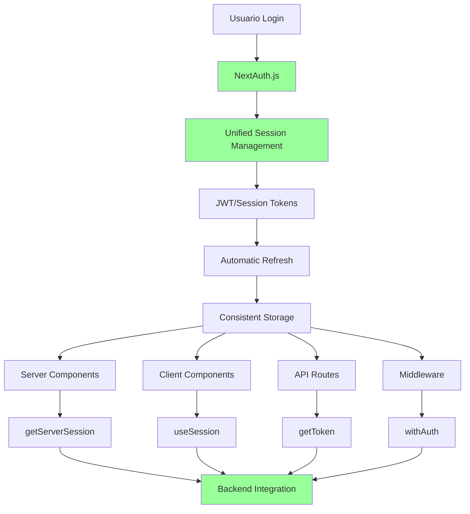

# 🔐 Migración de Autenticación a NextAuth.js - Plan Crítico

## 🚨 **ESTADO CRÍTICO**

**⚠️ PRIORIDAD ALTA**: El sistema actual implementa **autenticación mixta** con múltiples patrones inconsistentes que generan:

- 🔴 **Complejidad de mantenimiento**
- 🔴 **Inconsistencias de estado**
- 🔴 **Vulnerabilidades potenciales**
- 🔴 **Dificultad para debugging**
- 🔴 **Código duplicado**

---

## 📊 **Análisis del Estado Actual**

### **🔍 Problemas Identificados**

#### **1. Múltiples Implementaciones de Auth**
```typescript
// ❌ PROBLEMA: 4 implementaciones diferentes
src/context/AuthContext.tsx       // Context API
src/hooks/useAuth.ts              // Hook personalizado #1
src/hooks/useAuthStatus.ts        // Hook personalizado #2  
src/hooks/useCajaChicaAuth.ts     // Hook específico de módulo
```

#### **2. Inconsistencia en Storage**
```typescript
// ❌ PROBLEMA: Múltiples formas de persistir auth
localStorage.setItem('authToken', token);     // AuthContext
localStorage.setItem('usuario', user);       // useAuth
request.cookies.get('authToken');            // middleware.ts
request.cookies.get('usuario');              // middleware.ts
```

#### **3. Lógica de Auth Duplicada**
```typescript
// ❌ PROBLEMA: Lógica repetida en múltiples archivos
// En AuthContext.tsx
const login = async (email, password) => {
  const { user, token } = await loginService(email, password);
  setUsuario(user);
  localStorage.setItem("authToken", token);
  router.push("/dashboard/inicio");
};

// En useAuth.ts  
const login = async (email, password) => {
  const { token, user } = await loginService(email, password);
  saveLocalAuth(user, token);
  router.push("/dashboard/inicio");
};
```

#### **4. Middleware Inconsistente**
```typescript
// ❌ PROBLEMA: middleware.ts usa cookies, pero app usa localStorage
export function middleware(request: NextRequest) {
  const token = request.cookies.get('authToken')?.value;  // Cookies
  const user = request.cookies.get('usuario')?.value;    // Cookies
  
  // Pero la app usa localStorage:
  // localStorage.getItem('authToken')
}
```

### **🔍 Arquitectura Actual (Problemática)**



---

## 🎯 **Solución: NextAuth.js**

### **✅ Arquitectura Objetivo**



### **🚀 Beneficios de NextAuth.js**

#### **1. Unificación Completa**
```typescript
// ✅ SOLUCIÓN: Una sola implementación
import { useSession } from 'next-auth/react';
import { getServerSession } from 'next-auth/next';

// Client Components
const { data: session, status } = useSession();

// Server Components  
const session = await getServerSession(authOptions);

// API Routes
const token = await getToken({ req });

// Middleware
export { default } from 'next-auth/middleware';
```

#### **2. Storage Consistente**
```typescript
// ✅ SOLUCIÓN: NextAuth maneja storage automáticamente
// - Cookies seguras para tokens
// - Session storage optimizado
// - Automatic cleanup
// - CSRF protection
```

#### **3. Integración Simplificada**
```typescript
// ✅ SOLUCIÓN: Configuración centralizada
// pages/api/auth/[...nextauth].ts
export default NextAuth({
  providers: [
    CredentialsProvider({
      async authorize(credentials) {
        // Integración con backend actual
        const user = await authenticateWithBackend(credentials);
        return user;
      }
    })
  ],
  callbacks: {
    async jwt({ token, user }) {
      // Custom token logic
    },
    async session({ session, token }) {
      // Custom session logic  
    }
  }
});
```

---

## 📋 **Plan de Migración**

### **Fase 1: Preparación (2-3 días)**

#### **1.1 Instalar NextAuth.js**
```bash
npm install next-auth
npm install @next-auth/prisma-adapter  # Si usamos Prisma
```

#### **1.2 Configuración Base**
```typescript
// pages/api/auth/[...nextauth].ts
import NextAuth from 'next-auth';
import CredentialsProvider from 'next-auth/providers/credentials';

export default NextAuth({
  providers: [
    CredentialsProvider({
      name: 'credentials',
      credentials: {
        email: { label: "Email", type: "email" },
        password: { label: "Password", type: "password" }
      },
      async authorize(credentials) {
        try {
          // Integrar con backend actual
          const response = await fetch(`${process.env.NEXT_PUBLIC_API_URL}/api-beta/login`, {
            method: 'POST',
            headers: { 'Content-Type': 'application/json' },
            body: JSON.stringify({
              email: credentials?.email,
              password: credentials?.password
            })
          });
          
          const data = await response.json();
          
          if (response.ok && data.user) {
            return {
              id: data.user.id_auth_user,
              email: data.user.email,
              name: data.user.nombre,
              usuario_id: data.user.usuario_id,
              rol_id: data.user.rol_id,
              local_id: data.user.local_id,
              token: data.token
            };
          }
          return null;
        } catch (error) {
          return null;
        }
      }
    })
  ],
  callbacks: {
    async jwt({ token, user }) {
      if (user) {
        token.usuario_id = user.usuario_id;
        token.rol_id = user.rol_id;
        token.local_id = user.local_id;
        token.accessToken = user.token;
      }
      return token;
    },
    async session({ session, token }) {
      session.user.usuario_id = token.usuario_id;
      session.user.rol_id = token.rol_id;
      session.user.local_id = token.local_id;
      session.accessToken = token.accessToken;
      return session;
    }
  },
  pages: {
    signIn: '/login',
    error: '/login',
  },
  session: {
    strategy: 'jwt',
    maxAge: 24 * 60 * 60, // 24 horas
  }
});
```

#### **1.3 Configurar Provider**
```typescript
// app/layout.tsx
import { SessionProvider } from 'next-auth/react';

export default function RootLayout({ children }) {
  return (
    <html>
      <body>
        <SessionProvider>
          {children}
        </SessionProvider>
      </body>
    </html>
  );
}
```

### **Fase 2: Migración de Componentes (3-4 días)**

#### **2.1 Reemplazar useAuth/useAuthStatus**
```typescript
// ❌ ANTES: Multiple hooks
const { usuario, login, logout } = useAuth();
const { isAuthenticated, isLoading } = useAuthStatus();

// ✅ DESPUÉS: Un solo hook
const { data: session, status } = useSession();

const usuario = session?.user;
const isAuthenticated = status === 'authenticated';
const isLoading = status === 'loading';
```

#### **2.2 Migrar Componentes de Login**
```typescript
// ❌ ANTES: Custom login logic
const handleLogin = async (email, password) => {
  const result = await login(email, password);
  if (result.success) {
    router.push('/dashboard');
  }
};

// ✅ DESPUÉS: NextAuth signIn
import { signIn } from 'next-auth/react';

const handleLogin = async (email, password) => {
  const result = await signIn('credentials', {
    email,
    password,
    redirect: false
  });
  
  if (result?.ok) {
    router.push('/dashboard');
  }
};
```

#### **2.3 Migrar Middleware**
```typescript
// ❌ ANTES: Custom middleware
export function middleware(request: NextRequest) {
  const token = request.cookies.get('authToken')?.value;
  // ... lógica custom
}

// ✅ DESPUÉS: NextAuth middleware
export { default } from 'next-auth/middleware';

export const config = {
  matcher: ['/dashboard/:path*']
};
```

### **Fase 3: Migración de Servicios (2-3 días)**

#### **3.1 Actualizar Axios Interceptors**
```typescript
// ❌ ANTES: localStorage token
api.interceptors.request.use((config) => {
  const token = localStorage.getItem('authToken');
  if (token) {
    config.headers.Authorization = `Bearer ${token}`;
  }
  return config;
});

// ✅ DESPUÉS: NextAuth token
import { getToken } from 'next-auth/jwt';

api.interceptors.request.use(async (config) => {
  const token = await getToken({ req: config });
  if (token?.accessToken) {
    config.headers.Authorization = `Bearer ${token.accessToken}`;
  }
  return config;
});
```

#### **3.2 Migrar Server Components**
```typescript
// ✅ NUEVO: Server-side auth
import { getServerSession } from 'next-auth/next';
import { authOptions } from '@/pages/api/auth/[...nextauth]';

export default async function DashboardPage() {
  const session = await getServerSession(authOptions);
  
  if (!session) {
    redirect('/login');
  }
  
  return (
    <div>
      <h1>Bienvenido, {session.user.name}</h1>
      {/* Dashboard content */}
    </div>
  );
}
```

### **Fase 4: Testing y Cleanup (1-2 días)**

#### **4.1 Remover Código Obsoleto**
```bash
# Archivos a eliminar:
rm src/context/AuthContext.tsx
rm src/hooks/useAuth.ts
rm src/hooks/useAuthStatus.ts
rm src/hooks/useCajaChicaAuth.ts
rm middleware.ts  # Reemplazado por NextAuth middleware
```

#### **4.2 Testing Completo**
- [ ] Login/logout funciona
- [ ] Protección de rutas funciona
- [ ] Refresh de tokens automático
- [ ] Persistencia de sesión
- [ ] Integración con backend
- [ ] Todos los módulos funcionan

---

## 🔧 **Configuración Específica para MH-Next**

### **Variables de Entorno Actualizadas**
```env
# NextAuth Configuration
NEXTAUTH_URL=http://localhost:3000
NEXTAUTH_SECRET=tu-super-secret-key-aqui

# Backend Integration (mantener)
NEXT_PUBLIC_API_URL=https://mh-backend-production.up.railway.app

# JWT Configuration
NEXTAUTH_JWT_SECRET=tu-jwt-secret-diferente
```

### **Tipos TypeScript**
```typescript
// types/next-auth.d.ts
import NextAuth from 'next-auth';

declare module 'next-auth' {
  interface Session {
    accessToken?: string;
    user: {
      id: string;
      email: string;
      name: string;
      usuario_id: number;
      rol_id: number;
      local_id: number;
    };
  }
  
  interface User {
    usuario_id: number;
    rol_id: number;
    local_id: number;
    token: string;
  }
}

declare module 'next-auth/jwt' {
  interface JWT {
    usuario_id: number;
    rol_id: number;
    local_id: number;
    accessToken: string;
  }
}
```

---

## ⚠️ **Riesgos y Mitigaciones**

### **Riesgo 1: Interrupción del Servicio**
- **Mitigación**: Implementar feature flag para rollback rápido
- **Plan B**: Mantener sistema actual funcionando en paralelo

### **Riesgo 2: Pérdida de Sesiones Existentes**
- **Mitigación**: Migración gradual con período de transición
- **Comunicación**: Notificar a usuarios sobre re-login necesario

### **Riesgo 3: Incompatibilidad con Backend**
- **Mitigación**: Testing exhaustivo con backend actual
- **Coordinación**: Trabajo conjunto con equipo backend

---

## 📊 **Cronograma Detallado**

### **Semana 1: Preparación**
- **Día 1-2**: Setup NextAuth.js y configuración base
- **Día 3**: Testing de integración con backend
- **Día 4-5**: Preparación de componentes de migración

### **Semana 2: Migración Core**
- **Día 1-2**: Migrar login/logout y middleware
- **Día 3-4**: Migrar hooks y contextos
- **Día 5**: Testing de funcionalidades core

### **Semana 3: Migración Módulos**
- **Día 1-2**: Migrar módulos de dashboard
- **Día 3-4**: Migrar módulos específicos (nóminas, caja chica)
- **Día 5**: Testing integral

### **Semana 4: Cleanup y Deploy**
- **Día 1-2**: Remover código obsoleto
- **Día 3-4**: Testing final y documentación
- **Día 5**: Deploy a producción

---

## ✅ **Criterios de Éxito**

### **Funcionales**
- [ ] Login/logout funciona correctamente
- [ ] Protección de rutas operativa
- [ ] Persistencia de sesión funciona
- [ ] Integración con backend sin cambios
- [ ] Todos los módulos operativos

### **Técnicos**
- [ ] Código duplicado eliminado
- [ ] Una sola fuente de verdad para auth
- [ ] Middleware simplificado
- [ ] Storage consistente
- [ ] TypeScript types correctos

### **Performance**
- [ ] Tiempo de login ≤ actual
- [ ] Bundle size ≤ actual
- [ ] Memory usage ≤ actual
- [ ] No memory leaks

---

## 📚 **Recursos de Implementación**

### **Documentación**
- [NextAuth.js Docs](https://next-auth.js.org/)
- [Credentials Provider](https://next-auth.js.org/providers/credentials)
- [JWT Strategy](https://next-auth.js.org/configuration/options#jwt)

### **Ejemplos de Código**
- [NextAuth with Custom Backend](https://github.com/nextauthjs/next-auth/tree/main/apps/examples/credentials)
- [TypeScript Configuration](https://next-auth.js.org/getting-started/typescript)

---

## 🆘 **Contacto y Soporte**

### **Equipo Responsable**
- **Lead Developer**: [Asignar responsable]
- **Backend Integration**: [Coordinar con backend team]
- **QA Testing**: [Asignar tester]

### **Timeline Crítico**
- **Inicio**: Inmediatamente
- **Milestone 1**: Configuración base (1 semana)
- **Milestone 2**: Migración core (2 semanas)
- **Deployment**: 3-4 semanas

*Documento creado: Septiembre 2025*  
*Estado: **PENDIENTE DE IMPLEMENTACIÓN***  
