# 🏦 Módulo de Caja Chica - MH-Next

## 📋 **Resumen**

El **Módulo de Caja Chica** es el sistema de control financiero para gastos menores de Mercadohouse. Gestiona las nóminas de gastos generadas automáticamente por el sistema, permitiendo visualizar, analizar y controlar los gastos por usuario, local y categoría. Incluye un dashboard de estadísticas avanzadas, filtros inteligentes y funcionalidades de impresión de reportes.

---

## 🏗️ **Arquitectura del Módulo**

### **Componentes Principales**

```mermaid
graph TD
    A[CajaChicaPage] --> B[useNominasGastos Hook]
    A --> C[Dashboard de Estadísticas]
    A --> D[Sistema de Filtros]
    A --> E[Tabla de Nóminas]
    A --> F[usePrintNominaGasto]
    
    B --> G[nominasGastosService]
    G --> H[Backend API]
    H --> I[Database]
    
    C --> J[Métricas Generales]
    C --> K[Top Usuarios]
    C --> L[Top Locales]  
    C --> M[Categorías de Gastos]
    
    D --> N[Filtro por Local]
    D --> O[Filtro por Usuario]
    D --> P[Filtro por Estado]
    D --> Q[Filtro por Fechas]
    
    E --> R[Modal de Detalles]
    E --> S[Acciones de Impresión]
    
    F --> T[Generación PDF]
    F --> U[Configuración de Impresión]
    
    style A fill:#e1f5fe
    style B fill:#f3e5f5
    style C fill:#e8f5e8
    style G fill:#fff3e0
```



### **Flujo de Datos**

```mermaid
sequenceDiagram
    participant U as Usuario
    participant P as CajaChicaPage
    participant H as useNominasGastos
    participant S as nominasGastosService
    participant API as Backend API
    
    U->>P: Accede al módulo
    P->>H: Cargar nóminas iniciales
    H->>S: getNominasGastos()
    S->>API: GET /api-beta/nominas-gastos
    API-->>S: NominasGastosResponse
    S-->>H: Datos + Estadísticas
    H-->>P: Estado actualizado
    P-->>U: Vista con datos
    
    U->>P: Aplica filtros
    P->>H: aplicarFiltros()
    H->>S: getNominasGastos(filtros)
    S->>API: GET /api-beta/nominas-gastos?filtros
    API-->>S: Datos filtrados
    S-->>H: Resultados
    H-->>P: UI actualizada
    
    U->>P: Ver detalles de nómina
    P->>H: loadNominaDetalle(id)
    H->>S: getNominaGastoDetalle(id)
    S->>API: GET /api-beta/nominas-gastos/:id
    API-->>S: Detalle completo
    S-->>H: NominaGasto detallada
    H-->>P: Modal con detalles
```



---

## 📁 **Estructura de Archivos**

```
src/
├── app/dashboard/caja-chica/
│   ├── layout.tsx              # Layout del módulo
│   └── page.tsx                # Página principal (823 líneas)
├── hooks/
│   ├── useNominasGastos.ts     # Hook principal del módulo
│   └── usePrintNominaGasto.ts  # Hook para impresión PDF
├── services/
│   └── nominasGastosService.ts # Servicio API (107 líneas)
├── types/
│   └── nominasGastos.d.ts      # Definiciones TypeScript (134 líneas)
└── components/
    └── (Reutiliza componentes UI existentes)
```

---

## 💰 **Funcionalidades Principales**

### **1. Gestión de Nóminas de Gastos**

#### **Estados de Nómina**

| Estado | Descripción | Color | Significado |
|--------|-------------|-------|-------------|
| **generada** | Nómina recién creada por el sistema | `info` | Lista para revisión |
| **reembolsada** | Gastos ya reembolsados al usuario | `success` | Proceso completado |
| **pendiente** | Esperando procesamiento | `warning` | Requiere atención |

#### **Estructura de Nómina**

```typescript
interface NominaGasto {
  id: number;
  usuario_id: number;
  nombre_usuario: string;
  monto_total_rendicion: number;
  cantidad_gastos: number;
  estado: 'generada' | 'reembolsada' | 'pendiente';
  observaciones: string;
  fecha_creacion: string;
  fecha_reembolso: string | null;
  fecha_reinicio_ciclo: string;
  observaciones_reinicio: string;
  locales_afectados: LocalAfectado[];
  gastos_incluidos?: GastoIncluido[];
}
```

#### **Locales Afectados**

```typescript
interface LocalAfectado {
  local_id: number;
  nombre_local: string;
  monto_local: number;      // Monto gastado en este local
  cantidad_gastos: number;  // Número de gastos en este local
}
```

#### **Gastos Incluidos**

```typescript
interface GastoIncluido {
  id: number;
  descripcion: string;
  monto: number;
  fecha: string;
  local_asignado_id: number;
  local_nombre: string;
  cuenta_contable_id: number;
  cuenta_contable_nombre: string;
  comprobante: string;
}
```

### **2. Sistema de Filtros Avanzados**

#### **Filtros Disponibles**

```typescript
interface FiltrosNominasGastos {
  usuario_id?: number;        // Filtro por usuario específico
  local_id?: number;          // Filtro por local específico
  estado?: 'generada' | 'reembolsada' | 'pendiente';
  fecha_desde?: string;       // Rango de fechas
  fecha_hasta?: string;
  monto_min?: number;         // Rango de montos
  monto_max?: number;
  pagina?: number;            // Paginación
  limite?: number;
  include_stats?: boolean;    // Incluir estadísticas
}
```

#### **Implementación de Filtros**

```typescript
const CajaChicaPage = () => {
  const [filtroLocal, setFiltroLocal] = useState<number | null>(null);
  const [filtroUsuario, setFiltroUsuario] = useState("");
  
  const handleFiltroLocalChange = useCallback(async (localId: number | null) => {
    setFiltroLocal(localId);
    
    const nuevosFiltros: FiltrosNominasGastos = {
      pagina: 1,
      limite: 20,
      include_stats: true,
      ...(localId ? { local_id: localId } : {}),
      ...(filtroUsuario ? { usuario_id: parseInt(filtroUsuario) } : {})
    };
    
    await aplicarFiltros(nuevosFiltros);
  }, [filtroUsuario, aplicarFiltros]);
  
  const handleFiltroUsuarioChange = useCallback(async (usuarioId: string) => {
    setFiltroUsuario(usuarioId);
    
    const nuevosFiltros: FiltrosNominasGastos = {
      pagina: 1,
      limite: 20,
      include_stats: true,
      ...(filtroLocal ? { local_id: filtroLocal } : {}),
      ...(usuarioId ? { usuario_id: parseInt(usuarioId) } : {})
    };
    
    await aplicarFiltros(nuevosFiltros);
  }, [filtroLocal, aplicarFiltros]);
};
```

### **3. Dashboard de Estadísticas**

#### **Estadísticas Generales**

```typescript
interface EstadisticasNominasGastos {
  contexto: 'general' | 'usuario' | 'local' | 'usuario_local';
  total_gastado: number;      // Monto total gastado
  total_gastos: number;       // Número total de gastos
  promedio_gasto: number;     // Promedio por gasto
  primera_fecha: string;      // Fecha del primer gasto
  ultima_fecha: string;       // Fecha del último gasto
  top_usuarios: TopUsuario[]; // Usuarios que más gastan
  top_locales: TopLocal[];    // Locales con más gastos
  por_categoria: CategoriaGasto[]; // Gastos por categoría
}
```

#### **Top Usuarios**

```typescript
interface TopUsuario {
  usuario_id: number;
  nombre_usuario: string;
  total_gastado: number;
}

// Visualización
const TopUsuariosCard = ({ topUsuarios }) => (
  <Card>
    <CardHeader title="Top Usuarios" />
    <CardContent>
      <List>
        {topUsuarios.map((usuario, index) => (
          <ListItem key={usuario.usuario_id}>
            <ListItemAvatar>
              <Avatar sx={{ bgcolor: getRankColor(index) }}>
                {index + 1}
              </Avatar>
            </ListItemAvatar>
            <ListItemText
              primary={usuario.nombre_usuario}
              secondary={formatearMontoPesos(usuario.total_gastado)}
            />
          </ListItem>
        ))}
      </List>
    </CardContent>
  </Card>
);
```

#### **Categorías de Gastos**

```typescript
interface CategoriaGasto {
  categoria_principal: string;
  categoria_nombre: string;
  total_gastado: number;
  cantidad_gastos: number;
  porcentaje: number;
  subcategorias_top: SubcategoriaTop[];
}

// Visualización con gráfico de dona
const CategoriasChart = ({ categorias }) => {
  const chartData = categorias.map(cat => ({
    name: cat.categoria_nombre,
    value: cat.total_gastado,
    porcentaje: cat.porcentaje
  }));
  
  return (
    <ResponsiveContainer width="100%" height={300}>
      <PieChart>
        <Pie
          data={chartData}
          cx="50%"
          cy="50%"
          innerRadius={60}
          outerRadius={100}
          paddingAngle={5}
          dataKey="value"
        >
          {chartData.map((entry, index) => (
            <Cell key={`cell-${index}`} fill={CATEGORY_COLORS[index % CATEGORY_COLORS.length]} />
          ))}
        </Pie>
        <Tooltip formatter={(value) => formatearMontoPesos(value)} />
        <Legend />
      </PieChart>
    </ResponsiveContainer>
  );
};
```

---

## 📊 **Visualización de Datos**

### **Tabla Principal de Nóminas**

```typescript
const NominasTable = ({ nominas, onViewDetails, onPrint }) => (
  <TableContainer component={Paper} elevation={0}>
    <Table>
      <TableHead>
        <TableRow>
          <TableCell>Usuario</TableCell>
          <TableCell>Monto Total</TableCell>
          <TableCell>Cantidad Gastos</TableCell>
          <TableCell>Estado</TableCell>
          <TableCell>Fecha Creación</TableCell>
          <TableCell>Locales Afectados</TableCell>
          <TableCell align="right">Acciones</TableCell>
        </TableRow>
      </TableHead>
      <TableBody>
        {nominas.map((nomina) => (
          <TableRow key={nomina.id} hover>
            <TableCell>
              <Box sx={{ display: 'flex', alignItems: 'center' }}>
                <Avatar sx={{ mr: 2, bgcolor: 'primary.main' }}>
                  {nomina.nombre_usuario.charAt(0).toUpperCase()}
                </Avatar>
                <Typography variant="body2" fontWeight={500}>
                  {nomina.nombre_usuario}
                </Typography>
              </Box>
            </TableCell>
            
            <TableCell>
              <Typography variant="h6" color="primary">
                {formatearMontoPesos(nomina.monto_total_rendicion)}
              </Typography>
            </TableCell>
            
            <TableCell>
              <Chip 
                label={`${nomina.cantidad_gastos} gastos`}
                size="small"
                variant="outlined"
              />
            </TableCell>
            
            <TableCell>
              <Chip
                label={getEstadoLabel(nomina.estado)}
                color={getEstadoColor(nomina.estado)}
                size="small"
              />
            </TableCell>
            
            <TableCell>
              <Typography variant="body2" color="text.secondary">
                {formatDate(nomina.fecha_creacion)}
              </Typography>
            </TableCell>
            
            <TableCell>
              <Box sx={{ display: 'flex', flexWrap: 'wrap', gap: 0.5 }}>
                {nomina.locales_afectados.map((local) => (
                  <Chip
                    key={local.local_id}
                    label={local.nombre_local}
                    size="small"
                    variant="outlined"
                    color="secondary"
                  />
                ))}
              </Box>
            </TableCell>
            
            <TableCell align="right">
              <Stack direction="row" spacing={1}>
                <IconButton
                  size="small"
                  onClick={() => onViewDetails(nomina)}
                  title="Ver detalles"
                >
                  <VisibilityIcon />
                </IconButton>
                <IconButton
                  size="small"
                  onClick={() => onPrint(nomina)}
                  title="Imprimir PDF"
                >
                  <PrintIcon />
                </IconButton>
              </Stack>
            </TableCell>
          </TableRow>
        ))}
      </TableBody>
    </Table>
  </TableContainer>
);
```

### **Modal de Detalles**

```typescript
const DetalleNominaModal = ({ open, nomina, onClose }) => {
  if (!nomina) return null;
  
  return (
    <Dialog open={open} onClose={onClose} maxWidth="lg" fullWidth>
      <DialogTitle>
        <Box sx={{ display: 'flex', justifyContent: 'space-between', alignItems: 'center' }}>
          <Typography variant="h6">
            Detalle de Nómina - {nomina.nombre_usuario}
          </Typography>
          <Chip
            label={getEstadoLabel(nomina.estado)}
            color={getEstadoColor(nomina.estado)}
          />
        </Box>
      </DialogTitle>
      
      <DialogContent>
        <Grid container spacing={3}>
          {/* Información General */}
          <Grid item xs={12} md={6}>
            <Card variant="outlined">
              <CardHeader title="Información General" />
              <CardContent>
                <Stack spacing={2}>
                  <Box>
                    <Typography variant="body2" color="text.secondary">
                      Monto Total
                    </Typography>
                    <Typography variant="h5" color="primary">
                      {formatearMontoPesos(nomina.monto_total_rendicion)}
                    </Typography>
                  </Box>
                  
                  <Box>
                    <Typography variant="body2" color="text.secondary">
                      Cantidad de Gastos
                    </Typography>
                    <Typography variant="h6">
                      {nomina.cantidad_gastos}
                    </Typography>
                  </Box>
                  
                  <Box>
                    <Typography variant="body2" color="text.secondary">
                      Fecha de Creación
                    </Typography>
                    <Typography>
                      {formatDate(nomina.fecha_creacion)}
                    </Typography>
                  </Box>
                  
                  {nomina.fecha_reembolso && (
                    <Box>
                      <Typography variant="body2" color="text.secondary">
                        Fecha de Reembolso
                      </Typography>
                      <Typography>
                        {formatDate(nomina.fecha_reembolso)}
                      </Typography>
                    </Box>
                  )}
                </Stack>
              </CardContent>
            </Card>
          </Grid>
          
          {/* Locales Afectados */}
          <Grid item xs={12} md={6}>
            <Card variant="outlined">
              <CardHeader title="Locales Afectados" />
              <CardContent>
                <List>
                  {nomina.locales_afectados.map((local) => (
                    <ListItem key={local.local_id}>
                      <ListItemText
                        primary={local.nombre_local}
                        secondary={
                          <Box>
                            <Typography variant="body2">
                              Monto: {formatearMontoPesos(local.monto_local)}
                            </Typography>
                            <Typography variant="body2">
                              Gastos: {local.cantidad_gastos}
                            </Typography>
                          </Box>
                        }
                      />
                    </ListItem>
                  ))}
                </List>
              </CardContent>
            </Card>
          </Grid>
          
          {/* Gastos Incluidos */}
          {nomina.gastos_incluidos && nomina.gastos_incluidos.length > 0 && (
            <Grid item xs={12}>
              <Card variant="outlined">
                <CardHeader title="Gastos Incluidos" />
                <CardContent>
                  <TableContainer>
                    <Table size="small">
                      <TableHead>
                        <TableRow>
                          <TableCell>Descripción</TableCell>
                          <TableCell>Monto</TableCell>
                          <TableCell>Fecha</TableCell>
                          <TableCell>Local</TableCell>
                          <TableCell>Cuenta Contable</TableCell>
                          <TableCell>Comprobante</TableCell>
                        </TableRow>
                      </TableHead>
                      <TableBody>
                        {nomina.gastos_incluidos.map((gasto) => (
                          <TableRow key={gasto.id}>
                            <TableCell>{gasto.descripcion}</TableCell>
                            <TableCell>
                              {formatearMontoPesos(gasto.monto)}
                            </TableCell>
                            <TableCell>
                              {formatDate(gasto.fecha)}
                            </TableCell>
                            <TableCell>{gasto.local_nombre}</TableCell>
                            <TableCell>
                              {gasto.cuenta_contable_nombre}
                            </TableCell>
                            <TableCell>{gasto.comprobante}</TableCell>
                          </TableRow>
                        ))}
                      </TableBody>
                    </Table>
                  </TableContainer>
                </CardContent>
              </Card>
            </Grid>
          )}
          
          {/* Observaciones */}
          {nomina.observaciones && (
            <Grid item xs={12}>
              <Alert severity="info">
                <AlertTitle>Observaciones</AlertTitle>
                {nomina.observaciones}
              </Alert>
            </Grid>
          )}
        </Grid>
      </DialogContent>
      
      <DialogActions>
        <Button onClick={onClose}>Cerrar</Button>
        <Button 
          variant="contained" 
          startIcon={<PrintIcon />}
          onClick={() => handlePrint(nomina)}
        >
          Imprimir PDF
        </Button>
      </DialogActions>
    </Dialog>
  );
};
```

---

## 🖨️ **Sistema de Impresión PDF**

### **Hook usePrintNominaGasto**

```typescript
interface PrintOptions {
  formato?: 'A4' | 'Letter';
  orientacion?: 'portrait' | 'landscape';
  incluirLogo?: boolean;
  incluirFirma?: boolean;
}

export const usePrintNominaGasto = () => {
  const [loading, setLoading] = useState(false);

  const printNominaGasto = useCallback(async (
    nomina: NominaGasto, 
    options: PrintOptions = {}
  ) => {
    setLoading(true);
    
    try {
      // Obtener token de autenticación
      const token = localStorage.getItem('authToken');
      if (!token) {
        throw new Error('Token de autenticación no encontrado');
      }

      // Configuración por defecto
      const defaultOptions: PrintOptions = {
        formato: 'A4',
        orientacion: 'portrait',
        incluirLogo: true,
        incluirFirma: false,
        ...options
      };

      // Construir URL con parámetros
      const baseUrl = '/api-beta/nominas-gastos';
      const params = new URLSearchParams({
        formato: defaultOptions.formato!,
        orientacion: defaultOptions.orientacion!,
        incluirLogo: defaultOptions.incluirLogo!.toString(),
        incluirFirma: defaultOptions.incluirFirma!.toString(),
      });

      const pdfUrl = `${baseUrl}/${nomina.id}/pdf?${params.toString()}`;

      // Hacer petición autenticada
      const response = await fetch(pdfUrl, {
        method: 'GET',
        headers: {
          'Authorization': `Bearer ${token}`,
          'Content-Type': 'application/pdf',
        },
        credentials: 'include',
      });

      if (!response.ok) {
        if (response.status === 401) {
          throw new Error('Token inválido. Inicia sesión nuevamente.');
        }
        throw new Error(`Error del servidor: ${response.status}`);
      }

      // Obtener PDF como blob
      const pdfBlob = await response.blob();
      const pdfUrlBlob = URL.createObjectURL(pdfBlob);

      // Crear iframe oculto para imprimir
      const iframe = document.createElement('iframe');
      iframe.style.display = 'none';
      iframe.src = pdfUrlBlob;

      document.body.appendChild(iframe);

      // Esperar a que cargue y lanzar impresión
      iframe.onload = () => {
        try {
          iframe.contentWindow?.print();
          
          // Limpiar después de imprimir
          setTimeout(() => {
            document.body.removeChild(iframe);
            URL.revokeObjectURL(pdfUrlBlob);
          }, 1000);
        } catch (printError) {
          console.error('Error al imprimir:', printError);
          // Fallback: abrir en nueva ventana
          window.open(pdfUrlBlob, '_blank');
        }
      };

    } catch (error) {
      console.error('Error en impresión:', error);
      throw error;
    } finally {
      setLoading(false);
    }
  }, []);

  return { printNominaGasto, loading };
};
```

### **Configuración de Impresión**

```typescript
const PrintOptionsModal = ({ open, onClose, onPrint }) => {
  const [options, setOptions] = useState<PrintOptions>({
    formato: 'A4',
    orientacion: 'portrait',
    incluirLogo: true,
    incluirFirma: false
  });

  const handlePrint = () => {
    onPrint(options);
    onClose();
  };

  return (
    <Dialog open={open} onClose={onClose}>
      <DialogTitle>Configuración de Impresión</DialogTitle>
      <DialogContent>
        <Stack spacing={3} sx={{ mt: 2 }}>
          <FormControl>
            <InputLabel>Formato</InputLabel>
            <Select
              value={options.formato}
              onChange={(e) => setOptions(prev => ({ 
                ...prev, 
                formato: e.target.value as 'A4' | 'Letter' 
              }))}
            >
              <MenuItem value="A4">A4</MenuItem>
              <MenuItem value="Letter">Letter</MenuItem>
            </Select>
          </FormControl>

          <FormControl>
            <InputLabel>Orientación</InputLabel>
            <Select
              value={options.orientacion}
              onChange={(e) => setOptions(prev => ({ 
                ...prev, 
                orientacion: e.target.value as 'portrait' | 'landscape' 
              }))}
            >
              <MenuItem value="portrait">Vertical</MenuItem>
              <MenuItem value="landscape">Horizontal</MenuItem>
            </Select>
          </FormControl>

          <FormControlLabel
            control={
              <Switch
                checked={options.incluirLogo}
                onChange={(e) => setOptions(prev => ({ 
                  ...prev, 
                  incluirLogo: e.target.checked 
                }))}
              />
            }
            label="Incluir logo de la empresa"
          />

          <FormControlLabel
            control={
              <Switch
                checked={options.incluirFirma}
                onChange={(e) => setOptions(prev => ({ 
                  ...prev, 
                  incluirFirma: e.target.checked 
                }))}
              />
            }
            label="Incluir espacio para firma"
          />
        </Stack>
      </DialogContent>
      <DialogActions>
        <Button onClick={onClose}>Cancelar</Button>
        <Button 
          variant="contained" 
          onClick={handlePrint}
          startIcon={<PrintIcon />}
        >
          Imprimir
        </Button>
      </DialogActions>
    </Dialog>
  );
};
```

---

## 🔧 **Hook Principal: useNominasGastos**

### **Estado del Hook**

```typescript
export const useNominasGastos = (): UseNominasGastosReturn => {
  // Estados principales
  const [nominas, setNominas] = useState<NominaGasto[]>([]);
  const [loading, setLoading] = useState(true);
  const [error, setError] = useState<string | null>(null);
  const [estadisticas, setEstadisticas] = useState<EstadisticasNominasGastos | null>(null);
  
  // Paginación
  const [pagination, setPagination] = useState<PaginationMeta>({
    pagina: 1,
    limite: 20,
    total: 0,
    totalPaginas: 0,
    tieneSiguiente: false,
    tieneAnterior: false
  });
  
  // Filtros
  const [filtros, setFiltros] = useState<FiltrosNominasGastos>(initialFiltros);
};
```

### **Operaciones Principales**

#### **Cargar Nóminas con Estadísticas**

```typescript
const loadNominas = useCallback(async (nuevosFiltros?: FiltrosNominasGastos) => {
  try {
    setLoading(true);
    setError(null);
    
    const filtrosAplicar = nuevosFiltros || filtros;
    const resultado = await nominasGastosService.getNominasGastos(filtrosAplicar);
    
    if (resultado.success) {
      console.log('✅ Datos recibidos del API:', resultado);
      setNominas(resultado.data);
      setPagination(resultado.meta);
      
      // Estadísticas incluidas si se solicitaron
      if (resultado.estadisticas) {
        setEstadisticas(resultado.estadisticas);
      }
      
      // Actualizar filtros aplicados
      if (nuevosFiltros) setFiltros(filtrosAplicar);
    } else {
      setError('Error al cargar nóminas de gastos');
    }
  } catch (err) {
    setError(err instanceof Error ? err.message : 'Error al cargar nóminas de gastos');
  } finally {
    setLoading(false);
  }
}, [filtros]);
```

#### **Cargar Detalle de Nómina**

```typescript
const loadNominaDetalle = useCallback(async (id: number): Promise<NominaGasto> => {
  try {
    setError(null);
    const resultado = await nominasGastosService.getNominaGastoDetalle(id);
    
    if (resultado.success) {
      console.log('✅ Detalle de nómina recibido:', resultado.data);
      console.log('✅ Locales afectados:', resultado.data.locales_afectados);
      console.log('✅ Gastos incluidos:', resultado.data.gastos_incluidos);
      return resultado.data;
    } else {
      throw new Error('Error al cargar detalle de nómina');
    }
  } catch (err) {
    setError(err instanceof Error ? err.message : 'Error al cargar detalle de nómina');
    throw err;
  }
}, []);
```

#### **Sistema de Filtros**

```typescript
// Aplicar filtros
const aplicarFiltros = useCallback((nuevosFiltros: FiltrosNominasGastos) => {
  const filtrosCompletos = { ...filtros, ...nuevosFiltros, pagina: 1 };
  loadNominas(filtrosCompletos);
}, [filtros, loadNominas]);

// Limpiar filtros
const limpiarFiltros = useCallback(() => {
  loadNominas(initialFiltros);
}, [loadNominas]);

// Cambiar página
const cambiarPagina = useCallback((pagina: number) => {
  const nuevosFiltros = { ...filtros, pagina };
  loadNominas(nuevosFiltros);
}, [filtros, loadNominas]);

// Cambiar límite por página
const cambiarLimite = useCallback((limite: number) => {
  const nuevosFiltros = { ...filtros, limite, pagina: 1 };
  loadNominas(nuevosFiltros);
}, [filtros, loadNominas]);
```

---

## 🌐 **Integración con Backend**

### **Servicio nominasGastosService**

#### **Endpoints Principales**

| Método | Endpoint | Propósito | Parámetros |
|--------|----------|-----------|------------|
| `GET` | `/api-beta/nominas-gastos` | Listar nóminas con filtros | filtros + include_stats |
| `GET` | `/api-beta/nominas-gastos/:id` | Obtener nómina detallada | nominaId |
| `GET` | `/api-beta/nominas-gastos/:id/pdf` | Generar PDF de nómina | PrintOptions |

#### **Autenticación y Headers**

```typescript
class NominasGastosService {
  private getAuthHeaders() {
    const token = localStorage.getItem('authToken');
    return {
      'Authorization': `Bearer ${token}`,
      'Content-Type': 'application/json',
    };
  }

  async getNominasGastos(filtros: FiltrosNominasGastos = {}): Promise<NominasGastosResponse> {
    try {
      const params = new URLSearchParams();
      
      // Construir parámetros de filtro
      if (filtros.usuario_id) params.append('usuario_id', filtros.usuario_id.toString());
      if (filtros.local_id) params.append('local_id', filtros.local_id.toString());
      if (filtros.estado) params.append('estado', filtros.estado);
      if (filtros.fecha_desde) params.append('fecha_desde', filtros.fecha_desde);
      if (filtros.fecha_hasta) params.append('fecha_hasta', filtros.fecha_hasta);
      if (filtros.monto_min) params.append('monto_min', filtros.monto_min.toString());
      if (filtros.monto_max) params.append('monto_max', filtros.monto_max.toString());
      if (filtros.pagina) params.append('pagina', filtros.pagina.toString());
      if (filtros.limite) params.append('limite', filtros.limite.toString());
      if (filtros.include_stats) params.append('include_stats', 'true');

      const url = `${API_URL}/api-beta/nominas-gastos?${params.toString()}`;
      const response = await axios.get<NominasGastosResponse>(url, { 
        headers: this.getAuthHeaders() 
      });

      return response.data;
    } catch (error) {
      this.handleError(error);
    }
  }
}
```

#### **Manejo de Errores**

```typescript
private handleError(error: any) {
  if (axios.isAxiosError(error)) {
    if (error.response?.status === 403) {
      throw new Error('Error 403: No tienes permisos para acceder a este recurso');
    }
    
    const errorData = error.response?.data as ErrorResponse;
    throw new Error(errorData?.error?.message || `Error ${error.response?.status}`);
  }
  throw new Error('Error de conexión al obtener nóminas de gastos');
}
```

### **Respuestas del API**

#### **Lista de Nóminas**

```typescript
interface NominasGastosResponse {
  success: boolean;
  data: NominaGasto[];
  meta: PaginationMeta;
  estadisticas?: EstadisticasNominasGastos; // Solo si include_stats=true
}
```

#### **Detalle de Nómina**

```typescript
interface NominaGastoDetalleResponse {
  success: boolean;
  data: NominaGasto; // Con gastos_incluidos completo
}
```

---

## 📱 **Responsive Design**

### **Adaptaciones por Dispositivo**

#### **Mobile (< 600px)**
- 📱 **Layout compacto**: Estadísticas en acordeón
- 📊 **Tabla simplificada**: Solo columnas esenciales
- 🔽 **Filtros colapsados**: En drawer lateral
- 👆 **Touch-friendly**: Botones más grandes

#### **Tablet (600px - 900px)**
- 📱 **Grid adaptativo**: 2 columnas en estadísticas
- 📊 **Tabla media**: Columnas principales visibles
- 🔄 **Filtros visibles**: En toolbar superior

#### **Desktop (> 900px)**
- 🖥️ **Vista completa**: Todas las estadísticas visibles
- 📊 **Tabla completa**: Todas las columnas
- 🎯 **Hover effects**: Interacciones avanzadas
- ⚡ **Performance óptima**: Carga paralela de datos

### **Implementación Responsive**

```typescript
const CajaChicaPage = () => {
  const theme = useTheme();
  const isMobile = useMediaQuery(theme.breakpoints.down('sm'));
  const isTablet = useMediaQuery(theme.breakpoints.down('md'));
  
  return (
    <Container maxWidth="xl" sx={{ py: 4, mt: 9 }}>
      {/* Header adaptativo */}
      <Box sx={{ 
        display: "flex", 
        alignItems: "center", 
        justifyContent: "space-between", 
        flexWrap: "wrap", 
        gap: 2 
      }}>
        <Box>
          <Typography 
            variant={isMobile ? "h5" : "h4"} 
            fontWeight={700}
          >
            Caja Chica - Nóminas de Gastos
          </Typography>
          <Typography variant="body1" color="text.secondary">
            Gestiona y visualiza las nóminas de gastos generadas automáticamente
          </Typography>
        </Box>
      </Box>

      {/* Estadísticas responsive */}
      {estadisticas && (
        <Grid container spacing={3} sx={{ mb: 4 }}>
          <Grid item xs={12} sm={6} md={3}>
            <MetricCard
              title="Total Gastado"
              value={formatearMontoPesos(estadisticas.total_gastado)}
              icon={<AttachMoneyIcon />}
            />
          </Grid>
          <Grid item xs={12} sm={6} md={3}>
            <MetricCard
              title="Total Gastos"
              value={estadisticas.total_gastos.toLocaleString()}
              icon={<ReceiptIcon />}
            />
          </Grid>
          <Grid item xs={12} sm={6} md={3}>
            <MetricCard
              title="Promedio por Gasto"
              value={formatearMontoPesos(estadisticas.promedio_gasto)}
              icon={<TrendingUpIcon />}
            />
          </Grid>
          <Grid item xs={12} sm={6} md={3}>
            <MetricCard
              title="Período"
              value={`${formatDate(estadisticas.primera_fecha)} - ${formatDate(estadisticas.ultima_fecha)}`}
              icon={<CalendarIcon />}
            />
          </Grid>
        </Grid>
      )}

      {/* Filtros responsive */}
      <Paper sx={{ p: 2, mb: 3 }}>
        <Grid container spacing={2} alignItems="center">
          <Grid item xs={12} sm={6} md={4}>
            <FormControl fullWidth size="small">
              <InputLabel>Local</InputLabel>
              <Select
                value={filtroLocal || ''}
                onChange={(e) => handleFiltroLocalChange(
                  e.target.value ? Number(e.target.value) : null
                )}
              >
                <MenuItem value="">Todos los locales</MenuItem>
                <MenuItem value={1}>LA CANTERA 3055</MenuItem>
                <MenuItem value={2}>LIBERTADOR 1476</MenuItem>
                <MenuItem value={3}>BALMACEDA 599</MenuItem>
              </Select>
            </FormControl>
          </Grid>

          <Grid item xs={12} sm={6} md={4}>
            <Autocomplete
              size="small"
              options={usuarios || []}
              getOptionLabel={(option) => option.nombre}
              value={usuarios?.find(u => u.id.toString() === filtroUsuario) || null}
              onChange={(_, newValue) => {
                handleFiltroUsuarioChange(newValue ? newValue.id.toString() : '');
              }}
              renderInput={(params) => (
                <TextField {...params} label="Usuario" />
              )}
            />
          </Grid>

          <Grid item xs={12} sm={12} md={4}>
            <Stack direction="row" spacing={1}>
              <Button
                variant="outlined"
                size="small"
                onClick={limpiarFiltros}
                disabled={loading}
              >
                Limpiar Filtros
              </Button>
            </Stack>
          </Grid>
        </Grid>
      </Paper>

      {/* Tabla responsive */}
      <NominasTable
        nominas={nominas}
        isMobile={isMobile}
        onViewDetails={handleViewNomina}
        onPrint={handlePrint}
      />
    </Container>
  );
};
```

---

## ⚡ **Optimizaciones de Performance**

### **1. Lazy Loading de Estadísticas**

```typescript
// Cargar estadísticas solo cuando se necesiten
const loadEstadisticas = useCallback(async () => {
  const filtrosConStats = { ...filtros, include_stats: true };
  await loadNominas(filtrosConStats);
}, [filtros, loadNominas]);

// Usar Intersection Observer para cargar cuando sea visible
const { ref, inView } = useInView({
  threshold: 0.1,
  triggerOnce: true
});

useEffect(() => {
  if (inView && !estadisticas) {
    loadEstadisticas();
  }
}, [inView, estadisticas, loadEstadisticas]);
```

### **2. Memoización de Componentes**

```typescript
// Memoizar tabla pesada
const MemoizedNominasTable = memo(NominasTable, (prevProps, nextProps) => {
  return (
    prevProps.nominas.length === nextProps.nominas.length &&
    JSON.stringify(prevProps.nominas) === JSON.stringify(nextProps.nominas)
  );
});

// Memoizar estadísticas
const MemoizedEstadisticas = memo(EstadisticasDashboard, (prevProps, nextProps) => {
  return prevProps.estadisticas?.total_gastado === nextProps.estadisticas?.total_gastado;
});
```

### **3. Debounce en Filtros**

```typescript
const debouncedAplicarFiltros = useMemo(
  () => debounce((filtros: FiltrosNominasGastos) => {
    aplicarFiltros(filtros);
  }, 300),
  [aplicarFiltros]
);

// Cleanup del debounce
useEffect(() => {
  return () => {
    debouncedAplicarFiltros.cancel();
  };
}, [debouncedAplicarFiltros]);
```

### **4. Paginación Eficiente**

```typescript
// Paginación con cache de páginas anteriores
const [cachedPages, setCachedPages] = useState<Map<number, NominaGasto[]>>(new Map());

const cambiarPagina = useCallback(async (nuevaPagina: number) => {
  // Verificar si la página está en cache
  if (cachedPages.has(nuevaPagina)) {
    setNominas(cachedPages.get(nuevaPagina)!);
    setPagination(prev => ({ ...prev, pagina: nuevaPagina }));
    return;
  }
  
  // Cargar página desde API
  const nuevosFiltros = { ...filtros, pagina: nuevaPagina };
  await loadNominas(nuevosFiltros);
  
  // Guardar en cache
  setCachedPages(prev => new Map(prev.set(nuevaPagina, nominas)));
}, [filtros, loadNominas, nominas, cachedPages]);
```

---

## 🔒 **Seguridad y Validaciones**

### **Autenticación en Requests**

```typescript
// Verificación de token en cada request
private getAuthHeaders() {
  const token = localStorage.getItem('authToken');
  if (!token) {
    throw new Error('Token de autenticación no encontrado');
  }
  return {
    'Authorization': `Bearer ${token}`,
    'Content-Type': 'application/json',
  };
}
```

### **Validación de Permisos**

```typescript
// Control de acceso por roles
const canAccessCajaChica = (user: Usuario): boolean => {
  // Solo Admin y Supervisor pueden acceder
  return user.rol_id <= ROLES.SUPERVISOR;
};

// Uso en el componente
const CajaChicaPage = () => {
  const { usuario } = useAuth();
  
  useEffect(() => {
    if (!canAccessCajaChica(usuario)) {
      router.push('/dashboard');
      showSnackbar('No tienes permisos para acceder a Caja Chica', 'error');
    }
  }, [usuario]);
};
```

### **Sanitización de Datos**

```typescript
// Sanitizar filtros antes de enviar al backend
const sanitizeFiltros = (filtros: FiltrosNominasGastos): FiltrosNominasGastos => {
  const sanitized: FiltrosNominasGastos = {};
  
  // Validar números
  if (filtros.usuario_id && Number.isInteger(filtros.usuario_id)) {
    sanitized.usuario_id = filtros.usuario_id;
  }
  
  if (filtros.local_id && Number.isInteger(filtros.local_id)) {
    sanitized.local_id = filtros.local_id;
  }
  
  // Validar fechas
  if (filtros.fecha_desde && isValidDate(filtros.fecha_desde)) {
    sanitized.fecha_desde = filtros.fecha_desde;
  }
  
  // Validar estado
  if (filtros.estado && ['generada', 'reembolsada', 'pendiente'].includes(filtros.estado)) {
    sanitized.estado = filtros.estado;
  }
  
  return sanitized;
};
```

---

## 🚨 **Troubleshooting**

### **Problemas Comunes**

#### **1. Estadísticas no cargan**
```typescript
// Verificar que include_stats esté habilitado
const filtrosConStats = { ...filtros, include_stats: true };
console.log('Filtros enviados:', filtrosConStats);

// Verificar respuesta del API
console.log('Respuesta completa:', resultado);
console.log('¿Incluye estadísticas?', !!resultado.estadisticas);
```

#### **2. Error 403 en requests**
```bash
# Verificar token
localStorage.getItem('authToken')

# Verificar permisos del usuario
# Solo Admin y Supervisor pueden acceder a caja chica

# Renovar token si es necesario
```

#### **3. PDF no se genera**
```typescript
// Verificar configuración de impresión
console.log('Opciones de impresión:', options);
console.log('URL generada:', pdfUrl);

// Verificar respuesta del servidor
if (!response.ok) {
  const errorText = await response.text();
  console.error('Error del servidor:', errorText);
}
```

#### **4. Filtros no funcionan**
```typescript
// Verificar construcción de parámetros
const params = new URLSearchParams();
console.log('Parámetros construidos:', params.toString());

// Verificar que los filtros se apliquen correctamente
console.log('Filtros antes:', filtros);
console.log('Filtros después:', nuevosFiltros);
```

---

## 🔮 **Roadmap y Mejoras Futuras**

### **Corto Plazo (1-3 meses)**

#### **Funcionalidades**
- [ ] **Exportar a Excel**: Descargar nóminas en formato Excel
- [ ] **Filtros por rango de fechas**: Date picker mejorado
- [ ] **Búsqueda por texto**: Buscar en descripciones de gastos
- [ ] **Notificaciones**: Alertas de nóminas pendientes

#### **UX/UI**
- [ ] **Gráficos interactivos**: Charts.js para estadísticas
- [ ] **Vista calendario**: Visualizar gastos por fecha
- [ ] **Comparación de períodos**: Comparar mes vs mes
- [ ] **Tema personalizable**: Dark/light mode

### **Medio Plazo (3-6 meses)**

#### **Analytics**
- [ ] **Dashboard predictivo**: Predicciones de gastos
- [ ] **Alertas automáticas**: Gastos inusuales
- [ ] **Reportes programados**: Envío automático por email
- [ ] **Métricas de tendencias**: Análisis histórico

#### **Integración**
- [ ] **API REST**: Endpoints para integraciones
- [ ] **Webhooks**: Notificaciones automáticas
- [ ] **Mobile App**: App para gastos móviles
- [ ] **Sincronización contable**: ERP integration

### **Largo Plazo (6+ meses)**

#### **AI/ML**
- [ ] **Categorización automática**: IA para clasificar gastos
- [ ] **Detección de anomalías**: Gastos sospechosos
- [ ] **Optimización de procesos**: Sugerencias de mejora
- [ ] **Chatbot**: Asistente para consultas

#### **Arquitectura**
- [ ] **Real-time updates**: WebSocket para updates live
- [ ] **Microservicios**: Separar caja chica en servicio
- [ ] **Event sourcing**: Historial completo de cambios
- [ ] **GraphQL**: API más eficiente

---

## 📚 **Documentación Relacionada**

### **Técnica**
- 🏗️ **[Arquitectura General](../architecture/overview.md)** - Patrones del sistema
- 🏠 **[Dashboard](./dashboard.md)** - Navegación principal
- 💰 **[Nóminas](./nominas.md)** - Módulo relacionado
- 🧩 **[Componentes UI](../components/ui-components.md)** - Componentes reutilizables

### **APIs y Servicios**
- 📡 **Backend Integration**: `/api-beta/nominas-gastos`
- 🔄 **TanStack Query**: Cache y optimizaciones
- 📊 **TypeScript Types**: Definiciones completas

### **Testing**
- 🧪 **Unit Tests**: Tests de hooks y servicios
- 🔧 **Integration Tests**: Tests de flujos de filtros
- 📱 **E2E Tests**: Tests de impresión PDF

---

*Documentación actualizada: Septiembre 2025*   
*Especialidad: Control financiero de gastos menores con estadísticas avanzadas*
