# ⚙️ Módulo de Configuración - MH-Next

## 📋 **Resumen**

El **Módulo de Configuración** es el centro de control del sistema de Mercadohouse, proporcionando herramientas para gestión de usuarios, configuración de sistema, importación de datos y ajustes generales. Incluye funcionalidades como cambio de contraseñas, importación de listas de precios por local, y configuraciones centralizadas del sistema. Es un módulo esencial para la administración y mantenimiento del sistema.

---

## 🏗️ **Arquitectura del Módulo**

### **Componentes Principales**


### **Flujo de Configuración**

```mermaid
sequenceDiagram
    participant U as Usuario
    participant CP as ConfiguracionPage
    participant LPI as ListaPreciosImporter
    participant API as Backend API
    participant FS as File System
    
    U->>CP: Accede a Configuración
    CP->>CP: useAuthStatus - verificar permisos
    CP-->>U: Vista con tabs
    
    U->>CP: Selecciona "Información Usuario"
    CP-->>U: Muestra datos + botón cambiar contraseña
    
    U->>CP: Selecciona "Importar Lista Precios"
    CP->>LPI: Renderizar componente
    LPI-->>U: Formulario de importación
    
    U->>LPI: Selecciona local
    U->>LPI: Selecciona archivo Excel
    LPI->>LPI: Validar tipo archivo
    
    U->>LPI: Confirma carga
    LPI->>API: POST /api-beta/lista-precios-{local}
    API->>API: Procesar archivo Excel
    API-->>LPI: Respuesta con registros procesados
    LPI-->>U: Notificación de éxito
```



---

## 📁 **Estructura de Archivos**

```
src/
├── app/dashboard/configuracion/
│   ├── layout.tsx              # Layout del módulo
│   └── page.tsx                # Página principal (137 líneas)
├── components/configuracion/
│   └── ListaPreciosImporter.tsx # Importador Excel (291 líneas)
├── constants/
│   ├── layout.ts               # Constantes de layout (1 línea)
│   └── locales.ts              # Configuración de locales (38 líneas)
├── theme/
│   └── theme.ts                # Temas dark/light (125 líneas)
├── utils/
│   └── apiConfig.ts            # Configuración API (172 líneas)
└── components/usuarios/
    └── ChangePasswordModal.tsx # Modal cambio contraseña (integrado)
```

---

## ⚙️ **Funcionalidades Principales**

### **1. Información de Usuario**

#### **Datos Mostrados**

```typescript
export default function ConfiguracionPage() {
  const { isAuthenticated, isLoading, id, usuario_id, rol_id } = useAuthStatus();
  
  return (
    <TabPanel value={tabValue} index={0}>
      <Typography variant="h6" gutterBottom>
        Información de Usuario
      </Typography>
      
      {/* Información básica */}
      <Typography variant="body1" sx={{ mt: 2 }}>
        <strong>ID Auth:</strong> {id}
      </Typography>
      <Typography variant="body1">
        <strong>ID Usuario:</strong> {usuario_id ?? "-"}
      </Typography>
      <Typography variant="body1" gutterBottom>
        <strong>Rol:</strong>{" "}
        {rol_id === 1
          ? "Administrador"
          : rol_id === 2
          ? "Supervisor"
          : "Empleado"}
      </Typography>

      <Divider sx={{ my: 3 }} />

      {/* Acciones disponibles */}
      <Typography variant="h6" gutterBottom>
        Acciones Disponibles
      </Typography>
      
      <Button 
        variant="outlined" 
        fullWidth 
        sx={{ mb: 2 }}
        onClick={() => setChangePasswordModalOpen(true)}
      >
        Cambiar contraseña
      </Button>
      
      <Button variant="outlined" fullWidth disabled>
        Cambiar local asignado (próximamente)
      </Button>
    </TabPanel>
  );
}
```

#### **Estados de Usuario**

| Campo | Descripción | Fuente | Ejemplo |
|-------|-------------|--------|---------|
| **ID Auth** | ID de autenticación único | `useAuthStatus.id` | `1234` |
| **ID Usuario** | ID relacionado (puede ser null) | `useAuthStatus.usuario_id` | `5678` o `-` |
| **Rol** | Nivel de permisos del usuario | `useAuthStatus.rol_id` | `Administrador` |

#### **Acciones Disponibles**

```typescript
// Cambiar contraseña (funcional)
const [changePasswordModalOpen, setChangePasswordModalOpen] = useState(false);

const handleChangePassword = () => {
  setChangePasswordModalOpen(true);
};

// Cambiar local asignado (próximamente)
const handleChangeLocal = () => {
  // TODO: Implementar funcionalidad
  showSnackbar("Funcionalidad próximamente disponible", "info");
};
```

### **2. Importador de Lista de Precios**

#### **Configuración de Locales**

```typescript
type Local = {
  id: number;
  nombre: string;
  activo: boolean;
  endpoint: string;
};

const locales: Local[] = [
  {
    id: 1,
    nombre: "LA CANTERA 3055",
    activo: true,                      // ✅ Disponible
    endpoint: "lista-precios-cantera"
  },
  {
    id: 2,
    nombre: "LIBERTADOR 1476",
    activo: false,                     // ❌ No disponible
    endpoint: "lista-precios-local2"
  },
  {
    id: 3,
    nombre: "BALMACEDA 599",
    activo: false,                     // ❌ No disponible
    endpoint: "lista-precios-local3"
  }
];
```

#### **Validación de Archivos**

```typescript
const handleFileUpload = (event: ChangeEvent<HTMLInputElement>) => {
  const selectedFile = event.target.files?.[0];
  if (!selectedFile) return;

  // Tipos de archivo permitidos
  const allowedTypes = [
    'application/vnd.ms-excel',                                    // .xls
    'application/vnd.openxmlformats-officedocument.spreadsheetml.sheet', // .xlsx
    'text/csv'                                                     // .csv
  ];
  
  if (!allowedTypes.includes(selectedFile.type)) {
    showSnackbar("Por favor selecciona un archivo Excel (.xls, .xlsx) o CSV", "error");
    return;
  }

  setFile(selectedFile);
  setFileName(selectedFile.name);
};
```

#### **Sistema de Carga con Progress**

```typescript
const handleUpload = async () => {
  if (!file) {
    showSnackbar("Por favor selecciona un archivo", "error");
    return;
  }

  const local = locales.find(l => l.id === selectedLocal);
  if (!local) {
    showSnackbar("Local no válido", "error");
    return;
  }

  setIsLoading(true);
  setUploadProgress(0);

  try {
    const formData = new FormData();
    formData.append("file", file);

    const response = await axios.post(
      `${API_URL}/api-beta/${local.endpoint}`,
      formData,
      {
        headers: {
          "Content-Type": "multipart/form-data",
        },
        onUploadProgress: (progressEvent) => {
          if (progressEvent.total) {
            const progress = Math.round(
              (progressEvent.loaded * 100) / progressEvent.total
            );
            setUploadProgress(progress);
          }
        },
      }
    );

    // Procesar respuesta del servidor
    const responseData = response.data;
    let successMessage = "✅ Carga completada";
    
    // Agregar información de registros procesados
    if (responseData.registros) {
      successMessage += `, ${responseData.registros} registros actualizados`;
    } else if (responseData.registros_procesados) {
      successMessage += `, ${responseData.registros_procesados} registros actualizados`;
    } else if (responseData.registros_actualizados) {
      successMessage += `, ${responseData.registros_actualizados} registros actualizados`;
    } else {
      successMessage += ", lista de precios actualizada";
    }

    showSnackbar(successMessage, "success");
    handleClear();
  } catch (err: unknown) {
    const axiosError = err as AxiosError<{ message?: string; error?: string }>;
    const errorMessage = axiosError.response?.data?.message || 
                        axiosError.response?.data?.error || 
                        "Error al cargar la lista de precios";
    showSnackbar(errorMessage, "error");
  } finally {
    setIsLoading(false);
    setUploadProgress(0);
  }
};
```

#### **Interfaz de Carga**

```typescript
export function ListaPreciosImporter() {
  const { open, message, severity, showSnackbar, handleClose } = useSnackbar();
  const [selectedLocal, setSelectedLocal] = useState<number>(1);
  const [file, setFile] = useState<File | null>(null);
  const [fileName, setFileName] = useState<string | null>(null);
  const [isLoading, setIsLoading] = useState(false);
  const [uploadProgress, setUploadProgress] = useState<number>(0);

  return (
    <Box>
      <Typography variant="h4" fontWeight="bold" mb={3}>
        Importador de Lista de Precios
      </Typography>

      <Card sx={{ p: 3, mb: 3 }}>
        <Typography variant="h6" gutterBottom>
          Configuración de Importación
        </Typography>
        
        <Grid container spacing={3}>
          {/* Selector de local */}
          <Grid size={{ xs: 12, md: 6 }}>
            <FormControl fullWidth>
              <InputLabel>Local</InputLabel>
              <Select
                value={selectedLocal}
                label="Local"
                onChange={(e) => setSelectedLocal(e.target.value as number)}
              >
                {locales.map((local) => (
                  <MenuItem 
                    key={local.id} 
                    value={local.id}
                    disabled={!local.activo}
                  >
                    {local.nombre} {!local.activo && "(No disponible)"}
                  </MenuItem>
                ))}
              </Select>
            </FormControl>
          </Grid>
          
          {/* Selector de archivo */}
          <Grid size={{ xs: 12, md: 6 }}>
            <FormControl fullWidth>
              <Button
                component="label"
                variant="outlined"
                startIcon={<CloudUploadIcon />}
                disabled={isLoading}
                sx={{ height: 56, justifyContent: 'flex-start', px: 2 }}
              >
                {fileName || "Seleccionar Archivo"}
                <input
                  type="file"
                  accept=".xls,.xlsx"
                  hidden
                  onChange={handleFileUpload}
                />
              </Button>
            </FormControl>
          </Grid>
        </Grid>

        {/* Archivo seleccionado */}
        {fileName && (
          <Box sx={{ display: 'flex', alignItems: 'center', gap: 1, mt: 2 }}>
            <Typography variant="body2" color="text.secondary">
              Archivo seleccionado:
            </Typography>
            <Typography variant="body2" fontWeight="medium">
              {fileName}
            </Typography>
            <IconButton onClick={handleClear} size="small">
              <CancelIcon fontSize="small" />
            </IconButton>
          </Box>
        )}

        {/* Barra de progreso */}
        {isLoading && uploadProgress > 0 && (
          <Box sx={{ mt: 2 }}>
            <Typography variant="body2" gutterBottom>
              Progreso de carga: {uploadProgress}%
            </Typography>
            <Box sx={{ width: '100%', bgcolor: 'grey.200', borderRadius: 1 }}>
              <Box
                sx={{
                  width: `${uploadProgress}%`,
                  height: 8,
                  bgcolor: 'primary.main',
                  borderRadius: 1,
                  transition: 'width 0.3s ease'
                }}
              />
            </Box>
          </Box>
        )}

        {/* Botón de carga */}
        {file && (
          <Box sx={{ mt: 2 }}>
            <Button
              variant="contained"
              color="primary"
              onClick={handleUpload}
              disabled={isLoading}
              fullWidth
              startIcon={isLoading ? (
                <Box sx={{ 
                  width: 16, 
                  height: 16, 
                  border: '2px solid white', 
                  borderTop: '2px solid transparent', 
                  borderRadius: '50%', 
                  animation: 'spin 1s linear infinite' 
                }} />
              ) : undefined}
            >
              {isLoading ? "Cargando..." : "Cargar Lista de Precios"}
            </Button>
          </Box>
        )}
      </Card>

      {/* Información adicional */}
      <Card sx={{ p: 3 }}>
        <Typography variant="h6" gutterBottom>
          Información de Importación
        </Typography>
        
        <Typography variant="body2" color="text.secondary" paragraph>
          <strong>Formatos soportados:</strong> Excel (.xls, .xlsx)
        </Typography>
        
        <Typography variant="body2" color="text.secondary" paragraph>
          <strong>Local activo:</strong> CANTERA 3055
        </Typography>
        
        <Typography variant="body2" color="text.secondary" paragraph>
          <strong>Nota:</strong> Los otros locales están deshabilitados hasta que se configuren sus endpoints correspondientes.
        </Typography>
      </Card>
    </Box>
  );
}
```

---

## 🎨 **Sistema de Temas**

### **Tema Oscuro (Principal)**

```typescript
export const darkTheme = createTheme({
  palette: {
    mode: "dark",
    primary: {
      main: "#FFD93D",        // Amarillo vibrante
    },
    secondary: {
      main: "#38BDF8",        // Azul cielo
    },
    success: {
      main: "#4ADE80",        // Verde
    },
    error: {
      main: "#F87171",        // Rojo
    },
    warning: {
      main: "#FACC15",        // Amarillo advertencia
    },
    info: {
      main: "#38BDF8",        // Azul info
    },
    background: {
      default: "#0a0a0a",     // Negro profundo
      paper: "#121212",       // Gris oscuro
    },
    divider: "#262626",       // Gris divisor
    text: {
      primary: "#F4F4F5",     // Blanco principal
      secondary: "#A1A1AA",   // Gris secundario
    },
  },
  typography: {
    fontFamily: "Inter, sans-serif",
  },
  components: {
    // Overrides personalizados para componentes
    MuiCssBaseline: {
      styleOverrides: {
        "*, *::before, *::after": {
          "::selection": {
            backgroundColor: "#FFD93D",
            color: "#0a0a0a",
          },
        },
      },
    },
    MuiPaper: {
      styleOverrides: {
        root: {
          backgroundImage: "none",
          backgroundColor: "#121212",
        },
      },
    },
    MuiDrawer: {
      styleOverrides: {
        paper: {
          backgroundColor: "#121212",
          borderRight: "1px solid #262626",
        },
      },
    },
    MuiAppBar: {
      styleOverrides: {
        root: {
          backgroundColor: "#0a0a0a",
          borderBottom: "1px solid #262626",
        },
      },
    },
    MuiTableCell: {
      styleOverrides: {
        root: {
          borderBottom: "1px solid #262626",
        },
      },
    },
    MuiDivider: {
      styleOverrides: {
        root: {
          borderColor: "#262626",
        },
      },
    },
  },
});
```

### **Tema Claro (Alternativo)**

```typescript
export const lightTheme = createTheme({
  palette: {
    mode: "light",
    primary: {
      main: "#FFD93D",        // Amarillo (consistente)
    },
    secondary: {
      main: "#38BDF8",        // Azul (consistente)
    },
    success: {
      main: "#22C55E",        // Verde más intenso
    },
    error: {
      main: "#EF4444",        // Rojo más intenso
    },
    warning: {
      main: "#FACC15",        // Amarillo advertencia
    },
    info: {
      main: "#0EA5E9",        // Azul más intenso
    },
    background: {
      default: "#FFFFFF",     // Blanco puro
      paper: "#F5F5F5",       // Gris claro
    },
    text: {
      primary: "#0A0A0A",     // Negro principal
      secondary: "#333333",   // Gris oscuro
    },
  },
  typography: {
    fontFamily: "Inter, sans-serif",
  },
});
```

---

## 🔧 **Configuración de API**

### **Configuración Centralizada**

```typescript
/**
 * Configuración centralizada para APIs con autenticación
 */
export const createAuthenticatedApi = (baseURL?: string): AxiosInstance => {
  const api = axios.create({
    baseURL: baseURL || `${API_URL}/api-beta`,
    headers: {
      'Content-Type': 'application/json',
    },
    timeout: 30000, // 30 segundos
  });

  // Interceptor para agregar token automáticamente
  api.interceptors.request.use(
    (config) => {
      const token = localStorage.getItem('authToken');
      if (token) {
        config.headers.Authorization = `Bearer ${token}`;
      }
      return config;
    },
    (error) => Promise.reject(error)
  );

  // Interceptor para manejar errores de autenticación
  api.interceptors.response.use(
    (response) => response,
    (error: AxiosError) => {
      if (error.response?.status === 401) {
        // Token expirado o inválido
        localStorage.removeItem('authToken');
        
        // Solo redirigir si no estamos ya en login
        if (!window.location.pathname.includes('/login')) {
          window.location.href = '/login';
        }
      }
      return Promise.reject(error);
    }
  );

  return api;
};
```

### **Manejo de Errores Centralizado**

```typescript
/**
 * Función helper para manejar errores de API de forma consistente
 */
export const handleApiError = (error: AxiosError): never => {
  console.error('API Error:', error);

  if (error.response?.status === 401) {
    throw new Error('Sesión expirada. Por favor, inicia sesión nuevamente.');
  }
  
  if (error.response?.status === 403) {
    throw new Error('No tienes permisos para realizar esta acción.');
  }
  
  if (error.response?.status === 404) {
    throw new Error('Recurso no encontrado.');
  }
  
  if (error.response && error.response.status >= 500) {
    throw new Error('Error interno del servidor. Por favor, intenta más tarde.');
  }
  
  // Errores de validación o negocio
  if (error.response?.data && typeof error.response.data === 'object') {
    const responseData = error.response.data as { 
      error?: { 
        code?: string; 
        message?: string; 
        details?: unknown 
      } 
    };
    
    if (responseData.error) {
      const apiError = responseData.error;
      
      // Error de saldo insuficiente
      if (apiError.code === 'INSUFFICIENT_BALANCE') {
        const details = apiError.details as { saldo_disponible?: number };
        throw new Error(
          `Saldo insuficiente. Disponible: $${details?.saldo_disponible?.toLocaleString() || 0}`
        );
      }
      
      // Error de validación
      if (apiError.code === 'VALIDATION_ERROR') {
        const details = apiError.details;
        if (details && typeof details === 'object') {
          const errores = Object.entries(details)
            .map(([campo, mensaje]) => `${campo}: ${mensaje}`)
            .join(', ');
          throw new Error(`Errores de validación: ${errores}`);
        }
      }
      
      throw new Error(apiError.message || 'Error en la solicitud');
    }
  }
  
  // Error de red
  if (error.code === 'NETWORK_ERROR' || !error.response) {
    throw new Error('Error de conexión. Verifica tu conexión a internet.');
  }
  
  throw new Error('Error desconocido. Por favor, intenta nuevamente.');
};
```

### **Constantes de Configuración**

```typescript
/**
 * Constantes de configuración
 */
export const API_CONFIG = {
  BASE_URL: API_URL,
  ENDPOINTS: {
    GASTOS: '/gastos',
    CAJA_CHICA: '/caja-chica',
    CUENTAS_CONTABLES: '/cuentas-contables',
    ESTADISTICAS: '/estadisticas',
  },
  TIMEOUTS: {
    DEFAULT: 30000,    // 30 segundos
    UPLOAD: 60000,     // 60 segundos para uploads
    DOWNLOAD: 120000,  // 120 segundos para downloads
  },
  RETRY: {
    ATTEMPTS: 3,       // 3 intentos
    DELAY: 1000,       // 1 segundo de delay
  }
} as const;
```

---

## 🏢 **Configuración de Locales**

### **Definición de Locales**

```typescript
export interface Local {
  id: number;
  nombre: string;
  activo: boolean;
}

/**
 * Mapeo estático de locales del sistema
 * Actualizar según los locales disponibles en la base de datos
 */
export const LOCALES: Local[] = [
  { id: 1, nombre: "LA CANTERA 3055", activo: true },
  { id: 2, nombre: "LIBERTADOR 1476", activo: true },
  { id: 3, nombre: "BALMACEDA 599", activo: true },
  // Agregar más locales según sea necesario
];
```

### **Funciones Helper**

```typescript
/**
 * Obtener locales activos
 */
export function getLocalesActivos(): Local[] {
  return LOCALES.filter(local => local.activo);
}

/**
 * Obtener local por ID
 */
export function getLocalById(id: number): Local | undefined {
  return LOCALES.find(local => local.id === id);
}

/**
 * Obtener local por nombre
 */
export function getLocalByNombre(nombre: string): Local | undefined {
  return LOCALES.find(local => local.nombre.toLowerCase() === nombre.toLowerCase());
}
```

### **Uso en Componentes**

```typescript
import { LOCALES, getLocalesActivos, getLocalById } from '@/constants/locales';

const LocalSelector = () => {
  const [selectedLocal, setSelectedLocal] = useState<number>(1);
  const localesActivos = getLocalesActivos();
  
  return (
    <FormControl fullWidth>
      <InputLabel>Local</InputLabel>
      <Select
        value={selectedLocal}
        onChange={(e) => setSelectedLocal(e.target.value as number)}
      >
        {localesActivos.map((local) => (
          <MenuItem key={local.id} value={local.id}>
            {local.nombre}
          </MenuItem>
        ))}
      </Select>
    </FormControl>
  );
};
```

---

## 📱 **Responsive Design**

### **Sistema de Tabs Responsive**

```typescript
const ConfiguracionPage = () => {
  const [tabValue, setTabValue] = useState(0);
  
  const handleTabChange = (event: React.SyntheticEvent, newValue: number) => {
    setTabValue(newValue);
  };

  return (
    <Box sx={{ display: "flex", flexDirection: "column" }}>
      <Box sx={{ px: { xs: 2, md: 3 }, pt: 10, pb: 4, flexGrow: 1 }}>
        <Typography variant="h4" fontWeight="bold" gutterBottom>
          Configuración
        </Typography>

        {/* Tabs responsivos */}
        <Box sx={{ borderBottom: 1, borderColor: 'divider', mt: 3 }}>
          <Tabs 
            value={tabValue} 
            onChange={handleTabChange}
            variant="scrollable"           // Scrollable en mobile
            scrollButtons="auto"
            allowScrollButtonsMobile
          >
            <Tab label="Información de Usuario" />
            <Tab label="Importar Lista de Precios" />
          </Tabs>
        </Box>

        {/* Contenido de tabs */}
        <TabPanel value={tabValue} index={0}>
          {/* Información de usuario */}
        </TabPanel>

        <TabPanel value={tabValue} index={1}>
          {/* Importador de lista de precios */}
        </TabPanel>
      </Box>
      
      <Footer />
    </Box>
  );
};
```

### **Grid Responsive en Importador**

```typescript
const ListaPreciosImporter = () => {
  return (
    <Grid container spacing={3}>
      {/* Selector de local */}
      <Grid size={{ xs: 12, md: 6 }}>
        <FormControl fullWidth>
          <InputLabel>Local</InputLabel>
          <Select
            value={selectedLocal}
            label="Local"
            onChange={(e) => setSelectedLocal(e.target.value as number)}
          >
            {/* Opciones */}
          </Select>
        </FormControl>
      </Grid>
      
      {/* Selector de archivo */}
      <Grid size={{ xs: 12, md: 6 }}>
        <FormControl fullWidth>
          <Button
            component="label"
            variant="outlined"
            startIcon={<CloudUploadIcon />}
            disabled={isLoading}
            sx={{ 
              height: 56, 
              justifyContent: 'flex-start', 
              px: 2,
              // Responsive text
              fontSize: { xs: '0.875rem', md: '1rem' }
            }}
          >
            {fileName || "Seleccionar Archivo"}
            <input type="file" accept=".xls,.xlsx" hidden onChange={handleFileUpload} />
          </Button>
        </FormControl>
      </Grid>
    </Grid>
  );
};
```

---

## 🌐 **Integración con Backend**

### **Endpoints de Configuración**

| Método | Endpoint | Propósito | Parámetros |
|--------|----------|-----------|------------|
| `POST` | `/api-beta/lista-precios-cantera` | Importar precios LA CANTERA | archivo Excel |
| `POST` | `/api-beta/lista-precios-local2` | Importar precios LIBERTADOR | archivo Excel |
| `POST` | `/api-beta/lista-precios-local3` | Importar precios BALMACEDA | archivo Excel |
| `POST` | `/api-beta/change-password` | Cambiar contraseña | currentPassword, newPassword |

### **Formato de Respuesta de Importación**

```typescript
interface ImportResponse {
  success: boolean;
  message: string;
  registros?: number;              // Registros procesados
  registros_procesados?: number;   // Alternativo
  registros_actualizados?: number; // Alternativo
  errores?: string[];              // Errores específicos
  warnings?: string[];             // Advertencias
}

// Ejemplo de respuesta exitosa
{
  "success": true,
  "message": "Lista de precios actualizada correctamente",
  "registros_procesados": 1250,
  "warnings": [
    "3 productos no encontrados en el sistema",
    "5 precios duplicados ignorados"
  ]
}

// Ejemplo de respuesta con error
{
  "success": false,
  "message": "Error al procesar el archivo",
  "error": "Formato de archivo no válido",
  "errores": [
    "Columna 'precio' faltante en fila 15",
    "Código de producto inválido en fila 23"
  ]
}
```

### **Manejo de Upload con Progress**

```typescript
const uploadWithProgress = async (file: File, endpoint: string) => {
  const formData = new FormData();
  formData.append("file", file);

  return axios.post(`${API_URL}/api-beta/${endpoint}`, formData, {
    headers: {
      "Content-Type": "multipart/form-data",
    },
    onUploadProgress: (progressEvent) => {
      if (progressEvent.total) {
        const progress = Math.round(
          (progressEvent.loaded * 100) / progressEvent.total
        );
        setUploadProgress(progress);
        
        // Callback opcional para UI
        onProgress?.(progress);
      }
    },
    timeout: API_CONFIG.TIMEOUTS.UPLOAD, // 60 segundos
  });
};
```

---

## 🔒 **Seguridad y Validaciones**

### **Validación de Archivos**

```typescript
const validateFile = (file: File): { valid: boolean; error?: string } => {
  // Validar tipo
  const allowedTypes = [
    'application/vnd.ms-excel',
    'application/vnd.openxmlformats-officedocument.spreadsheetml.sheet',
    'text/csv'
  ];
  
  if (!allowedTypes.includes(file.type)) {
    return {
      valid: false,
      error: "Tipo de archivo no permitido. Solo se aceptan archivos Excel (.xls, .xlsx) o CSV"
    };
  }
  
  // Validar tamaño (máximo 10MB)
  const maxSize = 10 * 1024 * 1024; // 10MB
  if (file.size > maxSize) {
    return {
      valid: false,
      error: "El archivo es demasiado grande. Tamaño máximo: 10MB"
    };
  }
  
  // Validar nombre
  if (file.name.length > 255) {
    return {
      valid: false,
      error: "El nombre del archivo es demasiado largo"
    };
  }
  
  return { valid: true };
};
```

### **Verificación de Permisos**

```typescript
const ConfiguracionPage = () => {
  const { isAuthenticated, isLoading, rol_id } = useAuthStatus();
  const router = useRouter();

  // Verificar autenticación
  useEffect(() => {
    if (!isLoading && !isAuthenticated) {
      router.push("/login");
    }
  }, [isAuthenticated, isLoading, router]);

  // Verificar permisos para importación (solo Admin y Supervisor)
  const canImport = rol_id === 1 || rol_id === 2; // Admin o Supervisor

  if (!isAuthenticated) {
    return null;
  }

  return (
    <TabPanel value={tabValue} index={1}>
      {canImport ? (
        <ListaPreciosImporter />
      ) : (
        <Alert severity="warning">
          No tienes permisos para importar listas de precios.
          Contacta al administrador si necesitas acceso.
        </Alert>
      )}
    </TabPanel>
  );
};
```

### **Sanitización de Datos**

```typescript
const sanitizeFileName = (fileName: string): string => {
  // Remover caracteres peligrosos
  return fileName
    .replace(/[<>:"/\\|?*]/g, '_')  // Caracteres no permitidos en nombres
    .replace(/\s+/g, '_')           // Espacios por guiones bajos
    .substring(0, 100);             // Limitar longitud
};

const sanitizeUploadData = (formData: FormData): FormData => {
  const sanitizedFormData = new FormData();
  
  for (const [key, value] of formData.entries()) {
    if (value instanceof File) {
      // Sanitizar nombre del archivo
      const sanitizedFile = new File([value], sanitizeFileName(value.name), {
        type: value.type,
        lastModified: value.lastModified,
      });
      sanitizedFormData.append(key, sanitizedFile);
    } else {
      // Sanitizar valores de texto
      sanitizedFormData.append(key, String(value).trim().substring(0, 1000));
    }
  }
  
  return sanitizedFormData;
};
```

---

## 🚨 **Troubleshooting**

### **Problemas Comunes**

#### **1. Error al cargar archivo**
```typescript
// Verificar tipo de archivo
console.log('Tipo de archivo:', file.type);
console.log('Tamaño:', file.size);
console.log('Nombre:', file.name);

// Verificar endpoint
const local = locales.find(l => l.id === selectedLocal);
console.log('Local seleccionado:', local);
console.log('Endpoint:', local?.endpoint);
```

#### **2. Progress no se actualiza**
```typescript
// Verificar configuración de axios
const config = {
  onUploadProgress: (progressEvent) => {
    console.log('Progress event:', progressEvent);
    console.log('Loaded:', progressEvent.loaded);
    console.log('Total:', progressEvent.total);
  }
};
```

#### **3. Error de permisos**
```typescript
// Verificar autenticación
const token = localStorage.getItem('authToken');
console.log('Token presente:', !!token);

// Verificar rol
console.log('Rol del usuario:', rol_id);
console.log('Puede importar:', rol_id === 1 || rol_id === 2);
```

#### **4. Respuesta del servidor incorrecta**
```typescript
// Debug de respuesta
try {
  const response = await axios.post(endpoint, formData);
  console.log('Respuesta completa:', response);
  console.log('Status:', response.status);
  console.log('Data:', response.data);
} catch (error) {
  console.error('Error completo:', error);
  console.error('Response data:', error.response?.data);
  console.error('Status:', error.response?.status);
}
```

---

## 🔮 **Roadmap y Mejoras Futuras**

### **Corto Plazo (1-3 meses)**

#### **Funcionalidades**
- [ ] **Cambio de local**: Permitir cambiar local asignado
- [ ] **Más formatos**: Soporte para JSON, XML
- [ ] **Validación avanzada**: Validar contenido del archivo
- [ ] **Preview**: Vista previa antes de importar

#### **UX/UI**
- [ ] **Drag & drop**: Arrastrar archivos para cargar
- [ ] **Historial**: Ver importaciones anteriores
- [ ] **Templates**: Descargar plantillas de ejemplo
- [ ] **Dark/Light toggle**: Cambio de tema

### **Medio Plazo (3-6 meses)**

#### **Configuraciones Avanzadas**
- [ ] **Configuración de empresa**: Logo, datos generales
- [ ] **Configuración de módulos**: Habilitar/deshabilitar funciones
- [ ] **Configuración de notificaciones**: Preferencias de alertas
- [ ] **Backup automático**: Respaldo de configuraciones

#### **Importación Avanzada**
- [ ] **Mapeo de columnas**: Personalizar campos
- [ ] **Transformaciones**: Aplicar reglas de negocio
- [ ] **Validaciones custom**: Reglas específicas por local
- [ ] **Importación programada**: Automatizar cargas

### **Largo Plazo (6+ meses)**

#### **Administración Avanzada**
- [ ] **Multi-tenant**: Configuración por empresa
- [ ] **API management**: Gestión de APIs externas
- [ ] **Monitoring**: Monitoreo de sistema
- [ ] **Logs centralizados**: Auditoría completa

#### **Integración**
- [ ] **ERP integration**: Conectar con sistemas externos
- [ ] **Cloud storage**: Integración con AWS/Azure
- [ ] **Real-time sync**: Sincronización en tiempo real
- [ ] **Webhooks**: Notificaciones automáticas

---

## 📚 **Documentación Relacionada**

### **Técnica**
- 🏗️ **[Arquitectura General](../architecture/overview.md)** - Patrones del sistema
- 👥 **[Usuarios](./usuarios.md)** - Gestión de usuarios y roles
- 🏠 **[Dashboard](./dashboard.md)** - Navegación principal
- 🔒 **[Refactoring Crítico](../critical-refactoring/auth-migration-nextauth.md)** - Mejoras futuras

### **APIs y Servicios**
- 📡 **Backend Integration**: `/api-beta/lista-precios-*`
- 🔄 **File Upload**: Manejo de archivos multipart
- 📊 **Progress Tracking**: Seguimiento de uploads
- 🎨 **Theme System**: Configuración de temas

### **Testing**
- 🧪 **Unit Tests**: Tests de validaciones
- 🔧 **Integration Tests**: Tests de upload
- 📱 **E2E Tests**: Tests de flujos completos
- 🎯 **Performance Tests**: Tests de carga de archivos

---

*Documentación actualizada: Septiembre 2024*  
*Próxima revisión: Diciembre 2024*  
*Especialidad: Configuración de sistema, importación de datos y gestión de ajustes generales*
