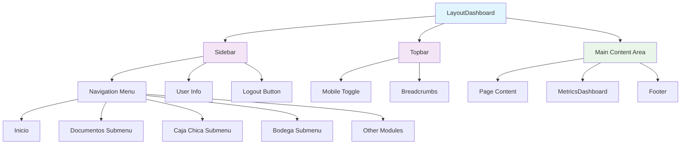
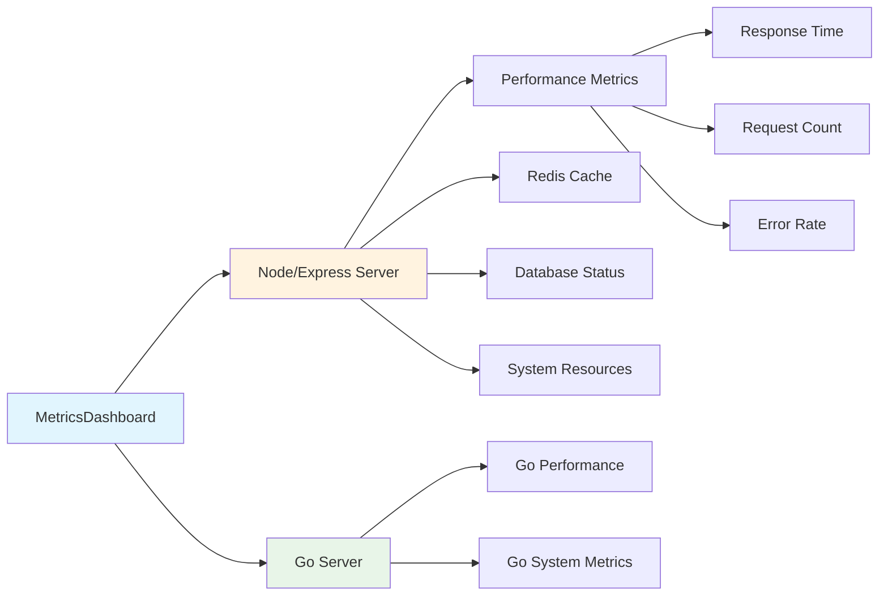

# 🏠 Dashboard Overview - MH-Next

## 📋 **Resumen**

El **Dashboard** es el módulo central del sistema MH-Next, proporcionando una vista unificada de todas las funcionalidades, métricas en tiempo real y navegación intuitiva para los usuarios de Mercadohouse. Actúa como el punto de entrada principal después del login y orquesta el acceso a todos los módulos del sistema.

---

## 🏗️ **Arquitectura del Dashboard**

### **Componentes Principales**



### **Estructura de Archivos**

```
src/
├── app/dashboard/
│   ├── layout.tsx              # Layout wrapper del dashboard
│   ├── page.tsx                # Redirección a /inicio
│   └── inicio/
│       ├── layout.tsx          # Layout específico del inicio
│       └── page.tsx            # Página principal del dashboard
├── components/layout/
│   ├── LayoutDashboard.tsx     # Layout principal con sidebar y topbar
│   ├── Sidebar.tsx             # Navegación lateral
│   └── Topbar.tsx              # Barra superior
└── components/ui/
    └── MetricsDashboard.tsx     # Dashboard de métricas del sistema
```

---

## 🎨 **Layout y Navegación**

### **1. LayoutDashboard**

**Responsabilidad**: Estructura principal del dashboard con layout responsive

**Características**:
- ✅ **Layout fijo**: Sidebar fijo + contenido scrolleable
- ✅ **Responsive design**: Mobile-first con drawer temporal
- ✅ **Animaciones**: Framer Motion para transiciones suaves
- ✅ **Autenticación**: Protección automática de rutas
- ✅ **Performance**: Lazy loading de componentes

```typescript
// Estructura del Layout
export function LayoutDashboard({ children }: { children: React.ReactNode }) {
  // Estados y hooks
  const [mobileOpen, setMobileOpen] = useState(false);
  const { isAuthenticated, isLoading } = useAuthStatus();
  
  // Animaciones staggered
  const layoutAnimation = useAnimations({ preset: 'fade', delay: 0.1 });
  const sidebarAnimation = useAnimations({ preset: 'fade', delay: 0.2 });
  const contentAnimation = useAnimations({ preset: 'fade', delay: 0.5 });
  
  // Render condicional basado en autenticación
  if (!isAuthenticated) router.push("/login");
  
  return (
    <AnimatedBox {...layoutAnimation}>
      <Sidebar /> {/* Fijo en desktop */}
      <Topbar />  {/* Sticky header */}
      <MainContent>{children}</MainContent> {/* Scrolleable */}
    </AnimatedBox>
  );
}
```

### **2. Sidebar Navigation**

**Responsabilidad**: Navegación principal y información del usuario

#### **Estructura del Menú**

| Sección | Módulos | Roles | Descripción |
|---------|---------|-------|-------------|
| **Principal** | Inicio | Todos | Dashboard principal |
| **Documentos** | Facturas, Notas Crédito, Lector DTE | Todos | Gestión documental |
| **Finanzas** | Nóminas, Caja Chica, Rinde Gastos | Todos | Control financiero |
| **Inventario** | Bodega (Inicio, Movimientos, Stock) | Supervisor+ | Gestión de stock |
| **Control** | Vencimientos, Auditoría Cartelería | Supervisor+ | Control de procesos |
| **Sistema** | Usuarios, Configuración | Admin/Supervisor | Administración |
| **Herramientas** | Zebra Integration | Supervisor+ | Herramientas especiales |

#### **Sistema de Permisos**

```typescript
// Roles del sistema
export const ROLES = {
  ADMIN: 1,        // Acceso completo
  SUPERVISOR: 2,   // Acceso a módulos de gestión
  EMPLEADO: 3,     // Acceso básico
} as const;

// Locales del sistema
export const LOCALES = {
  LOCAL_1: 1,      // LA CANTERA 3055
  LOCAL_2: 2,      // LIBERTADOR 1476  
  LOCAL_3: 3,      // BALMACEDA 599
} as const;

// Reglas por ruta
export const ROUTE_RULES: Record<string, RouteRule> = {
  "/dashboard/auditoria-carteleria": { 
    allowedRoles: [ROLES.SUPERVISOR], 
    allowedLocales: [LOCALES.LOCAL_1] 
  },
  "/dashboard/bodega/inicio": { 
    allowedRoles: [ROLES.SUPERVISOR], 
    allowedLocales: [LOCALES.LOCAL_1] 
  },
  "/dashboard/rinde-gastos": {}, // Acceso para todos
};
```

#### **Navegación Responsive**

```typescript
// Desktop: Sidebar fijo (240px width)
<Drawer variant="permanent" open={true}>

// Mobile: Drawer temporal con overlay
<Drawer variant="temporary" open={mobileOpen}>
```

### **3. Información del Usuario**

**Ubicación**: Parte superior del Sidebar

**Datos Mostrados**:
- 👤 **Nombre del usuario**
- 🏢 **Local asignado** (LA CANTERA, LIBERTADOR, BALMACEDA)
- 🎭 **Rol** (Admin, Supervisor, Empleado)
- 🔐 **Botón de logout**

---

## 📊 **Dashboard de Métricas**

### **MetricsDashboard Component**

**Responsabilidad**: Monitoreo en tiempo real del sistema

#### **Arquitectura de Métricas**



#### **Métricas Monitoreadas**

| Categoría | Métricas | Propósito |
|-----------|----------|-----------|
| **Performance** | Tiempo respuesta, requests/min | Monitoreo de velocidad |
| **Redis Cache** | Hit rate, keys totales, conexión | Estado del cache |
| **Database** | Conexiones activas, queries totales | Salud de BD |
| **System** | Memoria, CPU, uptime | Recursos del sistema |
| **Requests** | Total, errores, endpoints top | Análisis de uso |

#### **Visualización de Datos**

```typescript
// Ejemplo de métricas en tiempo real
const MetricsCard = ({ title, value, status, details }) => (
  <Paper elevation={0} sx={{ 
    p: 2, 
    transition: "all 0.3s ease",
    "&:hover": {
      transform: "translateY(-4px)",
      boxShadow: "0 8px 24px rgba(0,0,0,0.15)"
    }
  }}>
    <Box sx={{ display: "flex", alignItems: "center", mb: 1.5 }}>
      <Icon sx={{ color: getStatusColor(status), mr: 1 }} />
      <Typography variant="body2" fontWeight={600}>
        {title}
      </Typography>
    </Box>
    
    <Typography variant="h5" sx={{ 
      color: getStatusColor(status), 
      fontWeight: 700 
    }}>
      {value}
    </Typography>
    
    <Typography variant="caption" color="text.secondary">
      {details}
    </Typography>
  </Paper>
);
```

#### **Actualización de Datos**

- ⏱️ **Frecuencia**: Cada 10 segundos
- 🔄 **Auto-refresh**: Automático en background
- 📡 **Endpoints**:
  - Node: `/api-beta/monitoring/metrics`
  - Go: `/monitoring/metrics`
- ⚡ **Performance**: Lazy loading + memoization

---

## 🚀 **Sistema de Prefetch**

### **Optimización de Performance**

**Propósito**: Cargar datos críticos en background para mejorar UX

#### **Datos Prefetcheados**

```typescript
export function usePrefetch() {
  const queryClient = useQueryClient();

  // Datos críticos cargados al iniciar dashboard
  const prefetchData = async () => {
    await Promise.all([
      prefetchFacturas(),      // Facturas recientes
      prefetchNotasCredito(),  // Notas de crédito
      prefetchUsuarios(),      // Lista de usuarios (filtros)
      prefetchProveedores(),   // Lista de proveedores
    ]);
  };

  // Ejecutado 1 segundo después del login
  useEffect(() => {
    const timer = setTimeout(prefetchData, 1000);
    return () => clearTimeout(timer);
  }, []);
}
```

#### **Estrategia de Cache**

| Tipo de Dato | Stale Time | Propósito |
|--------------|------------|-----------|
| **Facturas** | 5 minutos | Datos que cambian frecuentemente |
| **Usuarios** | 10 minutos | Datos semi-estáticos |
| **Proveedores** | 10 minutos | Datos semi-estáticos |
| **Cartelería** | 2 minutos | Datos críticos que cambian rápido |

---

## 🎯 **Página de Inicio (Dashboard Home)**

### **Componentes de la Página Principal**

#### **1. Header Section**
```typescript
<Typography variant="h3" fontWeight="bold">
  Dashboard
</Typography>
<Typography variant="body1" color="text.secondary">
  Monitoreo en tiempo real del sistema y métricas de rendimiento
</Typography>
```

#### **2. MetricsDashboard**
- 📊 **Visualización completa** de métricas del sistema
- 🔄 **Actualización automática** cada 10 segundos
- 📱 **Responsive design** con grid adaptativo
- ⚡ **Performance optimizada** con lazy loading

#### **3. Footer**
- ℹ️ **Información del desarrollador**
- 🔗 **Enlaces externos** (GitHub, etc.)
- 📅 **Información de versión**

#### **4. Notificaciones**
```typescript
// Sistema de Snackbar para feedback
const { showSnackbar } = useSnackbar();

// Mensaje de bienvenida al login
useEffect(() => {
  const showLoginMessage = localStorage.getItem("showLoginMessage");
  if (showLoginMessage === "true") {
    showSnackbar("Sesión iniciada exitosamente", "success");
    localStorage.removeItem("showLoginMessage");
  }
}, []);
```

---

## 🔐 **Sistema de Autenticación y Protección**

### **Protección de Rutas**

```typescript
// Middleware de autenticación en LayoutDashboard
const { isAuthenticated, isLoading } = useAuthStatus();

if (isLoading) return <CircularProgress />;
if (!isAuthenticated) {
  router.push("/login");
  return null;
}
```

### **Control de Acceso por Roles**

```typescript
// Verificación de permisos por ruta
const canAccessRoute = (path: string, user?: AuthLikeUser): boolean => {
  // Admin siempre puede acceder
  if (isAdmin(user)) return true;

  const rule = ROUTE_RULES[path];
  if (!rule) return true; // Sin regla = acceso permitido

  const roleOk = !rule.allowedRoles || 
    (user?.rol_id != null && rule.allowedRoles.includes(user.rol_id));
  const localOk = !rule.allowedLocales || 
    (user?.id_local != null && rule.allowedLocales.includes(user.id_local));

  return roleOk && localOk;
};
```

### **Estados de Autenticación**

| Estado | Componente Mostrado | Acción |
|--------|-------------------|--------|
| **Loading** | CircularProgress | Verificando token |
| **No Auth** | Redirect to /login | Token inválido/expirado |
| **Authenticated** | Dashboard Content | Acceso permitido |

---

## 📱 **Responsive Design**

### **Breakpoints del Sistema**

```typescript
// Material-UI breakpoints utilizados
const breakpoints = {
  xs: 0,     // Mobile
  sm: 600,   // Tablet pequeña
  md: 900,   // Tablet/Desktop pequeño
  lg: 1200,  // Desktop
  xl: 1536   // Desktop grande
};

// Lógica responsive en components
const isMobile = useMediaQuery("(max-width:900px)");
```

### **Adaptaciones por Dispositivo**

#### **Mobile (< 900px)**
- 📱 **Sidebar**: Drawer temporal con overlay
- 🍔 **Hamburger menu**: En topbar para abrir sidebar
- 📊 **Métricas**: Grid de 1 columna
- 🔄 **Navigation**: Cierre automático al navegar

#### **Desktop (≥ 900px)**
- 🖥️ **Sidebar**: Fijo de 240px de ancho
- 📊 **Métricas**: Grid de 3 columnas
- 🎯 **Hover effects**: Interacciones mejoradas
- ⚡ **Performance**: Prefetch más agresivo

---

## 🎨 **Sistema de Temas y Animaciones**

### **Tema del Dashboard**

```typescript
// Configuración de colores
const theme = {
  palette: {
    primary: { main: "#FFD93D" },      // Amarillo Mercadohouse
    secondary: { main: "#38BDF8" },    // Azul complementario
    background: {
      default: "#0a0a0a",             // Dark mode
      paper: "#121212"
    }
  }
};
```

### **Animaciones con Framer Motion**

```typescript
// Animaciones staggered del layout
const layoutAnimation = useAnimations({ preset: 'fade', delay: 0.1 });
const sidebarAnimation = useAnimations({ preset: 'fade', delay: 0.2 });
const topbarAnimation = useAnimations({ preset: 'fade', delay: 0.3 });
const contentAnimation = useAnimations({ preset: 'fade', delay: 0.5 });

// Transiciones entre páginas
<PageTransition>
  {children}
</PageTransition>
```

### **Efectos de Hover**

```typescript
// Hover en cards de métricas
"&:hover": {
  borderColor: theme.palette.primary.main,
  boxShadow: "0 8px 24px rgba(0,0,0,0.15)",
  transform: "translateY(-4px)",
}

// Hover en navegación
"&:hover": {
  bgcolor: "rgba(255, 217, 61, 0.08)",
  transition: "background-color 0.3s ease",
}
```

---

## ⚡ **Optimizaciones de Performance**

### **1. Code Splitting**

```typescript
// Lazy loading de componentes pesados
const MetricsDashboard = lazy(() => import('@/components/ui/MetricsDashboard'));

// Dynamic imports en prefetch
const { getFacturas } = await import('@/services/facturaService');
```

### **2. Memoización**

```typescript
// Memoized callbacks para evitar re-renders
const handleDrawerToggle = useCallback(() => {
  setMobileOpen((prev) => !prev);
}, []);

// Memoized components
const MemoizedMetricsCard = memo(MetricsCard);
```

### **3. Bundle Optimization**

- 📦 **Tree shaking**: Imports específicos de MUI
- 🔄 **Code splitting**: Por rutas y componentes
- 💾 **Caching**: TanStack Query con stale time
- ⚡ **Prefetch**: Datos críticos en background

---

## 🔧 **Hooks Personalizados del Dashboard**

### **useAnimations**

```typescript
// Hook para animaciones consistentes
export const useAnimations = (config: AnimationConfig) => {
  return {
    initial: { opacity: 0, y: 20 },
    animate: { opacity: 1, y: 0 },
    transition: { duration: 0.3, delay: config.delay }
  };
};
```

### **useAuthStatus**

```typescript
// Hook para estado de autenticación
export const useAuthStatus = (): AuthStatus => {
  const [isAuthenticated, setIsAuthenticated] = useState(false);
  const [isLoading, setIsLoading] = useState(true);
  const [usuario, setUsuario] = useState<Usuario | undefined>();
  
  // Verificación automática del token
  useEffect(() => {
    checkAuthStatus();
  }, []);
  
  return { isAuthenticated, isLoading, usuario };
};
```

### **usePrefetch**

```typescript
// Hook para optimización de carga
export function usePrefetch() {
  const queryClient = useQueryClient();
  
  const prefetchFacturas = useCallback(() => {
    queryClient.prefetchQuery({
      queryKey: ['facturas', 1, 10],
      queryFn: () => getFacturas(1, 10),
      staleTime: 5 * 60 * 1000,
    });
  }, [queryClient]);
  
  return { prefetchFacturas, /* otros prefetch */ };
}
```

---

## 🚨 **Manejo de Errores**

### **Error Boundaries**

```typescript
// Error boundary para el dashboard
<ErrorBoundary
  fallback={<DashboardErrorFallback />}
  onError={(error, errorInfo) => {
    console.error('Dashboard error:', error, errorInfo);
  }}
>
  <DashboardContent />
</ErrorBoundary>
```

### **Estados de Error**

| Tipo de Error | Componente | Acción |
|--------------|------------|--------|
| **Auth Error** | Redirect to Login | Token expirado |
| **Network Error** | Retry Button | Problema de conexión |
| **Permission Error** | Access Denied Page | Sin permisos |
| **Component Error** | Error Fallback | Error de renderizado |

---

## 📈 **Métricas y Monitoreo**

### **Métricas del Frontend**

```typescript
// Tracking de eventos del dashboard
const trackDashboardEvent = (eventName: string, data: object) => {
  // Vercel Analytics
  track(eventName, data);
  
  // Custom metrics
  sendMetric({
    event: eventName,
    timestamp: Date.now(),
    user: usuario?.id,
    data
  });
};

// Eventos trackeados
trackDashboardEvent('dashboard_loaded', { loadTime: performance.now() });
trackDashboardEvent('navigation_click', { module: 'nominas' });
```

### **Performance Metrics**

- ⏱️ **Time to Interactive**: < 2 segundos
- 📊 **First Contentful Paint**: < 1.5 segundos
- 🔄 **Cache Hit Rate**: > 85%
- 📱 **Mobile Performance**: Score > 90

---

## 🔮 **Futuras Mejoras**

### **Roadmap del Dashboard**

#### **Corto Plazo (1-2 meses)**
- [ ] **PWA Support**: Service workers para offline
- [ ] **Dark/Light Theme Toggle**: Selector de tema
- [ ] **Personalización**: Dashboard configurable por usuario
- [ ] **Notificaciones Push**: Alertas en tiempo real

#### **Medio Plazo (3-6 meses)**
- [ ] **Dashboard Widgets**: Widgets arrastrables
- [ ] **Advanced Analytics**: Gráficos interactivos
- [ ] **Multi-tenant**: Soporte para múltiples empresas
- [ ] **API Dashboard**: Métricas de uso de APIs

#### **Largo Plazo (6+ meses)**
- [ ] **AI Insights**: Predicciones con ML
- [ ] **Voice Commands**: Control por voz
- [ ] **Mobile App**: App nativa complementaria
- [ ] **Real-time Collaboration**: Colaboración en tiempo real

---

## 🛠️ **Troubleshooting Común**

### **Problemas Frecuentes**

#### **1. Dashboard no carga**
```bash
# Verificar autenticación
localStorage.getItem('authToken')

# Verificar conexión API
curl -H "Authorization: Bearer TOKEN" API_URL/api-beta/me

# Limpiar cache
localStorage.clear()
```

#### **2. Métricas no se actualizan**
```bash
# Verificar endpoints
curl API_URL/api-beta/monitoring/metrics
curl API_URL/monitoring/metrics

# Verificar network tab en DevTools
# Verificar TanStack Query DevTools
```

#### **3. Sidebar no responde**
```typescript
// Verificar estado del drawer
console.log('mobileOpen:', mobileOpen);

// Verificar breakpoints
console.log('isMobile:', useMediaQuery("(max-width:900px)"));
```

#### **4. Animaciones lentas**
```typescript
// Deshabilitar animaciones en desarrollo
const shouldAnimate = process.env.NODE_ENV !== 'development';

// Reducir motion para usuarios con preferencias
const prefersReducedMotion = useMediaQuery('(prefers-reduced-motion: reduce)');
```

---

## 📚 **Recursos y Referencias**

### **Documentación Relacionada**
- 🏗️ **[Arquitectura General](../architecture/overview.md)** - Patrones y decisiones técnicas
- 🔐 **[Autenticación](../critical-refactoring/auth-migration-nextauth.md)** - Sistema de auth actual
- 🎨 **[Componentes UI](../components/ui-components.md)** - Guía de componentes
- 🔧 **[Hooks](../components/hooks.md)** - Custom hooks disponibles

### **Dependencias Clave**
- **Material-UI v7**: Sistema de diseño y componentes
- **Framer Motion**: Animaciones y transiciones  
- **TanStack Query**: Estado del servidor y cache
- **Next.js 15**: Framework y routing
- **TypeScript**: Tipado estático

### **APIs Utilizadas**
- `GET /api-beta/me` - Información del usuario autenticado
- `GET /api-beta/monitoring/metrics` - Métricas del servidor Node
- `GET /monitoring/metrics` - Métricas del servidor Go

---

*Documentación actualizada: Septiembre 2024*  
*Próxima revisión: Diciembre 2024*
