# 🧾 Módulo de Facturas - MH-Next

## 📋 **Resumen**

El **Módulo de Facturas** es el sistema central de gestión de Documentos Tributarios Electrónicos (DTE) y facturación de Mercadohouse. Maneja el ciclo completo de facturas desde el ingreso hasta el pago, incluyendo procesamiento DTE, integración con nóminas, métodos de pago múltiples, y servicios externos. Es uno de los módulos más complejos del sistema con optimizaciones avanzadas y lazy loading.

---

## 🏗️ **Arquitectura del Módulo**

### **Componentes Principales**

```mermaid
graph TD
    A[FacturasPage] --> B[FacturaPageContent]
    B --> C[FacturaSearchBar]
    B --> D[FacturaTable]
    B --> E[MobileImagePreloader]
    
    D --> F[FacturaCard - Mobile]
    D --> G[FacturaTableDesktop]
    D --> H[Modales Dinámicos]
    
    H --> I[ViewFacturaModal]
    H --> J[EditarMontoModal]
    H --> K[EditarMetodoPagoModal]
    H --> L[EditarFechaPagoModal]
    H --> M[EditarCamposBasicosModal]
    H --> N[DeleteFacturaModal]
    
    B --> O[useFacturas Hook]
    O --> P[facturaService]
    P --> Q[Backend API]
    Q --> R[Database]
    
    P --> S[adaptFactura]
    S --> T[Transformación de Datos]
    
    U[LectorDTE] --> V[XMLUploader]
    V --> W[DTE Processing]
    W --> X[Validación XML]
    W --> Y[Cálculos Comerciales]
    
    style A fill:#e1f5fe
    style B fill:#f3e5f5
    style O fill:#e8f5e8
    style P fill:#fff3e0
    style U fill:#fce4ec
```



### **Flujo de Datos y Estados**

```mermaid
sequenceDiagram
    participant U as Usuario
    participant P as FacturaPageContent
    participant H as useFacturas
    participant S as facturaService
    participant API as Backend API
    participant DB as Database
    
    U->>P: Accede al módulo
    P->>H: Inicializar con filtros
    H->>S: getFacturas()
    S->>API: GET /api-beta/facturas
    API->>DB: Query facturas
    DB-->>API: Resultados
    API-->>S: FacturaAPIResponse
    S->>S: adaptFactura()
    S-->>H: Facturas transformadas
    H-->>P: Estado actualizado
    P-->>U: Vista con facturas
    
    U->>P: Buscar por folio
    P->>H: Actualizar filtros
    H->>S: getFacturas(folio)
    S->>API: GET /api-beta/facturas/:folio
    API-->>S: Factura específica
    S-->>H: Resultado
    H-->>P: UI actualizada
    
    U->>P: Editar monto
    P->>H: useActualizarMontoFactura
    H->>H: Optimistic Update
    H->>S: actualizarMontoFactura()
    S->>API: PUT /api-beta/facturas/:id/monto
    API-->>S: Factura actualizada
    S-->>H: Confirmación
    H-->>P: Estado sincronizado
    
    U->>P: Cambiar método de pago
    P->>H: useActualizarMetodoPagoFactura
    H->>H: Optimistic Update
    H->>S: actualizarMetodoPagoFactura()
    S->>API: PUT /api-beta/facturas/:id/metodo-pago
    API-->>S: Factura con nuevo método
    S-->>H: Confirmación
    H-->>P: UI sincronizada
```



---

## 📁 **Estructura de Archivos**

```
src/
├── app/dashboard/facturas/
│   ├── layout.tsx              # Layout del módulo
│   └── page.tsx                # Página principal con lazy loading
├── app/dashboard/lector-dte/
│   ├── layout.tsx              # Layout para DTE
│   └── page.tsx                # Lector de DTE/XML
├── components/dashboard/
│   ├── FacturaPageContent.tsx  # Contenido principal (233 líneas)
│   ├── FacturaTable.tsx        # Tabla responsive (437 líneas)
│   ├── FacturaTableDesktop.tsx # Vista desktop
│   ├── FacturaCard.tsx         # Vista mobile
│   ├── FacturaSearchBar.tsx    # Barra de búsqueda
│   ├── FacturaMenuActions.tsx  # Menú de acciones
│   ├── FacturasAsignadasView.tsx # Vista para nóminas
│   └── Modales/
│       ├── ViewFacturaModal.tsx
│       ├── EditarMontoModal.tsx
│       ├── EditarMetodoPagoModal.tsx
│       ├── EditarFechaPagoModal.tsx
│       ├── EditarCamposBasicosModal.tsx
│       └── DeleteFacturaModal.tsx
├── components/movimientos/
│   └── IngresoMovimientos.tsx  # Procesador DTE (333+ líneas)
├── hooks/
│   └── useFacturas.ts          # Hook principal (446 líneas)
├── services/
│   └── facturaService.ts       # Servicio API (216 líneas)
├── types/
│   └── factura.d.ts            # Definiciones TypeScript (211 líneas)
├── utils/
│   └── adaptFactura.ts         # Transformación de datos (140 líneas)
└── components/ui/
    └── MobileImagePreloader.tsx # Optimización mobile
```

---

## 🧾 **Funcionalidades Principales**

### **1. Gestión de Facturas**

#### **Estados y Métodos de Pago**

| Método de Pago | Descripción | Estados Relacionados | Campos Requeridos |
|----------------|-------------|---------------------|-------------------|
| **POR_PAGAR** | Factura pendiente de pago | Default | - |
| **CHEQUE** | Pago con cheque | Requiere correlativo | `cheque_correlativo`, `monto_pagado` |
| **TRANSFERENCIA** | Pago electrónico | Requiere fecha | `fecha_pago`, `monto_pagado` |
| **EFECTIVO** | Pago en efectivo | Inmediato | `monto_pagado` |

#### **Estructura de Factura**

```typescript
interface Factura {
  id: string;                           // ID único
  folio: string;                        // Folio de la factura
  proveedor: string;                    // Nombre del proveedor
  local: string;                        // Local asignado
  estado: "BODEGA" | "SALA";           // Estado físico
  fechaIngreso: string;                 // Fecha de ingreso (ISO)
  image_url: string;                    // URL imagen original
  image_url_cloudinary: string;         // URL optimizada Cloudinary
  nombre_usuario: string;               // Usuario que registró
  rut_proveedor?: string;              // RUT del proveedor
  monto?: number;                      // Monto de la factura
  
  // Método de pago
  metodo_pago: "POR_PAGAR" | "CHEQUE" | "TRANSFERENCIA" | "EFECTIVO";
  monto_pagado?: number;               // Monto pagado
  fecha_pago?: string;                 // Fecha de pago
  
  // Estados de UI (Optimistic Updates)
  isUpdating?: boolean;                // Estado de actualización
  pendingMonto?: number;               // Monto pendiente
  pendingMetodoPago?: string;          // Método pendiente
  pendingFechaPago?: string;           // Fecha pendiente
  
  // Integración con cheques
  cheque_id?: number | null;
  cheque_correlativo?: string | null;
  cheque_monto?: number | null;
  cheque_fecha_creacion?: string | null;
  cheque_monto_asignado?: number | null;
  cheque_nombre_usuario?: string | null;
  
  // Integración con nóminas
  nomina_id?: number | null;
  nomina_numero?: string | null;
  nomina_tipo?: string | null;
  nomina_estado?: string | null;
  nomina_monto_asignado?: number | null;
  nomina_fecha_asignacion?: string | null;
  
  // Tracking de nóminas
  tracking_estado?: string | null;     // 'EN_ORIGEN' | 'EN_TRANSITO' | 'RECIBIDA'
  tracking_local_origen?: string | null;
  tracking_local_destino?: string | null;
  tracking_fecha_envio?: string | null;
  tracking_fecha_recepcion?: string | null;
  
  // Control de asignación
  asignado_a_nomina?: boolean;         // Indica si está asignada
  id_proveedor?: number;               // ID numérico del proveedor
}
```

### **2. Sistema de Búsqueda Avanzada**

#### **Tipos de Búsqueda**

```typescript
// Búsqueda por folio específico
const searchByFolio = async (folio: string) => {
  // Endpoint: GET /api-beta/facturas/:folio
  // Retry: false (si no existe, no existe)
  const response = await axios.get(`${API_URL}/api-beta/facturas/${folio}`);
  return response.data.facturas.map(adaptFactura);
};

// Búsqueda por correlativo de cheque
const searchByCheque = async (correlativo: string) => {
  // Endpoint: GET /api-beta/facturas/cheque/:correlativo
  // Encuentra todas las facturas pagadas con ese cheque
  const response = await axios.get(`${API_URL}/api-beta/facturas/cheque/${correlativo}`);
  return response.data.facturas.map(adaptFactura);
};

// Búsqueda general con filtros
const searchWithFilters = async (filters: {
  page?: number;
  limit?: number;
  local?: string;
  usuario?: string;
  proveedor?: string;
  fechaDesde?: string;
  fechaHasta?: string;
  prontasAPagar?: boolean;
}) => {
  // Endpoint: GET /api-beta/facturas?params
  const localMapping = {
    "LA CANTERA 3055": 1,
    "LIBERTADOR 1476": 2,
    "BALMACEDA 599": 3,
  };
  
  const params = {
    limit: filters.limit || 10,
    offset: ((filters.page || 1) - 1) * (filters.limit || 10),
    ...(filters.local ? { id_local: localMapping[filters.local] } : {}),
    ...(filters.usuario ? { id_usuario: filters.usuario } : {}),
    ...(filters.proveedor ? { id_proveedor: filters.proveedor } : {}),
    ...(filters.fechaDesde ? { fecha_desde: filters.fechaDesde } : {}),
    ...(filters.fechaHasta ? { fecha_hasta: filters.fechaHasta } : {}),
    ...(filters.prontasAPagar ? { prontas_a_pagar: filters.prontasAPagar } : {}),
  };
  
  const response = await axios.get(`${API_URL}/api-beta/facturas`, { params });
  return {
    facturas: response.data.facturas.map(adaptFactura),
    total: response.data.total_registros
  };
};
```

#### **Barra de Búsqueda Inteligente**

```typescript
const FacturaSearchBar = ({ 
  onSearch, 
  onClear, 
  onLocalChange,
  onUsuarioChange,
  onProveedorChange,
  onFechaDesdeChange,
  onFechaHastaChange,
  onProntasAPagarChange 
}) => {
  const [folio, setFolio] = useState("");
  const [chequeCorrelativo, setChequeCorrelativo] = useState("");
  const [localActual, setLocalActual] = useState("");
  const [usuarioActual, setUsuarioActual] = useState("");
  const [proveedorActual, setProveedorActual] = useState("");
  const [fechaDesde, setFechaDesde] = useState("");
  const [fechaHasta, setFechaHasta] = useState("");
  const [prontasAPagar, setProntasAPagar] = useState(false);

  const handleSearch = () => {
    // Priorizar búsquedas específicas
    if (folio.trim()) {
      onSearch(folio.trim(), "");
      return;
    }
    
    if (chequeCorrelativo.trim()) {
      onSearch("", chequeCorrelativo.trim());
      return;
    }
    
    // Búsqueda general con filtros
    onSearch("", "");
  };

  return (
    <Paper sx={{ p: 2, mb: 2 }}>
      <Grid container spacing={2} alignItems="center">
        {/* Búsqueda rápida */}
        <Grid item xs={12} sm={6} md={3}>
          <TextField
            fullWidth
            size="small"
            label="Buscar por folio"
            value={folio}
            onChange={(e) => setFolio(e.target.value)}
            onKeyPress={(e) => e.key === 'Enter' && handleSearch()}
            InputProps={{
              endAdornment: (
                <InputAdornment position="end">
                  <SearchIcon />
                </InputAdornment>
              )
            }}
          />
        </Grid>
        
        <Grid item xs={12} sm={6} md={3}>
          <TextField
            fullWidth
            size="small"
            label="Correlativo de cheque"
            value={chequeCorrelativo}
            onChange={(e) => setChequeCorrelativo(e.target.value)}
            onKeyPress={(e) => e.key === 'Enter' && handleSearch()}
          />
        </Grid>
        
        {/* Filtros avanzados */}
        <Grid item xs={12} sm={6} md={2}>
          <FormControl fullWidth size="small">
            <InputLabel>Local</InputLabel>
            <Select
              value={localActual}
              onChange={(e) => {
                setLocalActual(e.target.value);
                onLocalChange(e.target.value);
              }}
            >
              <MenuItem value="">Todos</MenuItem>
              <MenuItem value="LA CANTERA 3055">LA CANTERA 3055</MenuItem>
              <MenuItem value="LIBERTADOR 1476">LIBERTADOR 1476</MenuItem>
              <MenuItem value="BALMACEDA 599">BALMACEDA 599</MenuItem>
            </Select>
          </FormControl>
        </Grid>
        
        {/* Más filtros... */}
        <Grid item xs={12} sm={6} md={2}>
          <FormControlLabel
            control={
              <Switch
                checked={prontasAPagar}
                onChange={(e) => {
                  setProntasAPagar(e.target.checked);
                  onProntasAPagarChange(e.target.checked);
                }}
              />
            }
            label="Prontas a pagar"
          />
        </Grid>
        
        <Grid item xs={12} sm={12} md={2}>
          <Stack direction="row" spacing={1}>
            <Button
              variant="contained"
              onClick={handleSearch}
              startIcon={<SearchIcon />}
            >
              Buscar
            </Button>
            <Button
              variant="outlined"
              onClick={() => {
                setFolio("");
                setChequeCorrelativo("");
                setLocalActual("");
                onClear();
              }}
            >
              Limpiar
            </Button>
          </Stack>
        </Grid>
      </Grid>
    </Paper>
  );
};
```

### **3. Sistema de Optimistic Updates**

#### **Hook useActualizarMontoFactura**

```typescript
export const useActualizarMontoFactura = () => {
  const queryClient = useQueryClient();

  return useMutation({
    mutationFn: async (data: { id: string; monto: number }) => {
      return await actualizarMontoFactura(data.id, data.monto);
    },
    
    // Optimistic Update: actualizar UI inmediatamente
    onMutate: async (variables) => {
      const { id, monto } = variables;
      
      // Cancelar queries en progreso
      await queryClient.cancelQueries({ queryKey: ["facturas"] });
      
      // Snapshot del estado actual
      const previousFacturas: Array<[unknown, unknown]> = [];
      const all = queryClient.getQueriesData({ queryKey: ["facturas"] });
      
      all.forEach(([queryKey, old]) => {
        previousFacturas.push([queryKey, old]);
        const current = old as FacturasQueryResult | undefined;
        
        if (!current?.facturas) return;
        
        // Actualizar optimísticamente
        queryClient.setQueryData(queryKey, {
          ...current,
          facturas: current.facturas.map((factura: Factura) =>
            factura.id === id
              ? {
                  ...factura,
                  isUpdating: true,
                  pendingMonto: monto,
                  monto: monto // Mostrar nuevo valor inmediatamente
                }
              : factura
          ),
        });
      });
      
      return { previousFacturas };
    },
    
    // Si hay error, revertir cambios
    onError: (err, _variables, context) => {
      if (context?.previousFacturas) {
        context.previousFacturas.forEach(([queryKey, data]) => {
          queryClient.setQueryData(queryKey, data);
        });
      }
      console.error("Error en actualización de monto:", err);
    },
    
    // Al completarse exitosamente
    onSuccess: (response, variables) => {
      const facturaActualizada = adaptFactura(response);
      const { id } = variables;
      
      // Actualizar todas las queries con la respuesta del servidor
      const all = queryClient.getQueriesData({ queryKey: ["facturas"] });
      all.forEach(([queryKey, old]) => {
        const current = old as FacturasQueryResult | undefined;
        if (!current?.facturas) return;
        
        queryClient.setQueryData(queryKey, {
          ...current,
          facturas: current.facturas.map((factura: Factura) =>
            factura.id === id
              ? {
                  ...factura,
                  ...facturaActualizada,
                  isUpdating: false,
                  pendingMonto: undefined,
                }
              : factura
          ),
        });
      });
      
      // Actualizar entidad individual
      queryClient.setQueryData(["factura", id], facturaActualizada);
      
      // Invalidar queries para sincronización completa
      queryClient.invalidateQueries({ queryKey: ["facturas"] });
    },
  });
};
```

#### **Hook useActualizarMetodoPagoFactura**

```typescript
export const useActualizarMetodoPagoFactura = () => {
  const queryClient = useQueryClient();

  return useMutation({
    mutationFn: async (data: ActualizarMetodoPagoRequest) => {
      return await actualizarMetodoPagoFactura(data);
    },
    
    onMutate: async (variables) => {
      const { id, metodo_pago, monto_pagado, cheque } = variables;
      
      await queryClient.cancelQueries({ queryKey: ["facturas"] });
      
      const previousFacturas: Array<[unknown, unknown]> = [];
      const all = queryClient.getQueriesData({ queryKey: ["facturas"] });
      
      all.forEach(([queryKey, old]) => {
        previousFacturas.push([queryKey, old]);
        const current = old as FacturasQueryResult | undefined;
        
        if (!current?.facturas) return;
        
        queryClient.setQueryData(queryKey, {
          ...current,
          facturas: current.facturas.map((factura: Factura) =>
            factura.id === id
              ? {
                  ...factura,
                  isUpdating: true,
                  pendingMetodoPago: metodo_pago,
                  metodo_pago: metodo_pago,
                  monto_pagado: monto_pagado,
                  // Si es cheque, actualizar campos relacionados
                  ...(cheque ? {
                    cheque_correlativo: cheque.correlativo,
                    cheque_monto_asignado: cheque.monto
                  } : {})
                }
              : factura
          ),
        });
      });
      
      return { previousFacturas };
    },
    
    onError: (err, _variables, context) => {
      if (context?.previousFacturas) {
        context.previousFacturas.forEach(([queryKey, data]) => {
          queryClient.setQueryData(queryKey, data);
        });
      }
      console.error("Error en actualización de método de pago:", err);
    },
    
    onSuccess: (response, variables) => {
      const facturaActualizada = adaptFactura(response);
      const { id } = variables;
      
      // Actualizar con datos del servidor
      const all = queryClient.getQueriesData({ queryKey: ["facturas"] });
      all.forEach(([queryKey, old]) => {
        const current = old as FacturasQueryResult | undefined;
        if (!current?.facturas) return;
        
        queryClient.setQueryData(queryKey, {
          ...current,
          facturas: current.facturas.map((factura: Factura) =>
            factura.id === id
              ? {
                  ...factura,
                  ...facturaActualizada,
                  isUpdating: false,
                  pendingMetodoPago: undefined,
                }
              : factura
          ),
        });
      });
      
      // Si es cheque, invalidar queries de cheques para sincronización
      if (variables.metodo_pago === "CHEQUE") {
        queryClient.invalidateQueries({ queryKey: ["cheques", "proveedor"] });
      }
      
      queryClient.invalidateQueries({ queryKey: ["facturas"] });
    },
  });
};
```

---

## 🔄 **Transformación de Datos (adaptFactura)**

### **Función Principal**

```typescript
export function adaptFactura(factura: FacturaResponseExtended): Factura {
  // Mapping de locales
  const localMapping: Record<number, string> = {
    1: "LA CANTERA 3055",
    2: "LIBERTADOR 1476", 
    3: "BALMACEDA 599",
  };

  // Detectar formato de respuesta del backend
  const isNewFormat = factura.nombre_proveedor && factura.fecha_factura;
  
  return {
    id: factura.id.toString(), // Usar ID real de DB
    folio: factura.folio,
    
    // Compatibilidad entre formatos
    proveedor: isNewFormat 
      ? factura.nombre_proveedor! 
      : factura.proveedor,
    
    local: factura.nombre_local || 
           (factura.id_local ? localMapping[factura.id_local] : "Local desconocido"),
    
    estado: "BODEGA", // Estado por defecto
    
    // Fechas adaptadas según formato
    fechaIngreso: isNewFormat 
      ? factura.fecha_factura! 
      : factura.fecha_registro,
    
    // URLs de imágenes transformadas
    image_url: transformDriveUrl(factura.image_url || ""),
    image_url_cloudinary: factura.image_url_cloudinary,
    
    // Usuario (en nuevo formato no viene)
    nombre_usuario: isNewFormat 
      ? "Usuario desconocido" 
      : factura.nombre_usuario,
    
    rut_proveedor: factura.rut_proveedor || "undefined",
    
    // Montos convertidos a entero
    monto: montoAEntero(
      typeof factura.monto === 'string' 
        ? parseFloat(factura.monto) 
        : factura.monto || 0
    ),
    
    // Método de pago con default
    metodo_pago: factura.metodo_pago || "POR_PAGAR",
    monto_pagado: factura.monto_pagado 
      ? montoAEntero(
          typeof factura.monto_pagado === 'string' 
            ? parseFloat(factura.monto_pagado) 
            : factura.monto_pagado
        ) 
      : undefined,
    
    // Campos de integración
    id_proveedor: factura.id_proveedor,
    asignado_a_nomina: factura.asignado_a_nomina || false,
    fecha_pago: factura.fecha_pago,
    
    // Campos de cheques
    cheque_id: factura.cheque_id,
    cheque_correlativo: factura.cheque_correlativo,
    cheque_monto: factura.cheque_monto,
    cheque_fecha_creacion: factura.cheque_fecha_creacion,
    cheque_monto_asignado: factura.cheque_monto_asignado,
    cheque_nombre_usuario: factura.cheque_nombre_usuario,

    // Campos de nóminas
    nomina_id: factura.nomina_id,
    nomina_numero: factura.nomina_numero,
    nomina_tipo: factura.nomina_tipo,
    nomina_estado: factura.nomina_estado,
    nomina_monto_asignado: factura.nomina_monto_asignado,
    nomina_fecha_asignacion: factura.nomina_fecha_asignacion,

    // Campos de tracking
    tracking_estado: factura.tracking_estado,
    tracking_local_origen: factura.tracking_local_origen,
    tracking_local_destino: factura.tracking_local_destino,
    tracking_fecha_envio: factura.tracking_fecha_envio,
    tracking_fecha_recepcion: factura.tracking_fecha_recepcion,
  };
}
```

### **Transformación de URLs de Google Drive**

```typescript
const transformDriveUrl = (url: string): string => {
  // Convertir URLs de Google Drive a formato directo
  const regex = /\/file\/d\/(.*?)\/view/;
  const match = url.match(regex);
  
  if (match && match[1]) {
    return `https://drive.google.com/uc?id=${match[1]}`;
  }
  
  return url; // Devolver URL original si no coincide
};
```

### **Adaptador para Facturas Disponibles**

```typescript
export function adaptFacturaDisponible(factura: FacturaDisponibleResponse): Factura {
  return {
    id: factura.id.toString(),
    folio: factura.folio,
    proveedor: factura.nombre_proveedor,
    local: "Local desconocido", // No viene en respuesta
    estado: "BODEGA",
    fechaIngreso: factura.fecha_factura,
    image_url: "", // No viene en respuesta
    image_url_cloudinary: "",
    nombre_usuario: "Usuario desconocido",
    rut_proveedor: factura.rut_proveedor,
    monto: montoAEntero(factura.monto),
    
    // Valores por defecto para facturas disponibles
    metodo_pago: "POR_PAGAR",
    monto_pagado: undefined,
    id_proveedor: undefined,
    asignado_a_nomina: false, // Por definición no están asignadas
    fecha_pago: undefined,
    
    // Campos de cheques null por defecto
    cheque_id: null,
    cheque_correlativo: null,
    cheque_monto: null,
    cheque_fecha_creacion: null,
    cheque_monto_asignado: null,
    cheque_nombre_usuario: null,

    // Campos de nóminas null por defecto
    nomina_id: null,
    nomina_numero: null,
    nomina_tipo: null,
    nomina_estado: null,
    nomina_monto_asignado: null,
    nomina_fecha_asignacion: null,

    // Campos de tracking null por defecto
    tracking_estado: null,
    tracking_local_origen: null,
    tracking_local_destino: null,
    tracking_fecha_envio: null,
    tracking_fecha_recepcion: null,
  };
}
```

---

## 📄 **Procesamiento DTE (Documentos Tributarios Electrónicos)**

### **Arquitectura del Lector DTE**

```mermaid
graph TD
    A[XMLUploader] --> B[File Upload]
    B --> C[FileReader API]
    C --> D[XML Parsing]
    D --> E[DOMParser]
    E --> F[Validación XML]
    F --> G{¿XML Válido?}
    
    G -->|No| H[Error Handler]
    G -->|Sí| I[parseDteXml]
    
    I --> J[Extraer Encabezado]
    I --> K[Extraer Detalles]
    
    J --> L[DteHeader]
    K --> M[DteDetalle[]]
    
    L --> N[calculateCommercialValues]
    M --> N
    
    N --> O[Cálculos PV]
    O --> P[DteData Completa]
    P --> Q[Vista de Resultados]
    
    style A fill:#e1f5fe
    style I fill:#f3e5f5
    style N fill:#e8f5e8
    style P fill:#fff3e0
```

### **Tipos de DTE**

```typescript
// Encabezado del DTE
type DteHeader = {
  folio: string;                    // Folio del documento
  fechaEmision: string;             // Fecha de emisión
  terminoPago: string;              // Término de pago
  rutEmisor: string;                // RUT del emisor
  nombreEmisor: string;             // Nombre del emisor
  rutReceptor: string;              // RUT del receptor
  nombreReceptor: string;           // Nombre del receptor
  montoNeto: number;                // Monto neto
  iva: number;                      // IVA
  montoTotal: number;               // Monto total
};

// Detalle de productos/servicios
type DteDetalle = {
  nroLinDet: string;                // Número de línea
  codigo: string;                   // Código del producto
  nombre: string;                   // Nombre del producto
  descripcion: string;              // Descripción
  cantidad: number;                 // Cantidad
  precioUnitario: number;           // Precio unitario
  montoItem: number;                // Monto del ítem
  valorUnidad: number;              // Valor por unidad (calculado)
  pvDetalle: number;                // Precio de venta detalle (calculado)
  pvMayor: number;                  // Precio de venta mayor (calculado)
};

// Estructura completa del DTE
type DteData = {
  encabezado: DteHeader;
  detalles: DteDetalle[];
};
```

### **Procesamiento XML**

```typescript
const parseDteXml = (xmlDoc: Document): Omit<DteData, 'detalles'> & { detalles: DteDetalleRaw[] } => {
  // Extraer encabezado
  const encabezado: DteHeader = {
    folio: getTextContent(xmlDoc, "Folio") || "",
    fechaEmision: getTextContent(xmlDoc, "FchEmis") || "",
    terminoPago: getTextContent(xmlDoc, "TermPagoGlosa") || "",
    rutEmisor: getTextContent(xmlDoc, "RUTEmisor") || "",
    nombreEmisor: getTextContent(xmlDoc, "RznSoc") || "",
    rutReceptor: getTextContent(xmlDoc, "RUTRecep") || "",
    nombreReceptor: getTextContent(xmlDoc, "RznSocRecep") || "",
    montoNeto: parseFloat(getTextContent(xmlDoc, "MntNeto") || "0"),
    iva: parseFloat(getTextContent(xmlDoc, "IVA") || "0"),
    montoTotal: parseFloat(getTextContent(xmlDoc, "MntTotal") || "0"),
  };

  // Extraer detalles
  const detalleElements = xmlDoc.getElementsByTagName("Detalle");
  const detalles: DteDetalleRaw[] = [];

  for (let i = 0; i < detalleElements.length; i++) {
    const detalle = detalleElements[i];
    
    detalles.push({
      nroLinDet: getTextContent(detalle, "NroLinDet") || "",
      codigo: getTextContent(detalle, "CdgItem") || "",
      nombre: getTextContent(detalle, "NmbItem") || "",
      descripcion: getTextContent(detalle, "DscItem") || "",
      cantidad: parseFloat(getTextContent(detalle, "QtyItem") || "0"),
      precioUnitario: parseFloat(getTextContent(detalle, "PrcItem") || "0"),
      montoItem: parseFloat(getTextContent(detalle, "MontoItem") || "0"),
    });
  }

  return { encabezado, detalles };
};

// Helper para extraer texto de elementos XML
const getTextContent = (parent: Document | Element, tagName: string): string | null => {
  const element = parent.getElementsByTagName(tagName)[0];
  return element?.textContent || null;
};
```

### **Cálculos Comerciales**

```typescript
const calculateCommercialValues = (dteData: Omit<DteData, 'detalles'> & { detalles: DteDetalleRaw[] }): DteData => {
  const detallesConCalculos: DteDetalle[] = dteData.detalles.map((detalle) => {
    // Valor por unidad = Precio unitario / cantidad
    const valorUnidad = detalle.cantidad > 0 
      ? detalle.precioUnitario / detalle.cantidad 
      : detalle.precioUnitario;

    // Precio de venta detalle = Valor unidad * 1.3 (30% de margen)
    const pvDetalle = valorUnidad * 1.3;

    // Precio de venta mayor = Valor unidad * 1.2 (20% de margen)
    const pvMayor = valorUnidad * 1.2;

    return {
      ...detalle,
      valorUnidad: Math.round(valorUnidad),
      pvDetalle: Math.round(pvDetalle),
      pvMayor: Math.round(pvMayor),
    };
  });

  return {
    encabezado: dteData.encabezado,
    detalles: detallesConCalculos,
  };
};
```

### **Componente XMLUploader**

```typescript
export function XMLUploader() {
  const [dteData, setDteData] = useState<DteData | null>(null);
  const [error, setError] = useState<string | null>(null);
  const [isLoading, setIsLoading] = useState(false);
  const [fileName, setFileName] = useState<string | null>(null);
  const [fileInputKey, setFileInputKey] = useState(0);

  const handleFileUpload = (event: ChangeEvent<HTMLInputElement>) => {
    const file = event.target.files?.[0];
    if (!file) return;

    setIsLoading(true);
    setError(null);
    setFileName(file.name);

    const reader = new FileReader();

    reader.onload = (e) => {
      try {
        const xmlString = e.target?.result as string;
        const parser = new DOMParser();
        const xmlDoc = parser.parseFromString(xmlString, "text/xml");

        // Validar errores de parsing
        const parserErrors = xmlDoc.getElementsByTagName("parsererror");
        if (parserErrors.length > 0) {
          throw new Error("El archivo XML no es válido");
        }

        // Procesar DTE
        const dte = parseDteXml(xmlDoc);
        setDteData(calculateCommercialValues(dte));
      } catch (err) {
        setError(
          `Error al procesar el DTE: ${
            err instanceof Error ? err.message : String(err)
          }`
        );
        console.error(err);
      } finally {
        setIsLoading(false);
      }
    };

    reader.onerror = () => {
      setError("Error al leer el archivo");
      setIsLoading(false);
    };

    reader.readAsText(file);
  };

  const handleClear = () => {
    setDteData(null);
    setFileName(null);
    setError(null);
    setFileInputKey(prev => prev + 1); // Forzar reset del input
  };

  return (
    <Box sx={{ p: 3 }}>
      <Typography variant="h4" gutterBottom>
        Lector de DTE
      </Typography>
      
      <Typography variant="body1" color="text.secondary" sx={{ mb: 3 }}>
        Sube un archivo XML de DTE para procesar y visualizar su contenido
      </Typography>

      {/* Área de upload */}
      <Paper
        sx={{
          p: 3,
          mb: 3,
          border: "2px dashed",
          borderColor: "primary.main",
          borderRadius: 2,
          textAlign: "center",
          cursor: "pointer",
          "&:hover": {
            borderColor: "primary.dark",
            bgcolor: "action.hover",
          },
        }}
        component="label"
      >
        <input
          key={fileInputKey}
          type="file"
          accept=".xml"
          onChange={handleFileUpload}
          style={{ display: "none" }}
        />
        
        <CloudUploadIcon sx={{ fontSize: 48, color: "primary.main", mb: 1 }} />
        
        <Typography variant="h6" gutterBottom>
          Seleccionar archivo DTE (XML)
        </Typography>
        
        <Typography variant="body2" color="text.secondary">
          Haz clic aquí o arrastra un archivo XML
        </Typography>
      </Paper>

      {/* Estado de carga */}
      {isLoading && (
        <Box sx={{ display: "flex", alignItems: "center", gap: 2, mb: 2 }}>
          <CircularProgress size={24} />
          <Typography>Procesando DTE...</Typography>
        </Box>
      )}

      {/* Errores */}
      {error && (
        <Alert severity="error" sx={{ mb: 2 }}>
          {error}
        </Alert>
      )}

      {/* Archivo cargado */}
      {fileName && !error && (
        <Chip
          label={fileName}
          onDelete={handleClear}
          deleteIcon={<CancelIcon />}
          color="primary"
          sx={{ mb: 2 }}
        />
      )}

      {/* Resultados del DTE */}
      {dteData && (
        <Grid container spacing={3}>
          {/* Encabezado */}
          <Grid item xs={12} md={6}>
            <Card>
              <CardHeader 
                title="Información del Documento"
                action={
                  <IconButton onClick={() => navigator.clipboard.writeText(JSON.stringify(dteData.encabezado, null, 2))}>
                    <FileCopyIcon />
                  </IconButton>
                }
              />
              <CardContent>
                <Typography><strong>Folio:</strong> {dteData.encabezado.folio}</Typography>
                <Typography><strong>Fecha:</strong> {dteData.encabezado.fechaEmision}</Typography>
                <Typography><strong>Emisor:</strong> {dteData.encabezado.nombreEmisor}</Typography>
                <Typography><strong>RUT Emisor:</strong> {dteData.encabezado.rutEmisor}</Typography>
                <Typography><strong>Receptor:</strong> {dteData.encabezado.nombreReceptor}</Typography>
                <Typography><strong>RUT Receptor:</strong> {dteData.encabezado.rutReceptor}</Typography>
                <Typography><strong>Monto Neto:</strong> ${dteData.encabezado.montoNeto.toLocaleString()}</Typography>
                <Typography><strong>IVA:</strong> ${dteData.encabezado.iva.toLocaleString()}</Typography>
                <Typography><strong>Total:</strong> ${dteData.encabezado.montoTotal.toLocaleString()}</Typography>
              </CardContent>
            </Card>
          </Grid>

          {/* Detalles */}
          <Grid item xs={12}>
            <Card>
              <CardHeader title="Detalles de Productos" />
              <CardContent>
                <TableContainer>
                  <Table size="small">
                    <TableHead>
                      <TableRow>
                        <TableCell>Línea</TableCell>
                        <TableCell>Código</TableCell>
                        <TableCell>Producto</TableCell>
                        <TableCell align="right">Cantidad</TableCell>
                        <TableCell align="right">Precio Unit.</TableCell>
                        <TableCell align="right">Valor Unidad</TableCell>
                        <TableCell align="right">PV Detalle</TableCell>
                        <TableCell align="right">PV Mayor</TableCell>
                        <TableCell align="right">Total</TableCell>
                      </TableRow>
                    </TableHead>
                    <TableBody>
                      {dteData.detalles.map((detalle, index) => (
                        <TableRow key={index}>
                          <TableCell>{detalle.nroLinDet}</TableCell>
                          <TableCell>{detalle.codigo}</TableCell>
                          <TableCell>
                            <Typography variant="body2" fontWeight="medium">
                              {detalle.nombre}
                            </Typography>
                            {detalle.descripcion && (
                              <Typography variant="caption" color="text.secondary">
                                {detalle.descripcion}
                              </Typography>
                            )}
                          </TableCell>
                          <TableCell align="right">{detalle.cantidad}</TableCell>
                          <TableCell align="right">${detalle.precioUnitario.toLocaleString()}</TableCell>
                          <TableCell align="right">${detalle.valorUnidad.toLocaleString()}</TableCell>
                          <TableCell align="right">
                            <Typography color="success.main" fontWeight="medium">
                              ${detalle.pvDetalle.toLocaleString()}
                            </Typography>
                          </TableCell>
                          <TableCell align="right">
                            <Typography color="info.main" fontWeight="medium">
                              ${detalle.pvMayor.toLocaleString()}
                            </Typography>
                          </TableCell>
                          <TableCell align="right">${detalle.montoItem.toLocaleString()}</TableCell>
                        </TableRow>
                      ))}
                    </TableBody>
                  </Table>
                </TableContainer>
              </CardContent>
            </Card>
          </Grid>
        </Grid>
      )}
    </Box>
  );
}
```

---

## 🎨 **Interfaz de Usuario**

### **Diseño Responsive**

#### **Vista Desktop - FacturaTableDesktop**

```typescript
export function FacturaTableDesktop({
  facturas,
  onView,
  onEditarMonto,
  onEditarPago,
  onEditarFechaPago,
  onEditarCamposBasicos,
  onDelete,
}: FacturaTableDesktopProps) {
  return (
    <TableContainer component={Paper} elevation={0}>
      <Table>
        <TableHead>
          <TableRow>
            <TableCell>Imagen</TableCell>
            <TableCell>Folio</TableCell>
            <TableCell>Proveedor</TableCell>
            <TableCell>Local</TableCell>
            <TableCell>Monto</TableCell>
            <TableCell>Método de Pago</TableCell>
            <TableCell>Fecha Pago</TableCell>
            <TableCell>Nómina</TableCell>
            <TableCell>Tracking</TableCell>
            <TableCell align="right">Acciones</TableCell>
          </TableRow>
        </TableHead>
        <TableBody>
          {facturas.map((factura) => (
            <TableRow 
              key={factura.id} 
              hover
              sx={{
                opacity: factura.isUpdating ? 0.7 : 1,
                transition: 'opacity 0.3s ease'
              }}
            >
              {/* Imagen con lazy loading */}
              <TableCell>
                <Avatar
                  src={factura.image_url_cloudinary}
                  sx={{ width: 40, height: 40 }}
                  variant="rounded"
                >
                  <ReceiptIcon />
                </Avatar>
              </TableCell>
              
              {/* Folio */}
              <TableCell>
                <Typography variant="body2" fontWeight="medium">
                  {factura.folio}
                </Typography>
              </TableCell>
              
              {/* Proveedor */}
              <TableCell>
                <Box>
                  <Typography variant="body2">
                    {factura.proveedor}
                  </Typography>
                  {factura.rut_proveedor && (
                    <Typography variant="caption" color="text.secondary">
                      {factura.rut_proveedor}
                    </Typography>
                  )}
                </Box>
              </TableCell>
              
              {/* Local */}
              <TableCell>
                <Chip
                  label={factura.local}
                  size="small"
                  variant="outlined"
                  color={getLocalColor(factura.local)}
                />
              </TableCell>
              
              {/* Monto con estado de actualización */}
              <TableCell>
                <Box sx={{ display: 'flex', alignItems: 'center', gap: 1 }}>
                  {factura.isUpdating && factura.pendingMonto ? (
                    <Box sx={{ display: 'flex', alignItems: 'center', gap: 1 }}>
                      <CircularProgress size={16} />
                      <Typography variant="body2" color="warning.main">
                        {formatearMontoPesos(factura.pendingMonto)}
                      </Typography>
                    </Box>
                  ) : (
                    <Typography 
                      variant="body2" 
                      fontWeight="medium"
                      color={factura.monto ? "text.primary" : "text.secondary"}
                      sx={{ cursor: 'pointer' }}
                      onClick={() => onEditarMonto(factura)}
                    >
                      {factura.monto ? formatearMontoPesos(factura.monto) : 'Sin monto'}
                    </Typography>
                  )}
                </Box>
              </TableCell>
              
              {/* Método de pago */}
              <TableCell>
                <Box sx={{ display: 'flex', alignItems: 'center', gap: 1 }}>
                  {factura.isUpdating && factura.pendingMetodoPago ? (
                    <Box sx={{ display: 'flex', alignItems: 'center', gap: 1 }}>
                      <CircularProgress size={16} />
                      <Chip
                        label={getMetodoPagoLabel(factura.pendingMetodoPago)}
                        size="small"
                        color="warning"
                      />
                    </Box>
                  ) : (
                    <Chip
                      label={getMetodoPagoLabel(factura.metodo_pago)}
                      size="small"
                      color={getMetodoPagoColor(factura.metodo_pago)}
                      onClick={() => onEditarPago(factura)}
                      sx={{ cursor: 'pointer' }}
                    />
                  )}
                  
                  {/* Información adicional de cheque */}
                  {factura.cheque_correlativo && (
                    <Tooltip title={`Cheque: ${factura.cheque_correlativo}`}>
                      <Chip
                        label={factura.cheque_correlativo}
                        size="small"
                        variant="outlined"
                        color="info"
                      />
                    </Tooltip>
                  )}
                </Box>
              </TableCell>
              
              {/* Fecha de pago */}
              <TableCell>
                <Box sx={{ cursor: 'pointer' }} onClick={() => onEditarFechaPago(factura)}>
                  {factura.fecha_pago ? (
                    <Typography variant="body2">
                      {formatDate(factura.fecha_pago)}
                    </Typography>
                  ) : (
                    <Typography variant="body2" color="text.secondary">
                      Sin fecha
                    </Typography>
                  )}
                </Box>
              </TableCell>
              
              {/* Información de nómina */}
              <TableCell>
                {factura.nomina_numero ? (
                  <Box>
                    <Chip
                      label={factura.nomina_numero}
                      size="small"
                      color="primary"
                      variant="outlined"
                    />
                    <Typography variant="caption" color="text.secondary" display="block">
                      {factura.nomina_tipo}
                    </Typography>
                  </Box>
                ) : (
                  <Typography variant="body2" color="text.secondary">
                    No asignada
                  </Typography>
                )}
              </TableCell>
              
              {/* Estado de tracking */}
              <TableCell>
                {factura.tracking_estado ? (
                  <Chip
                    label={getTrackingLabel(factura.tracking_estado)}
                    size="small"
                    color={getTrackingColor(factura.tracking_estado)}
                  />
                ) : (
                  <Typography variant="body2" color="text.secondary">
                    -
                  </Typography>
                )}
              </TableCell>
              
              {/* Acciones */}
              <TableCell align="right">
                <FacturaMenuActions
                  factura={factura}
                  onView={onView}
                  onEditarCamposBasicos={onEditarCamposBasicos}
                  onDelete={onDelete}
                />
              </TableCell>
            </TableRow>
          ))}
        </TableBody>
      </Table>
    </TableContainer>
  );
}

// Helpers para colores y etiquetas
const getLocalColor = (local: string): 'primary' | 'secondary' | 'default' => {
  switch (local) {
    case 'LA CANTERA 3055': return 'primary';
    case 'LIBERTADOR 1476': return 'secondary';
    case 'BALMACEDA 599': return 'default';
    default: return 'default';
  }
};

const getMetodoPagoColor = (metodo: string): 'default' | 'success' | 'info' | 'warning' => {
  switch (metodo) {
    case 'POR_PAGAR': return 'default';
    case 'CHEQUE': return 'info';
    case 'TRANSFERENCIA': return 'success';
    case 'EFECTIVO': return 'warning';
    default: return 'default';
  }
};

const getMetodoPagoLabel = (metodo: string): string => {
  switch (metodo) {
    case 'POR_PAGAR': return 'Por Pagar';
    case 'CHEQUE': return 'Cheque';
    case 'TRANSFERENCIA': return 'Transferencia';
    case 'EFECTIVO': return 'Efectivo';
    default: return metodo;
  }
};

const getTrackingColor = (estado: string): 'default' | 'warning' | 'info' | 'success' => {
  switch (estado) {
    case 'EN_ORIGEN': return 'default';
    case 'EN_TRANSITO': return 'warning';
    case 'RECIBIDA': return 'success';
    default: return 'info';
  }
};

const getTrackingLabel = (estado: string): string => {
  switch (estado) {
    case 'EN_ORIGEN': return 'En Origen';
    case 'EN_TRANSITO': return 'En Tránsito';
    case 'RECIBIDA': return 'Recibida';
    default: return estado;
  }
};
```

#### **Vista Mobile - FacturaCard**

```typescript
export function FacturaCard({ 
  factura, 
  onView, 
  onEditarMonto,
  onEditarPago,
  onEditarFechaPago,
  onEditarCamposBasicos,
  onDelete 
}: FacturaCardProps) {
  return (
    <Card 
      sx={{ 
        mb: 2,
        opacity: factura.isUpdating ? 0.7 : 1,
        transition: 'opacity 0.3s ease'
      }}
    >
      <CardContent>
        <Box sx={{ display: 'flex', gap: 2 }}>
          {/* Imagen */}
          <Avatar
            src={factura.image_url_cloudinary}
            sx={{ width: 60, height: 60 }}
            variant="rounded"
          >
            <ReceiptIcon />
          </Avatar>
          
          {/* Contenido principal */}
          <Box sx={{ flex: 1 }}>
            {/* Header con folio y estado */}
            <Box sx={{ display: 'flex', justifyContent: 'space-between', alignItems: 'flex-start', mb: 1 }}>
              <Typography variant="h6" fontWeight="bold">
                {factura.folio}
              </Typography>
              
              {factura.isUpdating && (
                <CircularProgress size={20} />
              )}
            </Box>
            
            {/* Proveedor */}
            <Typography variant="body2" color="text.secondary" gutterBottom>
              {factura.proveedor}
            </Typography>
            
            {/* Chips de información */}
            <Box sx={{ display: 'flex', flexWrap: 'wrap', gap: 1, mb: 2 }}>
              <Chip
                label={factura.local}
                size="small"
                color={getLocalColor(factura.local)}
                variant="outlined"
              />
              
              <Chip
                label={getMetodoPagoLabel(factura.metodo_pago)}
                size="small"
                color={getMetodoPagoColor(factura.metodo_pago)}
              />
              
              {factura.nomina_numero && (
                <Chip
                  label={`Nómina: ${factura.nomina_numero}`}
                  size="small"
                  color="primary"
                  variant="outlined"
                />
              )}
            </Box>
            
            {/* Monto */}
            <Box sx={{ mb: 2 }}>
              <Typography variant="body2" color="text.secondary">
                Monto:
              </Typography>
              <Typography 
                variant="h6" 
                color={factura.monto ? "primary" : "text.secondary"}
                sx={{ cursor: 'pointer' }}
                onClick={() => onEditarMonto(factura)}
              >
                {factura.monto ? formatearMontoPesos(factura.monto) : 'Sin monto'}
              </Typography>
            </Box>
            
            {/* Fecha de pago */}
            {factura.fecha_pago && (
              <Box sx={{ mb: 2 }}>
                <Typography variant="body2" color="text.secondary">
                  Fecha de pago:
                </Typography>
                <Typography variant="body2">
                  {formatDate(factura.fecha_pago)}
                </Typography>
              </Box>
            )}
            
            {/* Información de cheque */}
            {factura.cheque_correlativo && (
              <Box sx={{ mb: 2 }}>
                <Typography variant="body2" color="text.secondary">
                  Cheque:
                </Typography>
                <Typography variant="body2">
                  {factura.cheque_correlativo}
                </Typography>
              </Box>
            )}
            
            {/* Tracking */}
            {factura.tracking_estado && (
              <Box sx={{ mb: 2 }}>
                <Chip
                  label={getTrackingLabel(factura.tracking_estado)}
                  size="small"
                  color={getTrackingColor(factura.tracking_estado)}
                />
              </Box>
            )}
          </Box>
        </Box>
        
        {/* Acciones */}
        <Box sx={{ display: 'flex', justifyContent: 'space-between', mt: 2 }}>
          <Button
            size="small"
            onClick={() => onView(factura)}
            startIcon={<VisibilityIcon />}
          >
            Ver
          </Button>
          
          <FacturaMenuActions
            factura={factura}
            onView={onView}
            onEditarCamposBasicos={onEditarCamposBasicos}
            onDelete={onDelete}
          />
        </Box>
      </CardContent>
    </Card>
  );
}
```

---

## ⚡ **Optimizaciones de Performance**

### **1. Lazy Loading Estratégico**

```typescript
// Página principal con lazy loading del contenido pesado
const FacturaPageContent = dynamic(
  () => import("@/components/dashboard/FacturaPageContent").then(mod => ({ default: mod.FacturaPageContent })),
  {
    loading: () => (
      <Box sx={{ display: "flex", justifyContent: "center", alignItems: "center", minHeight: "400px" }}>
        <CircularProgress />
      </Box>
    ),
    ssr: false, // Deshabilitar SSR para componente pesado
  }
);

// Modales lazy loaded
const ViewFacturaModal = dynamic(
  () => import("./ViewFacturaModal").then(mod => ({ default: mod.ViewFacturaModal })),
  {
    loading: () => (
      <Box sx={{ display: "flex", justifyContent: "center", alignItems: "center", minHeight: "200px" }}>
        <CircularProgress />
      </Box>
    ),
    ssr: false,
  }
);

const EditarMontoModal = dynamic(
  () => import("./EditarMontoModal").then(mod => ({ default: mod.EditarMontoModal })),
  { loading: () => <CircularProgress />, ssr: false }
);
```

### **2. Preloading de Imágenes Críticas**

```typescript
export function MobileImagePreloader({ images, maxImages = 5 }: { images: string[], maxImages?: number }) {
  const [preloadedImages, setPreloadedImages] = useState<Set<string>>(new Set());
  const { isMobile } = useMobileOptimization();

  useEffect(() => {
    // Precargar solo las primeras imágenes críticas
    const imagesToPreload = images.slice(0, isMobile ? 2 : maxImages);
    
    imagesToPreload.forEach((imageUrl) => {
      if (!imageUrl || preloadedImages.has(imageUrl)) return;
      
      const img = new Image();
      img.onload = () => {
        setPreloadedImages(prev => new Set(prev).add(imageUrl));
      };
      img.src = imageUrl;
    });
  }, [images, maxImages, isMobile, preloadedImages]);

  return null; // Componente invisible
}

// Uso en FacturaPageContent
const FacturaPageContent = () => {
  const facturas = data?.facturas ?? [];
  
  // Extraer URLs de las primeras 5 facturas para preloading
  const imageUrls = facturas.slice(0, 5).map(factura => factura.image_url_cloudinary);
  
  return (
    <AnimatedBox>
      {/* Preload de imágenes críticas optimizado para mobile */}
      <MobileImagePreloader images={imageUrls} maxImages={isMobile ? 2 : 5} />
      
      {/* Resto del contenido */}
      <FacturaSearchBar {...props} />
      <FacturaTable {...props} />
    </AnimatedBox>
  );
};
```

### **3. Optimistic Updates con Rollback**

```typescript
// Sistema de optimistic updates con manejo de errores
const useOptimisticFacturaUpdate = () => {
  const queryClient = useQueryClient();

  const createOptimisticUpdate = <T extends Record<string, any>>(
    mutationFn: (data: T) => Promise<any>,
    updateFields: (variables: T) => Partial<Factura>
  ) => {
    return useMutation({
      mutationFn,
      
      onMutate: async (variables) => {
        // Cancelar queries en progreso
        await queryClient.cancelQueries({ queryKey: ["facturas"] });
        
        // Snapshot del estado actual
        const previousFacturas: Array<[unknown, unknown]> = [];
        const all = queryClient.getQueriesData({ queryKey: ["facturas"] });
        
        all.forEach(([queryKey, old]) => {
          previousFacturas.push([queryKey, old]);
          const current = old as FacturasQueryResult | undefined;
          
          if (!current?.facturas) return;
          
          // Aplicar actualización optimista
          queryClient.setQueryData(queryKey, {
            ...current,
            facturas: current.facturas.map((factura: Factura) =>
              factura.id === variables.id
                ? {
                    ...factura,
                    isUpdating: true,
                    ...updateFields(variables)
                  }
                : factura
            ),
          });
        });
        
        return { previousFacturas };
      },
      
      onError: (err, _variables, context) => {
        // Rollback en caso de error
        if (context?.previousFacturas) {
          context.previousFacturas.forEach(([queryKey, data]) => {
            queryClient.setQueryData(queryKey, data);
          });
        }
        
        // Mostrar error al usuario
        toast.error("Error al actualizar factura");
        console.error("Error en optimistic update:", err);
      },
      
      onSuccess: (response, variables) => {
        // Confirmar actualización con datos del servidor
        const facturaActualizada = adaptFactura(response);
        
        const all = queryClient.getQueriesData({ queryKey: ["facturas"] });
        all.forEach(([queryKey, old]) => {
          const current = old as FacturasQueryResult | undefined;
          if (!current?.facturas) return;
          
          queryClient.setQueryData(queryKey, {
            ...current,
            facturas: current.facturas.map((factura: Factura) =>
              factura.id === variables.id
                ? {
                    ...factura,
                    ...facturaActualizada,
                    isUpdating: false,
                    pendingMonto: undefined,
                    pendingMetodoPago: undefined,
                    pendingFechaPago: undefined,
                  }
                : factura
            ),
          });
        });
        
        // Invalidar queries para sincronización completa
        queryClient.invalidateQueries({ queryKey: ["facturas"] });
        
        // Mostrar confirmación
        toast.success("Factura actualizada correctamente");
      },
    });
  };

  return { createOptimisticUpdate };
};
```

### **4. Gestión Inteligente de Queries**

```typescript
export const useFacturas = (
  page: number,
  limit: number,
  local?: string,
  usuario?: string,
  proveedor?: string,
  folio?: string,
  chequeCorrelativo?: string,
  fechaDesde?: string,
  fechaHasta?: string,
  prontasAPagar?: boolean
) => {
  const queryClient = useQueryClient();
  
  // Deshabilitar retry para búsquedas específicas
  // Si no encuentra a la primera, es porque no existe en la DB
  const isSearchByFolioOrCorrelativo = Boolean(folio || chequeCorrelativo);
  
  const result = useQuery<{ facturas: Factura[]; total: number }>({
    queryKey: [
      "facturas", 
      page, 
      limit, 
      local ?? "", 
      usuario ?? "", 
      proveedor ?? "", 
      folio ?? "", 
      chequeCorrelativo ?? "", 
      fechaDesde ?? "", 
      fechaHasta ?? "", 
      prontasAPagar ?? false
    ],
    queryFn: () => getFacturas(
      page, 
      limit, 
      local, 
      usuario, 
      proveedor, 
      folio, 
      chequeCorrelativo, 
      fechaDesde, 
      fechaHasta, 
      prontasAPagar
    ),
    
    // Configuraciones de cache optimizadas
    staleTime: folio || chequeCorrelativo ? 0 : 5 * 60 * 1000, // 5 min para listas, 0 para búsquedas específicas
    retry: isSearchByFolioOrCorrelativo ? false : 3, // No retry para búsquedas específicas
    refetchOnWindowFocus: false, // Evitar refetch innecesario
    refetchOnMount: "always", // Siempre refetch al montar
  });

  // Normalizar facturas por ID para cache individual
  if (result.data?.facturas) {
    result.data.facturas.forEach((f: Factura) => {
      queryClient.setQueryData(["factura", f.id], f);
    });
  }

  return result;
};
```

---

## 🌐 **Integración con Backend**

### **Endpoints Principales**

| Método | Endpoint | Propósito | Parámetros |
|--------|----------|-----------|------------|
| `GET` | `/api-beta/facturas` | Listar facturas con filtros | page, limit, filtros |
| `GET` | `/api-beta/facturas/:folio` | Buscar por folio específico | folio |
| `GET` | `/api-beta/facturas/cheque/:correlativo` | Buscar por cheque | correlativo |
| `GET` | `/api-beta/facturas/disponibles` | Facturas no asignadas | filtros |
| `PUT` | `/api-beta/facturas/:id/monto` | Actualizar monto | id, monto |
| `PUT` | `/api-beta/facturas/:id/metodo-pago` | Actualizar método de pago | id, metodo_pago, datos |
| `PUT` | `/api-beta/facturas/:id/fecha-pago` | Actualizar fecha de pago | id, fecha_pago |
| `PUT` | `/api-beta/facturas/:id/campos-basicos` | Actualizar campos básicos | id, campos |
| `DELETE` | `/api-beta/facturas/:id` | Eliminar factura | id |

### **Servicio facturaService**

```typescript
// Servicio principal para facturas
export const getFacturas = async (
  page: number = 1,
  limit: number = 10,
  local?: string,
  usuario?: string,
  proveedor?: string,
  folio?: string,
  chequeCorrelativo?: string,
  fechaDesde?: string,
  fechaHasta?: string,
  prontasAPagar?: boolean
): Promise<{ facturas: Factura[]; total: number }> => {
  try {
    // Mapping de locales
    const localMapping: Record<string, number> = {
      "LA CANTERA 3055": 1,
      "LIBERTADOR 1476": 2,
      "BALMACEDA 599": 3,
    };

    const id_local = local ? localMapping[local] : undefined;

    // Búsqueda específica por folio
    if (folio) {
      const response = await axios.get<FacturaAPIResponse>(`${API_URL}/api-beta/facturas/${folio}`);
      const { facturas: rawFacturas, total_registros } = response.data;
      const facturas: Factura[] = rawFacturas.map((f) => adaptFactura(f));
      return { facturas, total: total_registros };
    }

    // Búsqueda específica por correlativo de cheque
    if (chequeCorrelativo) {
      const response = await axios.get<FacturaAPIResponse>(`${API_URL}/api-beta/facturas/cheque/${chequeCorrelativo}`);
      const { facturas: rawFacturas, total_registros } = response.data;
      const facturas: Factura[] = rawFacturas.map((f) => adaptFactura(f));
      return { facturas, total: total_registros };
    }

    // Búsqueda general con filtros
    const response = await axios.get<FacturaAPIResponse>(`${API_URL}/api-beta/facturas`, {
      params: {
        limit,
        offset: (page - 1) * limit,
        ...(id_local ? { id_local } : {}),
        ...(usuario ? { id_usuario: usuario } : {}),
        ...(proveedor ? { id_proveedor: proveedor } : {}),
        ...(fechaDesde ? { fecha_desde: fechaDesde } : {}),
        ...(fechaHasta ? { fecha_hasta: fechaHasta } : {}),
        ...(prontasAPagar ? { prontas_a_pagar: prontasAPagar } : {}),
      },
    });

    const { facturas: rawFacturas, total_registros } = response.data;
    const facturas: Factura[] = rawFacturas.map((f) => adaptFactura(f));

    return { facturas, total: total_registros };
  } catch (error) {
    console.error("Error obteniendo facturas:", error);
    
    // Manejo específico de errores 404
    if (axios.isAxiosError(error) && error.response?.status === 404) {
      if (folio) {
        throw new Error(`No se encontró ninguna factura con el folio "${folio}"`);
      }
      if (chequeCorrelativo) {
        throw new Error(`No se encontró ninguna factura con el correlativo de cheque "${chequeCorrelativo}"`);
      }
      throw new Error("No se encontraron facturas con los criterios especificados");
    }
    
    throw new Error("No se pudieron cargar las facturas");
  }
};

// Actualizar monto de factura
export const actualizarMontoFactura = async (id: string, monto: number): Promise<FacturaResponse> => {
  try {
    const response = await axios.put(`${API_URL}/api-beta/facturas/${id}/monto`, { monto });
    return response.data;
  } catch (error) {
    console.error("Error actualizando monto:", error);
    throw new Error("No se pudo actualizar el monto de la factura");
  }
};

// Actualizar método de pago
export const actualizarMetodoPagoFactura = async (data: ActualizarMetodoPagoRequest): Promise<FacturaResponse> => {
  try {
    const response = await axios.put(`${API_URL}/api-beta/facturas/${data.id}/metodo-pago`, {
      metodo_pago: data.metodo_pago,
      monto_pagado: data.monto_pagado,
      ...(data.cheque ? { cheque: data.cheque } : {})
    });
    return response.data;
  } catch (error) {
    console.error("Error actualizando método de pago:", error);
    throw new Error("No se pudo actualizar el método de pago");
  }
};

// Actualizar fecha de pago
export const actualizarFechaPagoFactura = async (data: ActualizarFechaPagoRequest): Promise<FacturaResponse> => {
  try {
    const response = await axios.put(`${API_URL}/api-beta/facturas/${data.id}/fecha-pago`, {
      fecha_pago: data.fecha_pago
    });
    return response.data;
  } catch (error) {
    console.error("Error actualizando fecha de pago:", error);
    throw new Error("No se pudo actualizar la fecha de pago");
  }
};

// Facturas disponibles para nóminas
export const getFacturasDisponibles = async (filtros: {
  page?: number;
  limit?: number;
  proveedor?: string;
  folio?: string;
} = {}): Promise<{
  data: Factura[];
  pagination: {
    page: number;
    limit: number;
    total: number;
    hasNext: boolean;
  };
}> => {
  try {
    const params = new URLSearchParams();
    
    if (filtros.page) params.append('page', filtros.page.toString());
    if (filtros.limit) params.append('limit', filtros.limit.toString());
    if (filtros.proveedor) params.append('id_proveedor', filtros.proveedor);
    if (filtros.folio) params.append('folio', filtros.folio);

    const queryString = params.toString();
    const url = `${API_URL}/api-beta/facturas/disponibles${queryString ? `?${queryString}` : ''}`;

    const response = await axios.get(url);

    // Verificar estructura de respuesta
    if (!response.data || !response.data.data) {
      console.error('Unexpected response structure:', response.data);
      throw new Error('Estructura de respuesta inesperada del servidor');
    }

    // Aplicar adaptFacturaDisponible para endpoint específico
    const facturasAdaptadas = response.data.data.map((f: FacturaDisponibleResponse) => adaptFacturaDisponible(f));

    return {
      data: facturasAdaptadas,
      pagination: response.data.pagination
    };
  } catch (error) {
    console.error("Error obteniendo facturas disponibles:", error);
    throw new Error("No se pudieron cargar las facturas disponibles");
  }
};

// Eliminar factura
export const deleteFactura = async (id: string): Promise<DeleteFacturaResponse> => {
  try {
    const response = await axios.delete(`${API_URL}/api-beta/facturas/${id}`);
    return response.data;
  } catch (error) {
    console.error("Error eliminando factura:", error);
    throw new Error("No se pudo eliminar la factura");
  }
};
```

---

## 🔒 **Seguridad y Validaciones**

### **Validación de Datos**

```typescript
// Validación de montos
const validateMonto = (monto: number): boolean => {
  return !isNaN(monto) && monto > 0 && monto <= 999999999;
};

// Validación de fechas
const validateFecha = (fecha: string): boolean => {
  const date = new Date(fecha);
  return !isNaN(date.getTime()) && fecha.match(/^\d{4}-\d{2}-\d{2}$/);
};

// Validación de folio
const validateFolio = (folio: string): boolean => {
  return folio.trim().length > 0 && folio.length <= 50;
};

// Validación de correlativo de cheque
const validateCorrelativo = (correlativo: string): boolean => {
  return /^\d+$/.test(correlativo) && correlativo.length <= 20;
};
```

### **Control de Acceso**

```typescript
// Permisos por rol para facturas
const canEditFactura = (user: Usuario, factura: Factura): boolean => {
  // Admin puede editar todas
  if (user.rol_id === ROLES.ADMIN) return true;
  
  // Supervisor puede editar de su local
  if (user.rol_id === ROLES.SUPERVISOR) {
    return user.id_local === getLocalId(factura.local);
  }
  
  // Empleado no puede editar
  return false;
};

const canDeleteFactura = (user: Usuario): boolean => {
  // Solo Admin puede eliminar
  return user.rol_id === ROLES.ADMIN;
};

const canViewAllFacturas = (user: Usuario): boolean => {
  // Admin y Supervisor pueden ver todas
  return user.rol_id <= ROLES.SUPERVISOR;
};
```

### **Sanitización de Inputs**

```typescript
// Sanitizar parámetros de búsqueda
const sanitizeSearchParams = (params: any) => {
  return {
    folio: params.folio?.trim().slice(0, 50) || undefined,
    chequeCorrelativo: params.chequeCorrelativo?.replace(/\D/g, '').slice(0, 20) || undefined,
    local: params.local && VALID_LOCALES.includes(params.local) ? params.local : undefined,
    fechaDesde: params.fechaDesde && validateFecha(params.fechaDesde) ? params.fechaDesde : undefined,
    fechaHasta: params.fechaHasta && validateFecha(params.fechaHasta) ? params.fechaHasta : undefined,
  };
};
```

---

## 🚨 **Troubleshooting**

### **Problemas Comunes**

#### **1. Imágenes no cargan**
```typescript
// Verificar URLs de Cloudinary
console.log('URL original:', factura.image_url);
console.log('URL Cloudinary:', factura.image_url_cloudinary);

// Fallback para imágenes
const ImageWithFallback = ({ src, alt, ...props }) => {
  const [imgSrc, setImgSrc] = useState(src);
  
  const handleError = () => {
    setImgSrc('/placeholder-invoice.png'); // Imagen por defecto
  };
  
  return ;
};
```

#### **2. Optimistic updates fallan**
```typescript
// Debug de optimistic updates
const debugOptimisticUpdate = (variables: any, context: any) => {
  console.log('Variables de mutación:', variables);
  console.log('Estado anterior guardado:', context?.previousFacturas?.length);
  console.log('Queries afectadas:', context?.previousFacturas?.map(([key]) => key));
};

// En onError de mutation
onError: (err, variables, context) => {
  debugOptimisticUpdate(variables, context);
  console.error('Error en optimistic update:', err);
  
  // Verificar si el rollback funcionó
  const currentData = queryClient.getQueryData(['facturas', ...]);
  console.log('Estado después del rollback:', currentData);
}
```

#### **3. Búsquedas por folio no funcionan**
```typescript
// Verificar endpoint y parámetros
const debugSearch = async (folio: string) => {
  console.log('Buscando folio:', folio);
  
  try {
    const url = `${API_URL}/api-beta/facturas/${folio}`;
    console.log('URL construida:', url);
    
    const response = await axios.get(url);
    console.log('Respuesta del servidor:', response.data);
    
    return response.data;
  } catch (error) {
    console.error('Error en búsqueda:', error);
    
    if (axios.isAxiosError(error)) {
      console.log('Status:', error.response?.status);
      console.log('Data:', error.response?.data);
    }
  }
};
```

#### **4. Lazy loading no funciona**
```typescript
// Verificar dynamic imports
const checkDynamicImport = async () => {
  try {
    const module = await import("./FacturaPageContent");
    console.log('Módulo cargado:', module);
    return module;
  } catch (error) {
    console.error('Error cargando módulo:', error);
  }
};

// Verificar SSR
const ComponentWithSSRCheck = dynamic(
  () => import('./Component'),
  {
    ssr: false,
    loading: () => <div>Cargando...</div>
  }
);
```

#### **5. Performance lenta**
```typescript
// Monitorear performance de queries
const usePerformanceMonitor = () => {
  const queryClient = useQueryClient();
  
  useEffect(() => {
    const unsubscribe = queryClient.getQueryCache().subscribe((event) => {
      if (event.type === 'updated') {
        console.log('Query actualizada:', event.query.queryKey);
        console.log('Tiempo de fetch:', event.query.state.dataUpdatedAt - event.query.state.fetchFailureCount);
      }
    });
    
    return unsubscribe;
  }, [queryClient]);
};

// Verificar tamaño de cache
const checkCacheSize = () => {
  const cache = queryClient.getQueryCache();
  console.log('Queries en cache:', cache.getAll().length);
  console.log('Tamaño estimado:', JSON.stringify(cache.getAll()).length);
};
```

---

## 🔮 **Roadmap y Mejoras Futuras**

### **Corto Plazo (1-3 meses)**

#### **Funcionalidades**
- [ ] **Exportar facturas**: Descargar en Excel/PDF
- [ ] **Filtros avanzados**: Más criterios de búsqueda
- [ ] **Bulk operations**: Editar múltiples facturas
- [ ] **Historial de cambios**: Auditoría completa

#### **UX/UI**
- [ ] **Vista kanban**: Organizar por estados
- [ ] **Drag & drop**: Cambiar estados arrastrando
- [ ] **Shortcuts de teclado**: Navegación rápida
- [ ] **Modo offline**: Funcionalidad sin conexión

### **Medio Plazo (3-6 meses)**

#### **Integración**
- [ ] **API de proveedores**: Sincronización automática
- [ ] **OCR avanzado**: Extracción automática de datos
- [ ] **Notificaciones push**: Alertas en tiempo real
- [ ] **Integración contable**: ERP automático

#### **Analytics**
- [ ] **Dashboard de métricas**: KPIs de facturas
- [ ] **Reportes automáticos**: Envío programado
- [ ] **Predicciones**: ML para fechas de pago
- [ ] **Anomaly detection**: Facturas sospechosas

### **Largo Plazo (6+ meses)**

#### **AI/ML**
- [ ] **Clasificación automática**: IA para categorizar
- [ ] **Validación inteligente**: Detectar errores
- [ ] **Recomendaciones**: Sugerir acciones
- [ ] **Chatbot**: Asistente para consultas

#### **Arquitectura**
- [ ] **Microservicios**: Separar facturas
- [ ] **Event streaming**: Real-time updates
- [ ] **GraphQL**: API más eficiente
- [ ] **Blockchain**: Inmutabilidad de registros

---

## 📚 **Documentación Relacionada**

### **Técnica**
- 🏗️ **[Arquitectura General](../architecture/overview.md)** - Patrones del sistema
- 🏠 **[Dashboard](./dashboard.md)** - Navegación principal
- 💰 **[Nóminas](./nominas.md)** - Integración con nóminas
- 💵 **[Caja Chica](./caja-chica.md)** - Gastos relacionados

### **APIs y Servicios**
- 📡 **Backend Integration**: `/api-beta/facturas/*`
- 🔄 **TanStack Query**: Cache y optimizaciones
- 📊 **TypeScript Types**: Definiciones completas
- 🖼️ **Cloudinary**: Optimización de imágenes

### **Testing**
- 🧪 **Unit Tests**: Tests de hooks y servicios
- 🔧 **Integration Tests**: Tests de optimistic updates
- 📱 **E2E Tests**: Tests de flujos completos
- 🎭 **Visual Tests**: Tests de UI responsive

---

*Documentación actualizada: Septiembre 2024*  
*Próxima revisión: Diciembre 2024*  
*Especialidad: Gestión de DTE, optimistic updates y procesamiento de documentos tributarios electrónicos*
