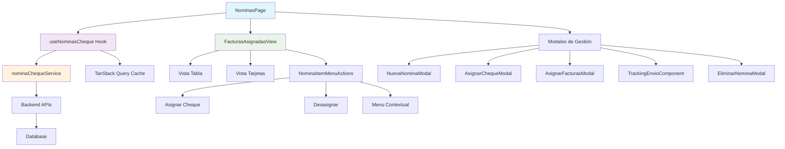
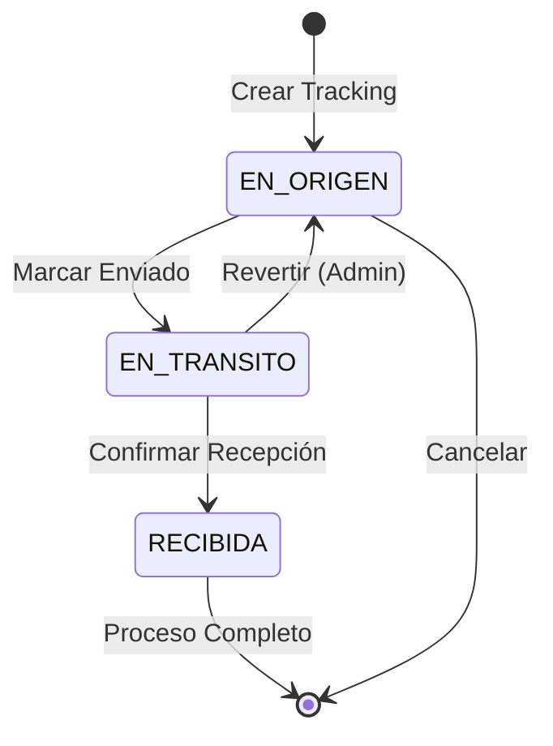

# 💰 Módulo de Nóminas - MH-Next

## 📋 **Resumen**

El **Módulo de Nóminas** es el sistema más complejo de MH-Next, encargado de gestionar la asignación de cheques a facturas, el tracking de envíos entre locales, y el control financiero de pagos a proveedores. Maneja tres tipos de nóminas: **cheques**, **facturas** y **mixtas**, con un flujo de trabajo sofisticado que incluye asignación, desasignación, tracking y reportes.

---

## 🏗️ **Arquitectura del Módulo**

### **Componentes Principales**



### **Tipos de Nóminas Soportadas**

| Tipo | Descripción | Uso Principal | Componentes |
|------|-------------|---------------|-------------|
| **cheques** | Nóminas tradicionales con cheques asignados | Pagos con cheques físicos | ChequeAsignado, AsignarChequeModal |
| **facturas** | Nóminas solo de facturas (sin cheques) | Pagos directos/transferencias | FacturaAsignada, AsignarFacturasModal |
| **mixta** | Combinación de facturas con/sin cheques | Flexibilidad máxima | Ambos componentes |

---

## 📁 **Estructura de Archivos**

```
src/
├── app/dashboard/nominas/
│   ├── layout.tsx              # Layout del módulo
│   └── page.tsx                # Página principal (1067 líneas)
├── components/dashboard/
│   ├── FacturasAsignadasView.tsx    # Vista principal de facturas
│   ├── NuevaNominaChequeModal.tsx   # Modal crear nómina
│   ├── AsignarChequeModal.tsx       # Modal asignar cheque
│   ├── AsignarFacturasModal.tsx     # Modal asignar facturas
│   ├── AsignarChequeAFacturaModal.tsx # Modal cheque a factura
│   └── TrackingEnvio.tsx           # Componente de tracking
├── components/nominas/
│   ├── NominaMenuActions.tsx       # Menú de acciones de nómina
│   ├── NominaItemMenuActions.tsx   # Menú de items (facturas/cheques)
│   └── EliminarNominaModal.tsx     # Modal eliminar nómina
├── hooks/
│   └── useNominasCheque.ts        # Hook principal (553 líneas)
├── services/
│   └── nominaChequeService.ts     # Servicio API (979 líneas)
└── types/
    └── nominaCheque.d.ts          # Definiciones TypeScript
```

---

## 🎯 **Funcionalidades Principales**

### **1. Gestión de Nóminas**

#### **Crear Nueva Nómina**
```typescript
interface CrearNominaRequest {
  numero_nomina: string;
  fecha_emision: string;
  local_origen: string;
  creado_por: string;
  tipo_nomina?: "cheques" | "facturas" | "mixta";
}

// Uso en el componente
const handleCrearNomina = async (request: CrearNominaRequest) => {
  try {
    const nuevaNomina = await crearNomina(request);
    showSnackbar("Nómina creada exitosamente", "success");
    setModalNuevaNominaOpen(false);
  } catch (error) {
    showSnackbar("Error al crear nómina", "error");
  }
};
```

#### **Estados de Nómina**

| Estado | Descripción | Color | Acciones Disponibles |
|--------|-------------|-------|---------------------|
| **pendiente** | Recién creada, sin tracking | `warning` | Asignar cheques, Crear tracking |
| **enviada** | En tránsito entre locales | `info` | Actualizar tracking, Ver detalles |
| **recibida** | Recibida en destino | `success` | Ver detalles, Generar reporte |

### **2. Sistema de Asignación de Cheques**

#### **Asignar Cheque a Nómina**
```typescript
interface AsignarChequeRequest {
  idCheque: number;
  montoAsignado: number;
  asignado_a_nomina: boolean;
}

// Flujo de asignación
const asignarCheque = async (nominaId: string, request: AsignarChequeRequest) => {
  // 1. Validar cheque disponible
  // 2. Asignar a nómina en backend
  // 3. Invalidar cache
  // 4. Actualizar UI
  // 5. Mostrar feedback
};
```

#### **Asignar Cheque a Factura Específica**
```typescript
interface AsignarChequeAFacturaRequest {
  chequeId: number;
  montoAsignado: number;
}

// Flujo más específico
const asignarChequeAFactura = async (
  nominaId: string, 
  facturaId: number, 
  request: AsignarChequeAFacturaRequest
) => {
  // 1. Validar factura existe en nómina
  // 2. Validar cheque disponible
  // 3. Crear relación cheque-factura
  // 4. Actualizar montos
  // 5. Invalidar múltiples caches
};
```

### **3. Sistema de Desasignación**

#### **Desasignación Inteligente**
```typescript
// El sistema detecta automáticamente el tipo de desasignación
const NominaItemMenuActions = ({ factura, tipoNomina }) => {
  const getMenuOptions = () => {
    switch (tipoNomina) {
      case "cheques":
        return factura.cheque ? ["Desasignar cheque"] : ["Asignar cheque"];
      case "facturas":
        return ["Desasignar factura"];
      case "mixta":
        return factura.cheque 
          ? ["Desasignar cheque", "Desasignar factura"]
          : ["Asignar cheque", "Desasignar factura"];
    }
  };
};
```

#### **Confirmación de Desasignación**
```typescript
// Dialog de confirmación con detalles específicos
const ConfirmationDialog = ({ item, type }) => (
  <Dialog open={confirmOpen}>
    <DialogTitle>Confirmar Desasignación</DialogTitle>
    <DialogContent>
      <Typography>
        ¿Está seguro de desasignar {type === 'cheque' ? 'el cheque' : 'la factura'}?
      </Typography>
      <Box sx={{ mt: 2, p: 2, bgcolor: 'background.paper', borderRadius: 1 }}>
        <Typography variant="body2">
          <strong>Folio:</strong> {item.folio}
        </Typography>
        <Typography variant="body2">
          <strong>Monto:</strong> {formatearMontoPesos(item.monto)}
        </Typography>
      </Box>
    </DialogContent>
    <DialogActions>
      <Button onClick={handleCancel}>Cancelar</Button>
      <Button onClick={handleConfirm} color="error">Desasignar</Button>
    </DialogActions>
  </Dialog>
);
```

---

## 📊 **Visualización de Datos**

### **FacturasAsignadasView Component**

#### **Vista de Tabla (Gestión Completa)**
```typescript
const TableView = ({ facturas, tipoNomina }) => (
  <TableContainer component={Paper}>
    <Table>
      <TableHead>
        <TableRow>
          <TableCell>Folio</TableCell>
          <TableCell>Proveedor</TableCell>
          <TableCell>Monto</TableCell>
          <TableCell>Estado</TableCell>
          <TableCell>Cheque</TableCell>
          <TableCell align="right">Acciones</TableCell>
        </TableRow>
      </TableHead>
      <TableBody>
        {facturas.map((factura) => (
          <TableRow key={factura.id}>
            <TableCell>{factura.folio}</TableCell>
            <TableCell>{factura.proveedor}</TableCell>
            <TableCell>{formatearMontoPesos(factura.monto)}</TableCell>
            <TableCell>
              <Chip 
                label={getEstadoLabel(factura.estado)} 
                color={getEstadoColor(factura.estado)}
                size="small"
              />
            </TableCell>
            <TableCell>
              {factura.cheque ? (
                <Chip 
                  label={`#${factura.cheque.correlativo}`}
                  color="info"
                  size="small"
                />
              ) : (
                <Typography variant="body2" color="text.secondary">
                  Sin cheque
                </Typography>
              )}
            </TableCell>
            <TableCell align="right">
              <NominaItemMenuActions
                factura={factura}
                tipoNomina={tipoNomina}
                onDesasignarFactura={handleDesasignarFactura}
                onDesasignarCheque={handleDesasignarCheque}
                onAsignarCheque={handleAsignarCheque}
              />
            </TableCell>
          </TableRow>
        ))}
      </TableBody>
    </Table>
  </TableContainer>
);
```

#### **Vista de Tarjetas (Solo Visual)**
```typescript
const CardView = ({ facturas }) => (
  <Box sx={{ 
    display: 'grid', 
    gridTemplateColumns: { xs: '1fr', sm: 'repeat(2, 1fr)', lg: 'repeat(3, 1fr)' },
    gap: 2 
  }}>
    {facturas.map((factura) => (
      <Paper key={factura.id} sx={{ p: 2, borderRadius: 2 }}>
        <Box sx={{ display: 'flex', justifyContent: 'space-between', mb: 1 }}>
          <Typography variant="h6" noWrap>
            {factura.folio}
          </Typography>
          <Chip 
            label={getEstadoLabel(factura.estado)} 
            color={getEstadoColor(factura.estado)}
            size="small"
          />
        </Box>
        
        <Typography variant="body2" color="text.secondary" gutterBottom>
          {factura.proveedor}
        </Typography>
        
        <Typography variant="h5" color="primary" gutterBottom>
          {formatearMontoPesos(factura.monto)}
        </Typography>
        
        {factura.cheque && (
          <Box sx={{ mt: 2, p: 1, bgcolor: 'info.light', borderRadius: 1 }}>
            <Typography variant="caption" color="info.contrastText">
              Cheque #{factura.cheque.correlativo}
            </Typography>
          </Box>
        )}
      </Paper>
    ))}
  </Box>
);
```

### **Alternador de Vistas**
```typescript
const ViewToggle = ({ view, onViewChange }) => (
  <Box sx={{ display: 'flex', gap: 1, mb: 2 }}>
    <Button
      variant={view === 'table' ? 'contained' : 'outlined'}
      startIcon={<ViewListIcon />}
      onClick={() => onViewChange('table')}
      size="small"
    >
      Tabla
    </Button>
    <Button
      variant={view === 'cards' ? 'contained' : 'outlined'}
      startIcon={<ViewModuleIcon />}
      onClick={() => onViewChange('cards')}
      size="small"
    >
      Tarjetas
    </Button>
  </Box>
);
```

---

## 🚚 **Sistema de Tracking de Envíos**

### **Estados de Tracking**



### **Componente TrackingEnvio**

```typescript
interface TrackingEnvio {
  id: string;
  estado: "EN_ORIGEN" | "EN_TRANSITO" | "RECIBIDA";
  localOrigen: string;
  localDestino: string;
  fechaEnvio?: string;
  fechaRecepcion?: string;
  observaciones?: string;
  enviadoPor?: string;
  recibidoPor?: string;
}

const TrackingEnvioComponent = ({ tracking, onUpdate }) => {
  const getEstadoInfo = (estado: string) => {
    switch (estado) {
      case "EN_ORIGEN":
        return { 
          label: "En Origen", 
          color: "warning", 
          icon: <InventoryIcon />,
          description: "Nómina preparada para envío"
        };
      case "EN_TRANSITO":
        return { 
          label: "En Tránsito", 
          color: "info", 
          icon: <LocalShippingIcon />,
          description: "Nómina enviada, esperando recepción"
        };
      case "RECIBIDA":
        return { 
          label: "Recibida", 
          color: "success", 
          icon: <CheckCircleIcon />,
          description: "Nómina recibida en destino"
        };
    }
  };

  return (
    <Card>
      <CardHeader
        avatar={<Avatar>{getEstadoInfo(tracking.estado).icon}</Avatar>}
        title={`Tracking: ${getEstadoInfo(tracking.estado).label}`}
        subheader={getEstadoInfo(tracking.estado).description}
      />
      <CardContent>
        <Timeline>
          <TimelineItem>
            <TimelineOppositeContent color="text.secondary">
              {tracking.fechaEnvio ? formatDate(tracking.fechaEnvio) : "Pendiente"}
            </TimelineOppositeContent>
            <TimelineSeparator>
              <TimelineDot color={tracking.estado !== "EN_ORIGEN" ? "success" : "grey"}>
                <SendIcon />
              </TimelineDot>
              <TimelineConnector />
            </TimelineSeparator>
            <TimelineContent>
              <Typography variant="h6">Enviado</Typography>
              <Typography color="text.secondary">
                Desde: {tracking.localOrigen}
              </Typography>
              {tracking.enviadoPor && (
                <Typography variant="body2">
                  Por: {tracking.enviadoPor}
                </Typography>
              )}
            </TimelineContent>
          </TimelineItem>
          
          <TimelineItem>
            <TimelineOppositeContent color="text.secondary">
              {tracking.fechaRecepcion ? formatDate(tracking.fechaRecepcion) : "Pendiente"}
            </TimelineOppositeContent>
            <TimelineSeparator>
              <TimelineDot color={tracking.estado === "RECIBIDA" ? "success" : "grey"}>
                <ReceiveIcon />
              </TimelineDot>
            </TimelineSeparator>
            <TimelineContent>
              <Typography variant="h6">Recibido</Typography>
              <Typography color="text.secondary">
                En: {tracking.localDestino}
              </Typography>
              {tracking.recibidoPor && (
                <Typography variant="body2">
                  Por: {tracking.recibidoPor}
                </Typography>
              )}
            </TimelineContent>
          </TimelineItem>
        </Timeline>
        
        {tracking.observaciones && (
          <Alert severity="info" sx={{ mt: 2 }}>
            <AlertTitle>Observaciones</AlertTitle>
            {tracking.observaciones}
          </Alert>
        )}
      </CardContent>
    </Card>
  );
};
```

### **Actualización de Tracking**

```typescript
const actualizarTracking = async (nominaId: string, data: ActualizarTrackingRequest) => {
  try {
    await nominaChequeService.actualizarTracking(nominaId, data);
    
    // Invalidar cache para refrescar datos
    queryClient.invalidateQueries({ queryKey: ["nomina", nominaId] });
    queryClient.invalidateQueries({ queryKey: ["nominas"] });
    
    showSnackbar("Tracking actualizado exitosamente", "success");
  } catch (error) {
    showSnackbar("Error al actualizar tracking", "error");
    throw error;
  }
};
```

---

## 🔧 **Hook Principal: useNominasCheque**

### **Estado del Hook**

```typescript
export const useNominasCheque = () => {
  // Estados principales
  const [nominas, setNominas] = useState<NominaCantera[]>([]);
  const [loading, setLoading] = useState(true);
  const [error, setError] = useState<string | null>(null);
  const [selectedNomina, setSelectedNomina] = useState<NominaCantera | null>(null);
  
  // Paginación
  const [pagination, setPagination] = useState<PaginationInfo>({
    page: 1,
    limit: 10,
    total: 0,
    hasNext: false
  });
  
  // Filtros
  const [filtros, setFiltros] = useState<FiltrosNominas>(initialFiltros);
};
```

### **Operaciones CRUD**

#### **Create - Crear Nómina**
```typescript
const crearNomina = useCallback(async (request: CrearNominaRequest) => {
  try {
    setLoading(true);
    setError(null);
    
    const nuevaNomina = await nominaChequeService.crearNomina(request);
    setNominas(prev => [nuevaNomina, ...prev]); // Prepend nueva nómina
    return nuevaNomina;
  } catch (err) {
    setError(err instanceof Error ? err.message : "Error al crear nómina");
    throw err;
  } finally {
    setLoading(false);
  }
}, []);
```

#### **Read - Cargar Nóminas**
```typescript
const loadNominas = useCallback(async (nuevosFiltros?: FiltrosNominas) => {
  try {
    setLoading(true);
    setError(null);
    
    const filtrosAplicar = nuevosFiltros || filtros;
    const resultado = await nominaChequeService.getNominas(filtrosAplicar);
    
    setNominas(resultado.nominas);
    setPagination(resultado.pagination);
    if (nuevosFiltros) setFiltros(filtrosAplicar);
  } catch (err) {
    setError(err instanceof Error ? err.message : "Error al cargar nóminas");
  } finally {
    setLoading(false);
  }
}, [filtros]);
```

#### **Update - Operaciones de Asignación**
```typescript
const asignarCheque = useCallback(async (nominaId: string, request: AsignarChequeRequest) => {
  try {
    setError(null);
    
    await nominaChequeService.asignarCheque(nominaId, request);
    
    // Invalidar caches relevantes
    queryClient.invalidateQueries({ queryKey: ["cheques", "disponibles"] });
    queryClient.invalidateQueries({ queryKey: ["nomina", nominaId] });
    
    // Recargar nómina si está seleccionada
    if (selectedNomina?.id === nominaId) {
      await loadNomina(nominaId);
    }
    
    // Refrescar lista
    await loadNominas();
  } catch (err) {
    setError(err instanceof Error ? err.message : "Error al asignar cheque");
    throw err;
  }
}, [selectedNomina?.id, loadNomina, loadNominas, queryClient]);
```

#### **Delete - Operaciones de Desasignación**
```typescript
const desasignarCheque = useCallback(async (nominaId: string, chequeId: number) => {
  try {
    setError(null);
    
    await nominaChequeService.desasignarCheque(nominaId, chequeId);
    
    // Invalidar cache para recargar datos
    queryClient.invalidateQueries({ queryKey: ["nominas_list"] });
    queryClient.invalidateQueries({ queryKey: ["nomina:", nominaId] });
    
    // Actualizar nómina seleccionada
    if (selectedNomina?.id === nominaId) {
      await loadNomina(nominaId);
    }
    
    await loadNominas();
  } catch (err) {
    setError(err instanceof Error ? err.message : "Error al desasignar cheque");
    throw err;
  }
}, [selectedNomina?.id, loadNomina, loadNominas, queryClient]);
```

### **Sistema de Filtros y Paginación**

```typescript
// Aplicar filtros
const aplicarFiltros = useCallback(async (nuevosFiltros: Partial<FiltrosNominas>) => {
  const filtrosCompletos = { ...filtros, ...nuevosFiltros, page: 1 }; // Reset page
  await loadNominas(filtrosCompletos);
}, [filtros, loadNominas]);

// Cambiar página
const cambiarPagina = useCallback(async (nuevaPagina: number) => {
  const nuevosFiltros = { ...filtros, page: nuevaPagina };
  await loadNominas(nuevosFiltros);
}, [filtros, loadNominas]);

// Cambiar límite por página
const cambiarLimite = useCallback(async (nuevoLimite: number) => {
  const nuevosFiltros = { ...filtros, limit: nuevoLimite, page: 1 };
  await loadNominas(nuevosFiltros);
}, [filtros, loadNominas]);

// Limpiar filtros
const limpiarFiltros = useCallback(async () => {
  await loadNominas(initialFiltros);
}, [loadNominas]);
```

---

## 🌐 **Integración con Backend**

### **Endpoints Principales**

| Método | Endpoint | Propósito | Parámetros |
|--------|----------|-----------|------------|
| `GET` | `/api-beta/nominas` | Listar nóminas con filtros | page, limit, tipo, estado |
| `GET` | `/api-beta/nominas/:id` | Obtener nómina completa | nominaId |
| `POST` | `/api-beta/nominas` | Crear nueva nómina | CrearNominaRequest |
| `POST` | `/api-beta/nominas/:id/cheques` | Asignar cheque a nómina | AsignarChequeRequest |
| `DELETE` | `/api-beta/nominas/:id/cheques/:chequeId` | Desasignar cheque | nominaId, chequeId |
| `DELETE` | `/api-beta/nominas/:id/facturas/:facturaId` | Desasignar factura | nominaId, facturaId |
| `PUT` | `/api-beta/nominas/:id/tracking` | Actualizar tracking | ActualizarTrackingRequest |
| `DELETE` | `/api-beta/nominas/:id` | Eliminar nómina | nominaId |

### **Transformación de Datos**

```typescript
// El servicio transforma respuestas del backend a tipos internos
const transformNominaResponse = (response: NominaCanteraResponse): NominaCantera => {
  // Parsear monto total
  const montoTotal = parseFloat(response.monto_total?.toString() || '0');
  
  // Determinar estado basado en tracking
  let estado: EstadoNomina = "pendiente";
  if (response.tracking_envio) {
    switch (response.tracking_envio.estado) {
      case "RECIBIDA": estado = "recibida"; break;
      case "EN_TRANSITO": estado = "enviada"; break;
      case "EN_ORIGEN": 
      default: estado = "pendiente"; break;
    }
  }
  
  // Transformar cheques
  const transformedCheques = response.cheques?.map(cheque => ({
    id: cheque.id?.toString() || '0',
    correlativo: cheque.correlativo || '',
    monto: parseFloat(cheque.monto?.toString() || '0'),
    montoAsignado: parseFloat(cheque.monto_asignado?.toString() || '0'),
    estado: "ASIGNADO" as const,
    // ... más propiedades
  }));
  
  // Transformar facturas asignadas
  const transformedFacturas = response.facturas_asignadas?.map(factura => ({
    id: factura.id?.toString() || '0',
    folio: factura.folio || '',
    proveedor: factura.nombre_proveedor || '',
    monto: parseFloat(factura.monto_factura?.toString() || '0'),
    // ... más propiedades
  }));
  
  return {
    id: response.id?.toString() || '0',
    numeroNomina: response.numero_nomina || '',
    fechaEmision: response.fecha_emision || '',
    estado,
    localOrigen: response.local_origen || '',
    creadoPor: response.creado_por || '',
    montoTotal,
    cantidadCheques: response.cantidad_cheques || 0,
    tipoNomina: response.tipo_nomina as TipoNomina || "cheques",
    cheques: transformedCheques,
    facturas: transformedFacturas,
    trackingEnvio: response.tracking_envio,
    // ... más propiedades
  };
};
```

### **Manejo de Errores**

```typescript
// Error handling en el servicio
const handleApiError = (error: any, operation: string) => {
  console.error(`❌ Error en ${operation}:`, error);
  
  if (error.response?.status === 401) {
    // Token expirado - redirigir a login
    window.location.href = '/login';
    return;
  }
  
  if (error.response?.status === 403) {
    throw new Error('No tienes permisos para realizar esta acción');
  }
  
  if (error.response?.status === 404) {
    throw new Error('Recurso no encontrado');
  }
  
  if (error.response?.status >= 500) {
    throw new Error('Error interno del servidor. Intenta nuevamente.');
  }
  
  throw new Error(error.message || `Error en ${operation}`);
};
```

---

## 📱 **Responsive Design**

### **Adaptaciones por Dispositivo**

#### **Mobile (< 600px)**
- 📱 **Vista por defecto**: Tarjetas en lugar de tabla
- 🔽 **Menús colapsados**: Filtros en acordeón
- 👆 **Touch-friendly**: Botones más grandes
- 📊 **Una columna**: Grid de tarjetas en 1 columna

#### **Tablet (600px - 900px)**
- 📱 **Vista híbrida**: Tabla simplificada o tarjetas en 2 columnas
- 🔄 **Alternador visible**: Botones tabla/tarjetas
- 📊 **Grid adaptativo**: 2 columnas en tarjetas

#### **Desktop (> 900px)**
- 🖥️ **Vista completa**: Tabla con todas las columnas
- 🎯 **Hover effects**: Interacciones avanzadas
- 📊 **Grid completo**: 3+ columnas en tarjetas
- ⚡ **Funcionalidad completa**: Todos los menús visibles

### **Implementación Responsive**

```typescript
const NominasPage = () => {
  const theme = useTheme();
  const isMobile = useMediaQuery(theme.breakpoints.down('sm'));
  const isTablet = useMediaQuery(theme.breakpoints.down('md'));
  
  return (
    <Box sx={{ p: { xs: 1, sm: 2, md: 3 } }}>
      {/* Header responsive */}
      <Stack 
        direction={{ xs: 'column', sm: 'row' }}
        justifyContent="space-between"
        alignItems={{ xs: 'stretch', sm: 'center' }}
        spacing={2}
        sx={{ mb: 3 }}
      >
        <Typography variant={isMobile ? 'h5' : 'h4'} fontWeight="bold">
          Nóminas
        </Typography>
        
        <Button
          variant="contained"
          startIcon={<AddIcon />}
          size={isMobile ? 'medium' : 'large'}
          fullWidth={isMobile}
          onClick={() => setModalNuevaNominaOpen(true)}
        >
          Nueva Nómina
        </Button>
      </Stack>
      
      {/* Filtros responsive */}
      <Collapse in={showFilters}>
        <Paper sx={{ p: 2, mb: 2 }}>
          <Stack 
            direction={{ xs: 'column', md: 'row' }}
            spacing={2}
            alignItems={{ xs: 'stretch', md: 'center' }}
          >
            {/* Filtros aquí */}
          </Stack>
        </Paper>
      </Collapse>
      
      {/* Vista principal */}
      <FacturasAsignadasView
        facturas={selectedNomina?.facturas || []}
        tipoNomina={selectedNomina?.tipoNomina || "cheques"}
        defaultView={isMobile ? 'cards' : 'table'}
        // ... props
      />
    </Box>
  );
};
```

---

## ⚡ **Optimizaciones de Performance**

### **1. Cache Strategy con TanStack Query**

```typescript
// Configuración de cache por tipo de dato
const CACHE_CONFIG = {
  nominas: {
    staleTime: 2 * 60 * 1000,      // 2 minutos
    cacheTime: 5 * 60 * 1000,      // 5 minutos
  },
  cheques: {
    staleTime: 30 * 1000,          // 30 segundos (datos dinámicos)
    cacheTime: 2 * 60 * 1000,      // 2 minutos
  },
  facturas: {
    staleTime: 1 * 60 * 1000,      // 1 minuto
    cacheTime: 3 * 60 * 1000,      // 3 minutos
  }
};

// Invalidación inteligente de cache
const invalidateRelatedCaches = (operationType: string, nominaId: string) => {
  switch (operationType) {
    case 'asignar_cheque':
      queryClient.invalidateQueries({ queryKey: ["cheques", "disponibles"] });
      queryClient.invalidateQueries({ queryKey: ["nomina", nominaId] });
      queryClient.invalidateQueries({ queryKey: ["nominas"] });
      break;
      
    case 'desasignar_factura':
      queryClient.invalidateQueries({ queryKey: ["facturas", "disponibles"] });
      queryClient.invalidateQueries({ queryKey: ["nomina", nominaId] });
      break;
      
    default:
      queryClient.invalidateQueries({ queryKey: ["nominas"] });
  }
};
```

### **2. Optimistic Updates**

```typescript
const asignarChequeOptimistic = async (nominaId: string, request: AsignarChequeRequest) => {
  // 1. Update optimista de UI
  const previousNominas = queryClient.getQueryData(['nominas']);
  
  queryClient.setQueryData(['nominas'], (old: NominaCantera[]) =>
    old?.map(nomina =>
      nomina.id === nominaId
        ? { ...nomina, cantidadCheques: nomina.cantidadCheques + 1 }
        : nomina
    )
  );
  
  try {
    // 2. Request al backend
    await nominaChequeService.asignarCheque(nominaId, request);
  } catch (error) {
    // 3. Rollback en caso de error
    queryClient.setQueryData(['nominas'], previousNominas);
    throw error;
  }
};
```

### **3. Lazy Loading de Modales**

```typescript
// Lazy loading de componentes pesados
const AsignarChequeModal = lazy(() => import('@/components/dashboard/AsignarChequeModal'));
const TrackingEnvioComponent = lazy(() => import('@/components/dashboard/TrackingEnvio'));

// Uso con Suspense
const ModalesContainer = () => (
  <Suspense fallback={<CircularProgress />}>
    {modalAsignarOpen && (
      <AsignarChequeModal
        open={modalAsignarOpen}
        onClose={() => setModalAsignarOpen(false)}
        // ... props
      />
    )}
  </Suspense>
);
```

### **4. Memoización de Componentes**

```typescript
// Memoizar componentes pesados
const MemoizedFacturasAsignadasView = memo(FacturasAsignadasView, (prevProps, nextProps) => {
  return (
    prevProps.facturas.length === nextProps.facturas.length &&
    prevProps.tipoNomina === nextProps.tipoNomina &&
    JSON.stringify(prevProps.facturas) === JSON.stringify(nextProps.facturas)
  );
});

// Memoizar callbacks
const handleAsignarCheque = useCallback((factura: FacturaAsignada) => {
  setFacturaSeleccionada(factura);
  setModalAsignarChequeAFacturaOpen(true);
}, []);
```

---

## 🎨 **Sistema de Estados Visuales**

### **Colores por Estado**

```typescript
const getEstadoColor = (estado: string): 'default' | 'primary' | 'secondary' | 'error' | 'info' | 'success' | 'warning' => {
  switch (estado) {
    case 'pendiente': return 'warning';
    case 'enviada': return 'info';
    case 'recibida': return 'success';
    default: return 'default';
  }
};

const getEstadoLabel = (estado: string): string => {
  switch (estado) {
    case 'pendiente': return 'Pendiente';
    case 'enviada': return 'En Tránsito';
    case 'recibida': return 'Recibida';
    default: return 'Desconocido';
  }
};
```

### **Iconografía Consistente**

```typescript
const getEstadoIcon = (estado: string) => {
  switch (estado) {
    case 'pendiente': return <PendingIcon />;
    case 'enviada': return <LocalShippingIcon />;
    case 'recibida': return <CheckCircleIcon />;
    default: return <HelpIcon />;
  }
};
```

### **Animaciones de Transición**

```typescript
// Animaciones para cambios de estado
const EstadoChip = ({ estado, prevEstado }) => {
  const shouldAnimate = estado !== prevEstado;
  
  return (
    <AnimatePresence mode="wait">
      <motion.div
        key={estado}
        initial={shouldAnimate ? { scale: 0.8, opacity: 0 } : false}
        animate={{ scale: 1, opacity: 1 }}
        exit={{ scale: 0.8, opacity: 0 }}
        transition={{ duration: 0.2 }}
      >
        <Chip
          label={getEstadoLabel(estado)}
          color={getEstadoColor(estado)}
          icon={getEstadoIcon(estado)}
          size="small"
        />
      </motion.div>
    </AnimatePresence>
  );
};
```

---

## 🔒 **Seguridad y Validaciones**

### **Validaciones de Negocio**

```typescript
// Validaciones antes de asignar cheque
const validarAsignacionCheque = (nomina: NominaCantera, cheque: ChequeAsignado): ValidationResult => {
  const errors: string[] = [];
  
  // 1. Verificar que la nómina esté en estado válido
  if (!['pendiente', 'enviada'].includes(nomina.estado)) {
    errors.push('No se puede asignar cheques a nóminas en este estado');
  }
  
  // 2. Verificar que el cheque esté disponible
  if (cheque.estado !== 'DISPONIBLE') {
    errors.push('El cheque no está disponible para asignación');
  }
  
  // 3. Verificar montos
  if (cheque.monto <= 0) {
    errors.push('El monto del cheque debe ser mayor a cero');
  }
  
  // 4. Verificar límites de la nómina
  const montoTotalConNuevoCheque = nomina.montoTotal + cheque.monto;
  const LIMITE_NOMINA = 10000000; // 10M CLP
  
  if (montoTotalConNuevoCheque > LIMITE_NOMINA) {
    errors.push(`El monto total excedería el límite de ${formatearMontoPesos(LIMITE_NOMINA)}`);
  }
  
  return {
    isValid: errors.length === 0,
    errors
  };
};

// Uso en el componente
const handleAsignarCheque = async (request: AsignarChequeRequest) => {
  const validation = validarAsignacionCheque(selectedNomina, selectedCheque);
  
  if (!validation.isValid) {
    setSnackbarMessage(validation.errors.join('. '));
    setSnackbarSeverity('error');
    setSnackbarOpen(true);
    return;
  }
  
  // Proceder con la asignación
  await asignarCheque(selectedNomina.id, request);
};
```

### **Control de Acceso por Roles**

```typescript
// Verificar permisos para operaciones específicas
const canPerformOperation = (operation: string, user: Usuario, nomina: NominaCantera): boolean => {
  switch (operation) {
    case 'crear_nomina':
      return user.rol_id <= ROLES.SUPERVISOR; // Admin o Supervisor
      
    case 'eliminar_nomina':
      return user.rol_id === ROLES.ADMIN; // Solo Admin
      
    case 'asignar_cheque':
      return user.rol_id <= ROLES.SUPERVISOR && 
             nomina.localOrigen === user.local_nombre;
             
    case 'actualizar_tracking':
      return user.rol_id <= ROLES.SUPERVISOR;
      
    default:
      return false;
  }
};

// Uso en componentes
const ActionButton = ({ operation, nomina, children, onClick }) => {
  const { usuario } = useAuth();
  const canPerform = canPerformOperation(operation, usuario, nomina);
  
  return (
    <Button
      disabled={!canPerform}
      onClick={canPerform ? onClick : undefined}
      title={!canPerform ? 'No tienes permisos para esta acción' : ''}
    >
      {children}
    </Button>
  );
};
```
---

## 🚨 **Troubleshooting**

### **Problemas Comunes**

#### **1. Error al asignar cheque**
```typescript
// Diagnóstico
const diagnosticarErrorAsignacion = (error: any) => {
  if (error.response?.status === 409) {
    return 'El cheque ya está asignado a otra nómina';
  }
  if (error.response?.status === 400) {
    return 'Datos de asignación inválidos';
  }
  if (error.message.includes('monto')) {
    return 'Error en validación de montos';
  }
  return 'Error desconocido en asignación';
};
```

#### **2. Cache desactualizado**
```bash
# Limpiar cache específico
queryClient.invalidateQueries({ queryKey: ["nominas"] });
queryClient.removeQueries({ queryKey: ["nomina", nominaId] });

# Limpiar todo el cache del módulo
queryClient.clear();
```

#### **3. Performance lenta**
```typescript
// Verificar queries lentas
const slowQueries = queryClient.getQueriesData({
  predicate: (query) => query.state.fetchStatus === 'fetching'
});

// Optimizar queries pesadas
const optimizeQuery = {
  queryKey: ['nominas'],
  queryFn: getNominas,
  staleTime: 5 * 60 * 1000, // Aumentar stale time
  select: (data) => data.slice(0, 50), // Limitar datos
};
```

#### **4. Estados inconsistentes**
```typescript
// Verificar sincronización de estados
const verificarConsistencia = (nomina: NominaCantera) => {
  const issues: string[] = [];
  
  // Verificar que la suma de cheques coincida
  const montoChequesCalculado = nomina.cheques?.reduce((sum, cheque) => sum + cheque.monto, 0) || 0;
  if (Math.abs(montoChequesCalculado - nomina.montoTotal) > 0.01) {
    issues.push('Inconsistencia en montos de cheques');
  }
  
  // Verificar estado vs tracking
  if (nomina.trackingEnvio?.estado === 'RECIBIDA' && nomina.estado !== 'recibida') {
    issues.push('Estado de nómina no coincide con tracking');
  }
  
  return issues;
};
```

---

## 🔮 **Roadmap y Mejoras Futuras**

### **Corto Plazo (1-3 meses)**

#### **Funcionalidades**
- [ ] **Bulk Operations**: Asignar múltiples cheques de una vez
- [ ] **Templates de Nóminas**: Plantillas predefinidas
- [ ] **Notificaciones Push**: Alertas de cambios de estado
- [ ] **Export/Import**: Excel/CSV de nóminas

#### **UX/UI**
- [ ] **Drag & Drop**: Asignar cheques arrastrando
- [ ] **Filtros Avanzados**: Filtros por fecha, monto, usuario
- [ ] **Vista Kanban**: Board de estados de nóminas
- [ ] **Dark Mode**: Soporte completo para tema oscuro

### **Medio Plazo (3-6 meses)**

#### **Integración**
- [ ] **API REST Completa**: Endpoints para integraciones externas
- [ ] **Webhooks**: Notificaciones automáticas de cambios
- [ ] **Sincronización Offline**: PWA con sync cuando vuelve conexión
- [ ] **Mobile App**: App nativa para tracking móvil

#### **Analytics**
- [ ] **Dashboard Avanzado**: Gráficos interactivos con Chart.js
- [ ] **Reportes Automáticos**: Generación programada de reportes
- [ ] **Predicciones**: ML para predecir tiempos de procesamiento
- [ ] **Alertas Inteligentes**: Notificaciones basadas en patrones

### **Largo Plazo (6+ meses)**

#### **Arquitectura**
- [ ] **Microservicios**: Separar nóminas en servicio independiente
- [ ] **Event Sourcing**: Historial completo de cambios
- [ ] **CQRS**: Separar comandos de consultas
- [ ] **GraphQL**: API más eficiente para queries complejas

#### **AI/ML**
- [ ] **Asignación Automática**: IA para asignar cheques óptimamente
- [ ] **Detección de Anomalías**: Alertas de patrones inusuales
- [ ] **Optimización de Rutas**: Mejor tracking de envíos
- [ ] **Chatbot**: Asistente para consultas de nóminas

---

## 📚 **Documentación Relacionada**

### **Técnica**
- 🏗️ **[Arquitectura General](../architecture/overview.md)** - Patrones del sistema
- 🔐 **[Autenticación](../critical-refactoring/auth-migration-nextauth.md)** - Sistema de auth
- 🏠 **[Dashboard](./dashboard.md)** - Navegación y layout
- 🧩 **[Componentes](../components/ui-components.md)** - Componentes reutilizables

### **APIs y Servicios**
- 📡 **Backend Integration**: Endpoints y transformaciones
- 🔄 **TanStack Query**: Cache y estado del servidor
- 📊 **TypeScript Types**: Definiciones de tipos

### **Testing**
- 🧪 **Unit Tests**: Tests de hooks y servicios
- 🔧 **Integration Tests**: Tests de flujos completos
- 📱 **E2E Tests**: Tests de interfaz de usuario

---

*Documentación actualizada: Septiembre 2025*   
*Módulo más complejo: 1,067 líneas de código en página principal*
