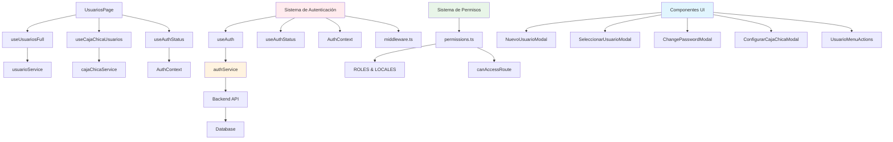
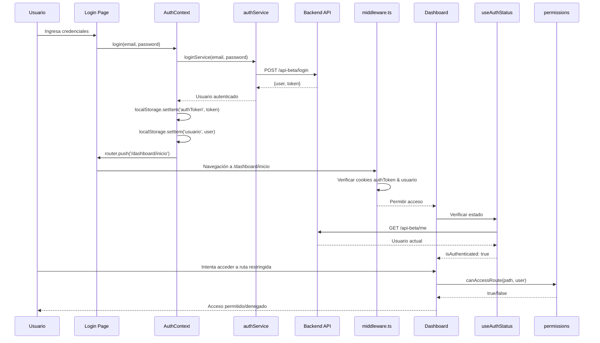

# 👥 Módulo de Usuarios - MH-Next

## 📋 **Resumen**

El **Módulo de Usuarios** es el sistema central de autenticación, autorización y gestión de usuarios de Mercadohouse. Maneja roles jerárquicos (Admin, Supervisor, Empleado), permisos granulares por ruta y local, autenticación mixta (localStorage + cookies), y gestión avanzada de caja chica por usuario. Es el núcleo de seguridad del sistema con patrones de autenticación distribuidos que requieren refactoring crítico.

---

## 🏗️ **Arquitectura del Módulo**

### **Componentes Principales**



### **Flujo de Autenticación Completo**



---

## 📁 **Estructura de Archivos**

```
src/
├── app/dashboard/usuarios/
│   ├── layout.tsx              # Layout del módulo
│   └── page.tsx                # Página principal (272 líneas)
├── hooks/
│   ├── useAuth.ts              # Hook principal de autenticación (110 líneas)
│   ├── useAuthStatus.ts        # Hook de estado de auth (103 líneas)
│   ├── useUsuarios.ts          # Hook para usuarios básicos (13 líneas)
│   ├── useUsuariosFull.ts      # Hook para usuarios completos (30 líneas)
│   └── useCajaChicaUsuarios.ts # Hook para gestión caja chica (104 líneas)
├── context/
│   └── AuthContext.tsx         # Contexto de autenticación
├── services/
│   ├── authService.ts          # Servicio de autenticación
│   ├── usuarioService.ts       # Servicio de usuarios (66 líneas)
│   └── cajaChicaService.ts     # Servicio de caja chica
├── components/usuarios/
│   ├── NuevoUsuarioModal.tsx   # Modal crear usuario (138 líneas)
│   ├── SeleccionarUsuarioModal.tsx # Modal selección (310 líneas)
│   ├── ChangePasswordModal.tsx # Modal cambio password (269 líneas)
│   ├── ConfigurarCajaChicaModal.tsx # Modal caja chica
│   └── UsuarioMenuActions.tsx  # Menú de acciones
├── utils/
│   └── permissions.ts          # Sistema de permisos (67 líneas)
├── middleware.ts               # Middleware Next.js
└── types/
    └── (Interfaces distribuidas en varios archivos)
```

---

## 👤 **Sistema de Usuarios y Roles**

### **Jerarquía de Roles**

| Rol | ID | Descripción | Permisos | Restricciones |
|-----|----|-----------|---------|--------------| 
| **Administrador** | 1 | Control total del sistema | • Acceso a todas las rutas<br>• Crear/editar usuarios<br>• Configurar caja chica<br>• Ver todos los locales | Ninguna |
| **Supervisor** | 2 | Gestión de local específico | • Acceso a módulos de su local<br>• Ver reportes locales<br>• Gestionar empleados locales | Solo su local asignado |
| **Empleado** | 3 | Operaciones básicas | • Rinde gastos<br>• Ver facturas básicas<br>• Operaciones limitadas | Solo su local<br>Sin acceso administrativo |

### **Estructura de Usuario**

```typescript
// Usuario básico (para listas)
export interface Usuario {
  id: number;
  nombre: string;
  whatsapp_id: string;
}

// Usuario completo (para gestión)
export interface UsuarioFull {
  id_auth_user: number;        // ID de autenticación
  email: string;               // Email único
  rol_id: number;             // 1=Admin, 2=Supervisor, 3=Empleado
  id_usuario: number | null;   // ID relacionado (puede ser null)
  nombre: string | null;       // Nombre completo
  whatsapp_id: string | null;  // ID de WhatsApp
}

// Usuario autenticado (contexto)
export interface UsuarioAuth {
  id_auth_user: number;
  email: string;
  usuario_id: number | null;
  rol_id: number;
  nombre: string | null;
  whatsapp_id: string | null;
  id_local: number | null;     // Local asignado
}

// Usuario con estado completo (useAuthStatus)
export interface Usuario {
  id_auth_user: number;
  usuario_id: number | null;
  rol_id: number;
  nombre: string;
  email: string;
  local_id: number;
  local_nombre: string;
}
```

### **Locales del Sistema**

```typescript
export const locales = [
  { id: 1, nombre: "LA CANTERA 3055" },
  { id: 2, nombre: "LIBERTADOR 1476" },
  { id: 3, nombre: "BALMACEDA 599" },
];

export const LOCALES = {
  LOCAL_1: 1,  // LA CANTERA 3055
  LOCAL_2: 2,  // LIBERTADOR 1476
  LOCAL_3: 3,  // BALMACEDA 599
} as const;
```

---

## 🔐 **Sistema de Autenticación (Mixto - CRÍTICO)**

### **⚠️ Problema Crítico: Patrones Mixtos**

El sistema actual usa **múltiples patrones de autenticación** que generan inconsistencias:

1. **localStorage** para tokens
2. **Cookies** para middleware
3. **Context API** para estado global
4. **useAuthStatus** para verificación
5. **useAuth** para operaciones

### **Patrón Actual - useAuth**

```typescript
export const useAuth = () => {
  const router = useRouter();
  const [loading, setLoading] = useState(false);
  const [usuario, setUsuario] = useState<UsuarioAuth | null>(null);

  // Cargar usuario desde API
  const loadUsuario = useCallback(async () => {
    try {
      const { user } = await getUsuarioAutenticado();
      setUsuario(user);
      localStorage.setItem("usuario", JSON.stringify(user));
    } catch (err) {
      console.error("No se pudo cargar el usuario:", err);
      saveLocalAuth(null, null);
    }
  }, []);

  // Inicialización desde localStorage
  useEffect(() => {
    const storedToken = localStorage.getItem("authToken");
    const storedUser = localStorage.getItem("usuario");
    
    if (storedToken) setAuthHeader(storedToken);
    
    if (storedUser) {
      setUsuario(JSON.parse(storedUser));
    } else if (storedToken) {
      loadUsuario();
    }
  }, [loadUsuario]);

  // Login con redirección
  const login = async (email: string, password: string): Promise<LoginResult> => {
    setLoading(true);
    try {
      const { token, user } = await loginService(email, password);
      
      // Guardar en localStorage
      saveLocalAuth(user, token);
      localStorage.setItem("showLoginMessage", "true");
      
      router.push("/dashboard/inicio");
      return { success: true, message: "Inicio de sesión exitoso." };
    } catch (err) {
      const error = err as AxiosError<{ message?: string }>;
      const message = error.response?.data?.message ?? "Error desconocido";
      return { success: false, message };
    } finally {
      setLoading(false);
    }
  };

  // Logout con limpieza
  const logout = async () => {
    try {
      await logoutService();
    } catch (err) {
      console.error("Error cerrando sesión:", err);
    } finally {
      saveLocalAuth(null, null);
      localStorage.setItem("showLogoutMessage", "true");
      router.push("/login");
    }
  };

  return { login, logout, loading, usuario, loadUsuario };
};
```

### **Patrón Actual - useAuthStatus**

```typescript
export const useAuthStatus = (): AuthStatus => {
  const [isAuthenticated, setIsAuthenticated] = useState(false);
  const [isLoading, setIsLoading] = useState(true);
  const [usuario, setUsuario] = useState<Usuario | undefined>();
  const [id, setId] = useState<number | undefined>();
  const [usuario_id, setUsuarioId] = useState<number | null>(null);
  const [rol_id, setRolId] = useState<number | undefined>();
  const router = useRouter();

  useEffect(() => {
    // Configurar token en axios
    const token = localStorage.getItem("authToken");
    if (token) {
      axios.defaults.headers.common["Authorization"] = `Bearer ${token}`;
    }

    const checkAuth = async () => {
      try {
        // Verificar con el backend
        const { data } = await axios.get(`${API_URL}/api-beta/me`, {
          withCredentials: true,
        });
        const user = data.user;
        
        // Crear objeto usuario completo
        const usuarioCompleto: Usuario = {
          id_auth_user: user.id_auth_user,
          usuario_id: user.usuario_id,
          rol_id: user.rol_id,
          nombre: user.nombre || user.name || "Usuario",
          email: user.email || "",
          local_id: user.id_local || 1,
          local_nombre: user.local_nombre || "LA CANTERA 3055",
        };
        
        setIsAuthenticated(true);
        setUsuario(usuarioCompleto);
        setId(user.id_auth_user);
        setUsuarioId(user.usuario_id);
        setRolId(user.rol_id);
      } catch (error) {
        const axiosError = error as AxiosError;
        
        // Manejar errores de autenticación
        if (axiosError.response?.status === 403 || axiosError.response?.status === 401) {
          clearAuthData();
          setIsAuthenticated(false);
          router.push("/login");
        }
      } finally {
        setIsLoading(false);
      }
    };

    checkAuth();
  }, [router]);

  return { isAuthenticated, isLoading, usuario, id, usuario_id, rol_id };
};
```

### **Middleware de Next.js**

```typescript
// middleware.ts
import { NextResponse } from 'next/server'
import type { NextRequest } from 'next/server'

export function middleware(request: NextRequest) {
  const token = request.cookies.get('authToken')?.value
  const user = request.cookies.get('usuario')?.value
  const isLoginPage = request.nextUrl.pathname === '/login'

  // Si está en login y tiene token, redirigir a dashboard
  if (isLoginPage && token && user) {
    return NextResponse.redirect(new URL('/dashboard/inicio', request.url))
  }

  // Si no está en login, no tiene token y trata de acceder a dashboard
  if (!isLoginPage && !token && request.nextUrl.pathname.startsWith('/dashboard')) {
    return NextResponse.redirect(new URL('/login', request.url))
  }

  return NextResponse.next()
}

export const config = {
  matcher: ['/login', '/dashboard/:path*']
}
```

### **Limpieza de Datos de Autenticación**

```typescript
const clearAuthData = () => {
  // Limpiar localStorage
  localStorage.removeItem("authToken");
  localStorage.removeItem("usuario");
  
  // Limpiar cookies
  document.cookie = "authToken=; expires=Thu, 01 Jan 1970 00:00:00 UTC; path=/;";
  document.cookie = "usuario=; expires=Thu, 01 Jan 1970 00:00:00 UTC; path=/;";
  
  // Limpiar headers de axios
  delete axios.defaults.headers.common["Authorization"];
};
```

---

## 🔑 **Sistema de Permisos Granulares**

### **Definición de Roles y Locales**

```typescript
export const ROLES = {
  ADMIN: 1,
  SUPERVISOR: 2,
  EMPLEADO: 3,
} as const;

export const LOCALES = {
  LOCAL_1: 1,  // LA CANTERA 3055
  LOCAL_2: 2,  // LIBERTADOR 1476
  LOCAL_3: 3,  // BALMACEDA 599
} as const;

export interface AuthLikeUser {
  rol_id?: number;
  id_local?: number | null;
}
```

### **Funciones de Verificación de Roles**

```typescript
export const isAdmin = (user?: AuthLikeUser): boolean =>
  user?.rol_id === ROLES.ADMIN;

export const isSupervisor = (user?: AuthLikeUser): boolean =>
  user?.rol_id === ROLES.SUPERVISOR;

export const isEmpleado = (user?: AuthLikeUser): boolean =>
  user?.rol_id === ROLES.EMPLEADO;

export const isLocal = (user?: AuthLikeUser, localId?: number): boolean => {
  if (localId == null) return false;
  return user?.id_local === localId;
};

// Política para rutas restringidas (Admin o Local 1)
export const canAccessRestrictedRoutes = (user?: AuthLikeUser): boolean => {
  return Boolean(user) && (isAdmin(user) || isLocal(user, LOCALES.LOCAL_1));
};
```

### **Reglas de Rutas Específicas**

```typescript
export interface RouteRule {
  allowedRoles?: number[];     // Roles permitidos
  allowedLocales?: number[];   // Locales permitidos
}

export const ROUTE_RULES: Record<string, RouteRule> = {
  // Rutas solo para Supervisor en Local 1
  "/dashboard/auditoria-carteleria": { 
    allowedRoles: [ROLES.SUPERVISOR], 
    allowedLocales: [LOCALES.LOCAL_1] 
  },
  "/dashboard/vencimientos": { 
    allowedRoles: [ROLES.SUPERVISOR], 
    allowedLocales: [LOCALES.LOCAL_1] 
  },
  "/dashboard/control-vencimientos": { 
    allowedRoles: [ROLES.SUPERVISOR], 
    allowedLocales: [LOCALES.LOCAL_1] 
  },
  "/dashboard/zebrai": { 
    allowedRoles: [ROLES.SUPERVISOR], 
    allowedLocales: [LOCALES.LOCAL_1] 
  },
  "/dashboard/lector-dte": { 
    allowedRoles: [ROLES.SUPERVISOR], 
    allowedLocales: [LOCALES.LOCAL_1] 
  },
  
  // Rutas de bodega (Supervisor en Local 1)
  "/dashboard/bodega/inicio": { 
    allowedRoles: [ROLES.SUPERVISOR], 
    allowedLocales: [LOCALES.LOCAL_1] 
  },
  "/dashboard/bodega/nuevo-movimiento": { 
    allowedRoles: [ROLES.SUPERVISOR], 
    allowedLocales: [LOCALES.LOCAL_1] 
  },
  "/dashboard/bodega/stock-general": { 
    allowedRoles: [ROLES.SUPERVISOR], 
    allowedLocales: [LOCALES.LOCAL_1] 
  },
  
  // Rutas abiertas para todos
  "/dashboard/rinde-gastos": {}, // Sin restricciones
};
```

### **Función Principal de Verificación**

```typescript
export const canAccessRoute = (path: string, user?: AuthLikeUser): boolean => {
  // Admin siempre puede acceder
  if (isAdmin(user)) return true;

  const rule = ROUTE_RULES[path];
  if (!rule) return true; // Si no hay regla, acceso permitido

  // Verificar rol
  const roleOk = !rule.allowedRoles || 
    (user?.rol_id != null && rule.allowedRoles.includes(user.rol_id));
  
  // Verificar local
  const localOk = !rule.allowedLocales || 
    (user?.id_local != null && rule.allowedLocales.includes(user.id_local));

  return roleOk && localOk;
};
```

### **Uso en Componentes**

```typescript
const ProtectedComponent = () => {
  const { usuario } = useAuthStatus();
  const currentPath = usePathname();
  
  // Verificar acceso
  const canAccess = canAccessRoute(currentPath, usuario);
  
  if (!canAccess) {
    return (
      <Box sx={{ p: 3, textAlign: 'center' }}>
        <Typography variant="h6" color="error">
          ⚠️ No tienes permisos para acceder a esta sección
        </Typography>
        <Typography variant="body2" color="text.secondary">
          Contacta al administrador si necesitas acceso
        </Typography>
      </Box>
    );
  }
  
  return <ActualComponent />;
};
```

---

## 👥 **Gestión de Usuarios**

### **Página Principal de Usuarios**

```typescript
export default function UsuariosPage() {
  const { usuarios, isLoading, isError } = useUsuariosFull();
  const { usuarios: usuariosCajaChica, isLoading: isLoadingCajaChica } = useCajaChicaUsuarios();
  const { isAuthenticated, isLoading: authLoading, rol_id } = useAuthStatus();
  const router = useRouter();

  // Estados para modales y notificaciones
  const [modalOpen, setModalOpen] = useState(false);
  const [snackbarOpen, setSnackbarOpen] = useState(false);
  const [snackbarMessage, setSnackbarMessage] = useState("");
  const [snackbarSeverity, setSnackbarSeverity] = useState<"success" | "error" | "info">("success");
  
  // Estados para caja chica
  const [modalCajaChicaOpen, setModalCajaChicaOpen] = useState(false);
  const [usuarioSeleccionado, setUsuarioSeleccionado] = useState<UsuarioCajaChica | null>(null);

  // Verificaciones de carga y autenticación
  if (isLoading || authLoading || isLoadingCajaChica) {
    return <CircularProgress />;
  }

  if (!isAuthenticated || isError) {
    router.push("/login");
    return null;
  }

  const esAdmin = rol_id === 1;

  // Función para ordenar usuarios por rol jerárquico
  const ordenarUsuariosPorRol = (usuariosList: UsuarioFull[]) => {
    return [...usuariosList].sort((a, b) => {
      // Orden: Administradores (1) -> Supervisores (2) -> Empleados (3+)
      const ordenRoles = { 1: 1, 2: 2, 3: 3 };
      const ordenA = ordenRoles[a.rol_id as keyof typeof ordenRoles] || 999;
      const ordenB = ordenRoles[b.rol_id as keyof typeof ordenRoles] || 999;
      
      if (ordenA !== ordenB) {
        return ordenA - ordenB;
      }
      
      // Si tienen el mismo rol, ordenar alfabéticamente
      const nombreA = a.nombre || a.email || "";
      const nombreB = b.nombre || b.email || "";
      return nombreA.localeCompare(nombreB);
    });
  };

  // Funciones para caja chica
  const getUsuarioCajaChica = (authUserId: number) => {
    return usuariosCajaChica.find(u => u.authUserId === authUserId);
  };

  const getCajaChicaChipColor = (usuario: UsuarioCajaChica) => {
    if (!usuario.tieneCajaChica) return "default";
    
    switch (usuario.estadoOperacional) {
      case "activo": return "success";
      case "requiere_reembolso": return "warning";
      case "inactivo": return "error";
      default: return "default";
    }
  };

  const getCajaChicaChipText = (usuario: UsuarioCajaChica) => {
    if (!usuario.tieneCajaChica) return "Sin caja chica";
    
    switch (usuario.estadoOperacional) {
      case "activo": return "Activo";
      case "requiere_reembolso": return "Requiere reembolso";
      case "inactivo": return "Inactivo";
      default: return "Desconocido";
    }
  };

  return (
    <Box sx={{ display: "flex", flexDirection: "column", minHeight: "95vh" }}>
      <Box sx={{ px: { xs: 2, md: 3 }, pt: 10, pb: 4, flexGrow: 1 }}>
        <Typography variant="h4" fontWeight="bold" gutterBottom>
          Gestión de Usuarios
        </Typography>

        {/* Botón crear usuario (solo Admin) */}
        {esAdmin && (
          <Box sx={{ mb: 2 }}>
            <Button
              variant="contained"
              color="primary"
              onClick={() => setModalOpen(true)}
            >
              Nuevo Usuario
            </Button>
          </Box>
        )}

        {/* Tabla de usuarios */}
        <Paper sx={{ width: "100%", overflowX: "auto" }}>
          <Table>
            <TableHead>
              <TableRow>
                <TableCell>Email</TableCell>
                <TableCell>Nombre</TableCell>
                <TableCell>WhatsApp ID</TableCell>
                <TableCell>Rol</TableCell>
                <TableCell>Local</TableCell>
                <TableCell>Estado Caja Chica</TableCell>
                <TableCell>Saldo Actual</TableCell>
                <TableCell align="center">Acciones</TableCell>
              </TableRow>
            </TableHead>
            <TableBody>
              {ordenarUsuariosPorRol(usuarios).map((usuario) => {
                const usuarioCajaChica = getUsuarioCajaChica(usuario.id_auth_user);
                
                return (
                  <TableRow key={usuario.id_auth_user}>
                    <TableCell>{usuario.email}</TableCell>
                    <TableCell>{usuario.nombre ?? "-"}</TableCell>
                    <TableCell>{usuario.whatsapp_id ?? "-"}</TableCell>
                    <TableCell>
                      {usuario.rol_id === 1
                        ? "Administrador"
                        : usuario.rol_id === 2
                        ? "Supervisor"
                        : "Empleado"}
                    </TableCell>
                    <TableCell>
                      {usuarioCajaChica?.nombreLocal ? (
                        <Typography variant="body2" color="text.primary" fontWeight={500}>
                          {usuarioCajaChica.nombreLocal}
                        </Typography>
                      ) : (
                        <Typography variant="body2" color="text.secondary">
                          Sin asignar
                        </Typography>
                      )}
                    </TableCell>
                    <TableCell>
                      {usuarioCajaChica ? (
                        <Chip
                          label={getCajaChicaChipText(usuarioCajaChica)}
                          color={getCajaChicaChipColor(usuarioCajaChica)}
                          size="small"
                          variant="outlined"
                        />
                      ) : (
                        <Chip
                          label="Sin información"
                          color="default"
                          size="small"
                          variant="outlined"
                        />
                      )}
                    </TableCell>
                    <TableCell>
                      {usuarioCajaChica?.montoActual ? (
                        <Typography variant="body2" color="success.main" fontWeight="bold">
                          {formatearMonto(usuarioCajaChica.montoActual)}
                        </Typography>
                      ) : (
                        <Typography variant="body2" color="text.secondary">
                          -
                        </Typography>
                      )}
                    </TableCell>
                    <TableCell align="center">
                      {esAdmin && usuarioCajaChica && (
                        <UsuarioMenuActions
                          usuario={usuarioCajaChica}
                          onConfigurarCajaChica={handleConfigurarCajaChica}
                        />
                      )}
                    </TableCell>
                  </TableRow>
                );
              })}
            </TableBody>
          </Table>
        </Paper>

        {/* Modales */}
        <NuevoUsuarioModal
          open={modalOpen}
          onClose={() => setModalOpen(false)}
          onUsuarioCreado={() => {
            setSnackbarMessage("Usuario creado exitosamente");
            setSnackbarSeverity("success");
            setSnackbarOpen(true);
          }}
        />

        <ConfigurarCajaChicaModal
          open={modalCajaChicaOpen}
          onClose={() => {
            setModalCajaChicaOpen(false);
            setUsuarioSeleccionado(null);
          }}
          usuario={usuarioSeleccionado}
          onSuccess={handleCajaChicaSuccess}
        />

        {/* Snackbar para notificaciones */}
        <Snackbar
          open={snackbarOpen}
          autoHideDuration={3000}
          onClose={() => setSnackbarOpen(false)}
          anchorOrigin={{ vertical: "bottom", horizontal: "center" }}
        >
          <Alert 
            severity={snackbarSeverity} 
            sx={{ width: "100%" }}
            onClose={() => setSnackbarOpen(false)}
          >
            {snackbarMessage}
          </Alert>
        </Snackbar>
      </Box>

      <Footer />
    </Box>
  );
}
```

---

## 🔧 **Hooks de Gestión de Usuarios**

### **useUsuariosFull - Usuarios Completos**

```typescript
export const useUsuariosFull = () => {
  const {
    data: usuarios = [],
    isLoading,
    isError,
    refetch,
  } = useQuery<UsuarioFull[], Error>({
    queryKey: ["usuariosFull"],
    queryFn: getUsuariosFull,
    refetchOnWindowFocus: false,
    retry: 1,
    staleTime: 1000 * 60 * 5, // 5 minutos
  });

  return {
    usuarios,
    isLoading,
    isError,
    refetch,
  };
};
```

### **useUsuarios - Usuarios Básicos**

```typescript
export const useUsuarios = () => {
  return useQuery<Usuario[], Error>({
    queryKey: ["usuarios"],
    queryFn: getUsuarios,
    refetchOnWindowFocus: false,
    refetchOnReconnect: false,
    retry: 1,
    staleTime: 1000 * 60 * 10, // 10 minutos
  });
};
```

### **useCajaChicaUsuarios - Gestión de Caja Chica**

```typescript
export const useCajaChicaUsuarios = () => {
  const queryClient = useQueryClient();

  // Query para obtener usuarios con estado de caja chica
  const {
    data: usuarios = [],
    isLoading,
    isError,
    refetch,
  } = useQuery<UsuarioCajaChica[], Error>({
    queryKey: ["usuariosCajaChica"],
    queryFn: getUsuariosCajaChica,
    refetchOnWindowFocus: false,
    retry: 1,
    staleTime: 1000 * 60 * 2, // 2 minutos
  });

  // Mutation para habilitar caja chica
  const habilitarMutation = useMutation({
    mutationFn: habilitarCajaChica,
    onSuccess: () => {
      // Invalidar queries relacionadas
      queryClient.invalidateQueries({ queryKey: ["usuariosCajaChica"] });
      queryClient.invalidateQueries({ queryKey: ["usuariosFull"] });
    },
  });

  // Mutation para editar caja chica
  const editarMutation = useMutation({
    mutationFn: editarCajaChica,
    onSuccess: () => {
      queryClient.invalidateQueries({ queryKey: ["usuariosCajaChica"] });
      queryClient.invalidateQueries({ queryKey: ["usuariosFull"] });
    },
  });

  // Mutation para deshabilitar caja chica
  const deshabilitarMutation = useMutation({
    mutationFn: deshabilitarCajaChica,
    onSuccess: () => {
      queryClient.invalidateQueries({ queryKey: ["usuariosCajaChica"] });
      queryClient.invalidateQueries({ queryKey: ["usuariosFull"] });
    },
  });

  // Funciones helper
  const habilitarCajaChicaUsuario = async (request: HabilitarCajaChicaRequest) => {
    return habilitarMutation.mutateAsync(request);
  };

  const editarCajaChicaUsuario = async (request: EditarCajaChicaRequest) => {
    return editarMutation.mutateAsync(request);
  };

  const deshabilitarCajaChicaUsuario = async (request: DeshabilitarCajaChicaRequest) => {
    return deshabilitarMutation.mutateAsync(request);
  };

  return {
    // Datos
    usuarios,
    isLoading,
    isError,
    refetch,

    // Estados de las mutaciones
    isHabilitando: habilitarMutation.isPending,
    isEditando: editarMutation.isPending,
    isDeshabilitando: deshabilitarMutation.isPending,

    // Errores de las mutaciones
    errorHabilitar: habilitarMutation.error,
    errorEditar: editarMutation.error,
    errorDeshabilitar: deshabilitarMutation.error,

    // Funciones
    habilitarCajaChicaUsuario,
    editarCajaChicaUsuario,
    deshabilitarCajaChicaUsuario,

    // Reset de errores
    resetErrorHabilitar: habilitarMutation.reset,
    resetErrorEditar: editarMutation.reset,
    resetErrorDeshabilitar: deshabilitarMutation.reset,
  };
};
```

---

## 🎨 **Componentes de Interfaz**

### **NuevoUsuarioModal - Crear Usuario**

```typescript
export default function NuevoUsuarioModal({
  open,
  onClose,
  onUsuarioCreado,
}: NuevoUsuarioModalProps) {
  const [email, setEmail] = useState("");
  const [password, setPassword] = useState("");
  const [errorEmail, setErrorEmail] = useState("");
  const [errorPassword, setErrorPassword] = useState("");
  const [loading, setLoading] = useState(false);
  const [snackbarOpen, setSnackbarOpen] = useState(false);

  // Validaciones en tiempo real
  const isEmailValid = (email: string) =>
    /^[^\s@]+@[^\s@]+\.[^\s@]+$/.test(email);

  useEffect(() => {
    if (email && !isEmailValid(email)) {
      setErrorEmail("El correo electrónico no es válido.");
    } else {
      setErrorEmail("");
    }
  }, [email]);

  useEffect(() => {
    if (password && password.length < 6) {
      setErrorPassword("La contraseña debe tener al menos 6 caracteres.");
    } else {
      setErrorPassword("");
    }
  }, [password]);

  const handleSubmit = async (e: React.FormEvent<HTMLFormElement>) => {
    e.preventDefault();

    if (errorEmail || errorPassword || !email || !password) return;

    try {
      setLoading(true);
      await register(email, password);

      setSnackbarOpen(true);
      setEmail("");
      setPassword("");
      onClose();
      onUsuarioCreado?.();
    } catch (error) {
      const axiosError = error as AxiosError<{ message?: string }>;
      const message = axiosError.response?.data?.message || "❌ Error al registrar.";

      // Asignar error al campo correspondiente
      if (message?.toLowerCase().includes("correo")) {
        setErrorEmail(message);
      } else if (message?.toLowerCase().includes("contraseña")) {
        setErrorPassword(message);
      }
    } finally {
      setLoading(false);
    }
  };

  return (
    <Modal open={open} onClose={onClose} keepMounted>
      <Box
        component="form"
        onSubmit={handleSubmit}
        sx={{
          position: "absolute",
          top: "50%",
          left: "50%",
          transform: "translate(-50%, -50%)",
          width: 360,
          bgcolor: "background.paper",
          boxShadow: 24,
          p: 4,
          borderRadius: 2,
        }}
      >
        <Typography variant="h6" gutterBottom>
          Crear nuevo usuario
        </Typography>

        <TextField
          label="Correo electrónico"
          fullWidth
          margin="normal"
          value={email}
          onChange={(e) => setEmail(e.target.value)}
          error={!!errorEmail}
          helperText={errorEmail}
        />

        <TextField
          label="Contraseña"
          type="password"
          fullWidth
          margin="normal"
          value={password}
          onChange={(e) => setPassword(e.target.value)}
          error={!!errorPassword}
          helperText={errorPassword}
        />

        <Button
          type="submit"
          variant="contained"
          fullWidth
          sx={{ mt: 2 }}
          disabled={loading || !!errorEmail || !!errorPassword}
        >
          {loading ? (
            <CircularProgress size={24} color="inherit" />
          ) : (
            "Crear usuario"
          )}
        </Button>

        <Snackbar
          open={snackbarOpen}
          autoHideDuration={3000}
          onClose={() => setSnackbarOpen(false)}
          anchorOrigin={{ vertical: "bottom", horizontal: "center" }}
        >
          <Alert severity="success" sx={{ width: "100%" }}>
            Cuenta registrada exitosamente
          </Alert>
        </Snackbar>
      </Box>
    </Modal>
  );
}
```

### **SeleccionarUsuarioModal - Relacionar Usuario**

```typescript
export default function SeleccionarUsuarioModal({
  open,
  authUserId,
  onSuccess,
  onError,
}: SeleccionarUsuarioModalProps) {
  const [usuarios, setUsuarios] = useState<UsuarioDisponible[]>([]);
  const [usuarioSeleccionado, setUsuarioSeleccionado] = useState<UsuarioDisponible | null>(null);
  const [loading, setLoading] = useState(false);
  const [loadingUsuarios, setLoadingUsuarios] = useState(false);
  const [usuariosCargados, setUsuariosCargados] = useState(false);
  const [snackbarOpen, setSnackbarOpen] = useState(false);
  const [snackbarMessage, setSnackbarMessage] = useState("");
  const [snackbarSeverity, setSnackbarSeverity] = useState<"success" | "error">("success");

  // Cargar usuarios disponibles (solo una vez)
  const cargarUsuariosDisponibles = useCallback(async () => {
    if (usuariosCargados) return;
    
    try {
      setLoadingUsuarios(true);
      const usuariosData = await getUsuariosDisponibles();
      setUsuarios(usuariosData);
      setUsuariosCargados(true);
      
      if (usuariosData.length === 0) {
        setSnackbarMessage("No hay usuarios disponibles. Contacte al administrador.");
        setSnackbarSeverity("error");
        setSnackbarOpen(true);
        onError("No hay usuarios disponibles");
      }
    } catch (error) {
      const axiosError = error as AxiosError<{ message?: string }>;
      const message = axiosError.response?.data?.message || "Error al cargar usuarios disponibles";
      
      setSnackbarMessage(message);
      setSnackbarSeverity("error");
      setSnackbarOpen(true);
      onError(message);
    } finally {
      setLoadingUsuarios(false);
    }
  }, [onError, usuariosCargados]);

  // Cargar cuando se abre el modal
  useEffect(() => {
    if (open && !usuariosCargados) {
      cargarUsuariosDisponibles();
    }
  }, [open, cargarUsuariosDisponibles, usuariosCargados]);

  const handleRelacionar = async () => {
    if (!usuarioSeleccionado) {
      setSnackbarMessage("Por favor seleccione un usuario");
      setSnackbarSeverity("error");
      setSnackbarOpen(true);
      return;
    }

    try {
      setLoading(true);
      const request: RelacionarUsuarioRequest = {
        authUserId,
        usuarioId: usuarioSeleccionado.id,
      };

      await relacionarUsuario(request);

      setSnackbarMessage("Usuario relacionado exitosamente");
      setSnackbarSeverity("success");
      setSnackbarOpen(true);
      
      // Cerrar modal después de un breve delay
      setTimeout(() => {
        onSuccess();
      }, 800);
    } catch (error) {
      const axiosError = error as AxiosError<{ message?: string }>;
      const message = axiosError.response?.data?.message || "Error al relacionar usuario";

      setSnackbarMessage(message);
      setSnackbarSeverity("error");
      setSnackbarOpen(true);
      onError(message);
    } finally {
      setLoading(false);
    }
  };

  // Modal no se puede cerrar manualmente (solo por éxito)
  const handleClose = (event: unknown, reason: string) => {
    if (reason === 'backdropClick' || reason === 'escapeKeyDown') {
      return; // No hacer nada
    }
  };

  // Reset al cerrar
  useEffect(() => {
    if (!open) {
      setUsuarios([]);
      setUsuariosCargados(false);
      setUsuarioSeleccionado(null);
    }
  }, [open]);

  return (
    <Modal 
      open={open} 
      onClose={handleClose}
      disableEscapeKeyDown
      sx={{
        display: 'flex',
        alignItems: 'center',
        justifyContent: 'center',
      }}
    >
      <Fade in={open}>
        <Paper
          elevation={24}
          sx={{
            p: 4,
            maxWidth: 500,
            width: '90%',
            borderRadius: 3,
            outline: 'none',
          }}
        >
          <Typography variant="h5" gutterBottom fontWeight="bold">
            Seleccionar Usuario
          </Typography>
          
          <Typography variant="body2" color="text.secondary" sx={{ mb: 3 }}>
            Para continuar, debes relacionar tu cuenta con un usuario existente del sistema.
          </Typography>

          {loadingUsuarios ? (
            <Box sx={{ display: 'flex', justifyContent: 'center', py: 4 }}>
              <CircularProgress />
            </Box>
          ) : (
            <Autocomplete
              options={usuarios}
              getOptionLabel={(option) => option.nombre}
              value={usuarioSeleccionado}
              onChange={(_, newValue) => setUsuarioSeleccionado(newValue)}
              renderInput={(params) => (
                <TextField
                  {...params}
                  label="Usuario"
                  placeholder="Busca tu nombre..."
                  variant="outlined"
                  fullWidth
                />
              )}
              sx={{ mb: 3 }}
            />
          )}

          <Box sx={{ display: 'flex', gap: 2, justifyContent: 'flex-end' }}>
            <Button
              variant="contained"
              onClick={handleRelacionar}
              disabled={!usuarioSeleccionado || loading || loadingUsuarios}
              sx={{ minWidth: 120 }}
            >
              {loading ? (
                <CircularProgress size={24} color="inherit" />
              ) : (
                "Relacionar"
              )}
            </Button>
          </Box>

          <Snackbar
            open={snackbarOpen}
            autoHideDuration={4000}
            onClose={() => setSnackbarOpen(false)}
            anchorOrigin={{ vertical: 'bottom', horizontal: 'center' }}
          >
            <Alert 
              severity={snackbarSeverity} 
              sx={{ width: '100%' }}
              onClose={() => setSnackbarOpen(false)}
            >
              {snackbarMessage}
            </Alert>
          </Snackbar>
        </Paper>
      </Fade>
    </Modal>
  );
}
```

### **ChangePasswordModal - Cambio de Contraseña**

```typescript
export const ChangePasswordModal: React.FC<ChangePasswordModalProps> = ({
  open,
  onClose,
  onSuccess,
}) => {
  const [currentPassword, setCurrentPassword] = useState("");
  const [newPassword, setNewPassword] = useState("");
  const [confirmPassword, setConfirmPassword] = useState("");
  const [loading, setLoading] = useState(false);
  const [errors, setErrors] = useState<{
    currentPassword?: string;
    newPassword?: string;
    confirmPassword?: string;
    general?: string;
  }>({});
  const [snackbarOpen, setSnackbarOpen] = useState(false);
  const [snackbarMessage, setSnackbarMessage] = useState("");
  const [snackbarSeverity, setSnackbarSeverity] = useState<"success" | "error">("success");

  // Validaciones en tiempo real
  useEffect(() => {
    const newErrors: typeof errors = {};

    if (newPassword && newPassword.length < 6) {
      newErrors.newPassword = "La nueva contraseña debe tener al menos 6 caracteres";
    }

    if (confirmPassword && newPassword !== confirmPassword) {
      newErrors.confirmPassword = "Las contraseñas no coinciden";
    }

    setErrors(newErrors);
  }, [newPassword, confirmPassword]);

  const handleSubmit = async (e: React.FormEvent) => {
    e.preventDefault();

    // Validaciones
    if (!currentPassword) {
      setErrors(prev => ({ ...prev, currentPassword: "La contraseña actual es requerida" }));
      return;
    }

    if (!newPassword) {
      setErrors(prev => ({ ...prev, newPassword: "La nueva contraseña es requerida" }));
      return;
    }

    if (newPassword !== confirmPassword) {
      setErrors(prev => ({ ...prev, confirmPassword: "Las contraseñas no coinciden" }));
      return;
    }

    if (Object.keys(errors).length > 0) return;

    try {
      setLoading(true);
      setErrors({});

      await changePassword({
        currentPassword,
        newPassword,
      });

      setSnackbarMessage("Contraseña cambiada exitosamente");
      setSnackbarSeverity("success");
      setSnackbarOpen(true);

      // Reset form
      setCurrentPassword("");
      setNewPassword("");
      setConfirmPassword("");

      // Cerrar modal después de mostrar éxito
      setTimeout(() => {
        onClose();
        onSuccess?.();
      }, 1500);

    } catch (error) {
      const axiosError = error as AxiosError<{ message?: string }>;
      const message = axiosError.response?.data?.message || "Error al cambiar contraseña";

      setErrors({ general: message });
      setSnackbarMessage(message);
      setSnackbarSeverity("error");
      setSnackbarOpen(true);
    } finally {
      setLoading(false);
    }
  };

  const handleClose = () => {
    setCurrentPassword("");
    setNewPassword("");
    setConfirmPassword("");
    setErrors({});
    onClose();
  };

  return (
    <Modal
      open={open}
      onClose={handleClose}
      sx={{
        display: 'flex',
        alignItems: 'center',
        justifyContent: 'center',
      }}
    >
      <Slide direction="up" in={open}>
        <Paper
          elevation={24}
          sx={{
            p: 4,
            maxWidth: 400,
            width: '90%',
            borderRadius: 3,
            outline: 'none',
          }}
        >
          <Typography variant="h5" gutterBottom fontWeight="bold">
            Cambiar Contraseña
          </Typography>

          {errors.general && (
            <Alert severity="error" sx={{ mb: 2 }}>
              {errors.general}
            </Alert>
          )}

          <Box component="form" onSubmit={handleSubmit}>
            <TextField
              label="Contraseña actual"
              type="password"
              fullWidth
              margin="normal"
              value={currentPassword}
              onChange={(e) => setCurrentPassword(e.target.value)}
              error={!!errors.currentPassword}
              helperText={errors.currentPassword}
              required
            />

            <TextField
              label="Nueva contraseña"
              type="password"
              fullWidth
              margin="normal"
              value={newPassword}
              onChange={(e) => setNewPassword(e.target.value)}
              error={!!errors.newPassword}
              helperText={errors.newPassword}
              required
            />

            <TextField
              label="Confirmar nueva contraseña"
              type="password"
              fullWidth
              margin="normal"
              value={confirmPassword}
              onChange={(e) => setConfirmPassword(e.target.value)}
              error={!!errors.confirmPassword}
              helperText={errors.confirmPassword}
              required
            />

            <Box sx={{ display: 'flex', gap: 2, justifyContent: 'flex-end', mt: 3 }}>
              <Button
                variant="outlined"
                onClick={handleClose}
                disabled={loading}
              >
                Cancelar
              </Button>
              <Button
                type="submit"
                variant="contained"
                disabled={loading || Object.keys(errors).length > 0}
                sx={{ minWidth: 120 }}
              >
                {loading ? (
                  <CircularProgress size={24} color="inherit" />
                ) : (
                  "Cambiar"
                )}
              </Button>
            </Box>
          </Box>

          <Snackbar
            open={snackbarOpen}
            autoHideDuration={3000}
            onClose={() => setSnackbarOpen(false)}
            anchorOrigin={{ vertical: 'bottom', horizontal: 'center' }}
          >
            <Alert 
              severity={snackbarSeverity} 
              sx={{ width: '100%' }}
              onClose={() => setSnackbarOpen(false)}
            >
              {snackbarMessage}
            </Alert>
          </Snackbar>
        </Paper>
      </Slide>
    </Modal>
  );
};
```

---

## 💰 **Integración con Caja Chica**

### **Estados de Caja Chica por Usuario**

```typescript
export interface UsuarioCajaChica {
  authUserId: number;           // ID de usuario de auth
  nombreUsuario: string;        // Nombre del usuario
  nombreLocal: string;          // Local asignado
  tieneCajaChica: boolean;     // ¿Tiene caja chica habilitada?
  estadoOperacional: 'activo' | 'requiere_reembolso' | 'inactivo';
  montoActual: number;         // Saldo actual
  montoMaximo: number;         // Límite máximo
  fechaUltimaRecarga: string;  // Última recarga
  fechaUltimoGasto: string;    // Último gasto
}
```

### **Gestión de Estados**

```typescript
// Función para obtener color del chip según estado
const getCajaChicaChipColor = (usuario: UsuarioCajaChica) => {
  if (!usuario.tieneCajaChica) {
    return "default";
  }
  
  switch (usuario.estadoOperacional) {
    case "activo":
      return "success";      // Verde - funcionando normalmente
    case "requiere_reembolso":
      return "warning";      // Amarillo - necesita reembolso
    case "inactivo":
      return "error";        // Rojo - deshabilitado
    default:
      return "default";
  }
};

// Función para obtener texto del chip
const getCajaChicaChipText = (usuario: UsuarioCajaChica) => {
  if (!usuario.tieneCajaChica) {
    return "Sin caja chica";
  }
  
  switch (usuario.estadoOperacional) {
    case "activo":
      return "Activo";
    case "requiere_reembolso":
      return "Requiere reembolso";
    case "inactivo":
      return "Inactivo";
    default:
      return "Desconocido";
  }
};
```

### **Operaciones de Caja Chica**

```typescript
// Habilitar caja chica para un usuario
export interface HabilitarCajaChicaRequest {
  authUserId: number;
  montoMaximo: number;
  montoInicial: number;
}

// Editar configuración de caja chica
export interface EditarCajaChicaRequest {
  authUserId: number;
  montoMaximo?: number;
  estadoOperacional?: 'activo' | 'requiere_reembolso' | 'inactivo';
}

// Deshabilitar caja chica
export interface DeshabilitarCajaChicaRequest {
  authUserId: number;
  motivo?: string;
}

// Uso en el hook
const {
  habilitarCajaChicaUsuario,
  editarCajaChicaUsuario,
  deshabilitarCajaChicaUsuario,
  isHabilitando,
  isEditando,
  isDeshabilitando,
} = useCajaChicaUsuarios();

// Habilitar caja chica
const handleHabilitar = async (authUserId: number) => {
  try {
    await habilitarCajaChicaUsuario({
      authUserId,
      montoMaximo: 500000, // $500.000
      montoInicial: 100000, // $100.000
    });
    
    showSnackbar("Caja chica habilitada exitosamente", "success");
  } catch (error) {
    showSnackbar("Error al habilitar caja chica", "error");
  }
};
```

---

## 🌐 **Integración con Backend**

### **Endpoints Principales**

| Método | Endpoint | Propósito | Parámetros |
|--------|----------|-----------|------------|
| `POST` | `/api-beta/login` | Iniciar sesión | email, password |
| `POST` | `/api-beta/logout` | Cerrar sesión | - |
| `GET` | `/api-beta/me` | Usuario actual | - |
| `POST` | `/api-beta/register` | Crear usuario | email, password |
| `POST` | `/api-beta/change-password` | Cambiar contraseña | currentPassword, newPassword |
| `POST` | `/api-beta/forgot-password` | Recuperar contraseña | email |
| `POST` | `/api-beta/reset-password` | Resetear contraseña | token, newPassword |
| `GET` | `/api-beta/usuarios` | Listar usuarios básicos | - |
| `GET` | `/api-beta/usuarios/full` | Listar usuarios completos | - |
| `GET` | `/api-beta/usuarios/disponibles` | Usuarios disponibles | - |
| `POST` | `/api-beta/usuarios/relacionar` | Relacionar usuario | authUserId, usuarioId |

### **Servicio de Autenticación**

```typescript
// authService.ts
const API_URL = process.env.NEXT_PUBLIC_API_URL;

export interface LoginResponse {
  message: string;
  token: string;
  user: UsuarioAuth;
}

export const login = async (email: string, password: string): Promise<LoginResponse> => {
  try {
    const response = await axios.post(`${API_URL}/api-beta/login`, {
      email,
      password,
    });
    
    return response.data;
  } catch (error) {
    console.error("Error en login:", error);
    throw error;
  }
};

export const logout = async (): Promise<void> => {
  try {
    await axios.post(`${API_URL}/api-beta/logout`);
  } catch (error) {
    console.error("Error en logout:", error);
    // No lanzar error para permitir logout local
  }
};

export const getUsuarioAutenticado = async (): Promise<{ user: UsuarioAuth }> => {
  try {
    const response = await axios.get(`${API_URL}/api-beta/me`, {
      withCredentials: true,
    });
    
    return response.data;
  } catch (error) {
    console.error("Error obteniendo usuario autenticado:", error);
    throw error;
  }
};

export const register = async (email: string, password: string): Promise<void> => {
  try {
    await axios.post(`${API_URL}/api-beta/register`, {
      email,
      password,
    });
  } catch (error) {
    console.error("Error en registro:", error);
    throw error;
  }
};

export const changePassword = async (data: {
  currentPassword: string;
  newPassword: string;
}): Promise<void> => {
  try {
    await axios.post(`${API_URL}/api-beta/change-password`, data);
  } catch (error) {
    console.error("Error cambiando contraseña:", error);
    throw error;
  }
};

export interface RelacionarUsuarioRequest {
  authUserId: number;
  usuarioId: number;
}

export const relacionarUsuario = async (request: RelacionarUsuarioRequest): Promise<void> => {
  try {
    await axios.post(`${API_URL}/api-beta/usuarios/relacionar`, request);
  } catch (error) {
    console.error("Error relacionando usuario:", error);
    throw error;
  }
};
```

### **Servicio de Usuarios**

```typescript
// usuarioService.ts
const API_URL = process.env.NEXT_PUBLIC_API_URL;

export const getUsuariosFull = async (): Promise<UsuarioFull[]> => {
  const response = await axios.get<UsuarioFull[]>(`${API_URL}/api-beta/usuarios/full`, {
    withCredentials: true,
  });
  return response.data;
};

export const getUsuarios = async (): Promise<Usuario[]> => {
  try {
    const response = await axios.get<Usuario[]>(`${API_URL}/api-beta/usuarios`);
    return response.data;
  } catch (error) {
    console.error("Error obteniendo usuarios:", error);
    throw new Error("No se pudieron cargar los usuarios");
  }
};

export const getUsuariosDisponibles = async (): Promise<UsuarioDisponible[]> => {
  try {
    const response = await axios.get<UsuarioDisponible[]>(`${API_URL}/api-beta/usuarios/disponibles`);
    return response.data;
  } catch (error) {
    console.error("Error obteniendo usuarios disponibles:", error);
    throw new Error("No se pudieron cargar los usuarios disponibles");
  }
};
```

---

## 🔒 **Seguridad y Validaciones**

### **Validación de Credenciales**

```typescript
// Validación de email
const isEmailValid = (email: string): boolean => {
  return /^[^\s@]+@[^\s@]+\.[^\s@]+$/.test(email);
};

// Validación de contraseña
const isPasswordValid = (password: string): boolean => {
  return password.length >= 6;
};

// Validación de contraseñas coincidentes
const doPasswordsMatch = (password: string, confirmPassword: string): boolean => {
  return password === confirmPassword;
};
```

### **Manejo de Errores de Autenticación**

```typescript
const handleAuthError = (error: AxiosError) => {
  if (error.response?.status === 401) {
    // Token inválido o expirado
    clearAuthData();
    router.push("/login");
    showSnackbar("Sesión expirada. Inicia sesión nuevamente.", "warning");
  } else if (error.response?.status === 403) {
    // Sin permisos
    showSnackbar("No tienes permisos para realizar esta acción.", "error");
  } else if (error.response?.status === 422) {
    // Datos inválidos
    const message = error.response.data?.message || "Datos inválidos";
    showSnackbar(message, "error");
  } else {
    // Error genérico
    showSnackbar("Error de conexión. Intenta nuevamente.", "error");
  }
};
```

### **Protección de Rutas**

```typescript
// Componente de protección de rutas
const ProtectedRoute = ({ children, requiredRole, requiredLocal }: {
  children: React.ReactNode;
  requiredRole?: number;
  requiredLocal?: number;
}) => {
  const { isAuthenticated, isLoading, usuario } = useAuthStatus();
  const router = useRouter();

  useEffect(() => {
    if (!isLoading && !isAuthenticated) {
      router.push("/login");
    }
  }, [isAuthenticated, isLoading, router]);

  if (isLoading) {
    return <CircularProgress />;
  }

  if (!isAuthenticated) {
    return null;
  }

  // Verificar permisos específicos
  if (requiredRole && usuario?.rol_id !== requiredRole && usuario?.rol_id !== ROLES.ADMIN) {
    return (
      <Box sx={{ p: 3, textAlign: 'center' }}>
        <Typography variant="h6" color="error">
          ⚠️ Acceso denegado
        </Typography>
        <Typography variant="body2" color="text.secondary">
          No tienes el rol necesario para acceder a esta sección
        </Typography>
      </Box>
    );
  }

  if (requiredLocal && usuario?.local_id !== requiredLocal && usuario?.rol_id !== ROLES.ADMIN) {
    return (
      <Box sx={{ p: 3, textAlign: 'center' }}>
        <Typography variant="h6" color="error">
          ⚠️ Acceso denegado
        </Typography>
        <Typography variant="body2" color="text.secondary">
          No tienes acceso a este local
        </Typography>
      </Box>
    );
  }

  return <>{children}</>;
};

// Uso
<ProtectedRoute requiredRole={ROLES.ADMIN}>
  <AdminPanel />
</ProtectedRoute>

<ProtectedRoute requiredRole={ROLES.SUPERVISOR} requiredLocal={LOCALES.LOCAL_1}>
  <LocalManagement />
</ProtectedRoute>
```

---

## 🚨 **Troubleshooting**

### **Problemas Comunes**

#### **1. Token expirado o inválido**
```typescript
// Síntomas: Redirects constantes a /login
// Verificar token en localStorage
const token = localStorage.getItem('authToken');
console.log('Token actual:', token);

// Verificar respuesta del endpoint /me
try {
  const response = await axios.get('/api-beta/me');
  console.log('Usuario actual:', response.data);
} catch (error) {
  console.error('Error de autenticación:', error.response?.status);
}

// Solución: Limpiar datos y reautenticar
clearAuthData();
router.push('/login');
```

#### **2. Permisos no funcionan**
```typescript
// Debug de permisos
const debugPermissions = (user: Usuario, path: string) => {
  console.log('Usuario:', user);
  console.log('Ruta:', path);
  console.log('Rol ID:', user?.rol_id);
  console.log('Local ID:', user?.local_id);
  console.log('Es Admin:', isAdmin(user));
  console.log('Puede acceder:', canAccessRoute(path, user));
};

// Verificar reglas de ruta
const rule = ROUTE_RULES[path];
console.log('Regla para ruta:', rule);
```

#### **3. Estados inconsistentes entre hooks**
```typescript
// Verificar estado en múltiples hooks
const debugAuthState = () => {
  const authStatus = useAuthStatus();
  const authContext = useAuth();
  
  console.log('useAuthStatus:', authStatus);
  console.log('useAuth:', authContext);
  console.log('localStorage token:', localStorage.getItem('authToken'));
  console.log('localStorage user:', localStorage.getItem('usuario'));
};
```

#### **4. Middleware no funciona**
```typescript
// Verificar cookies en el navegador
document.cookie.split(';').forEach(cookie => {
  console.log('Cookie:', cookie.trim());
});

// Verificar configuración de middleware
console.log('Pathname:', request.nextUrl.pathname);
console.log('Matcher config:', config.matcher);
```

#### **5. Caja chica no se actualiza**
```typescript
// Verificar invalidación de queries
const queryClient = useQueryClient();

// Forzar refetch
queryClient.invalidateQueries({ queryKey: ["usuariosCajaChica"] });
queryClient.invalidateQueries({ queryKey: ["usuariosFull"] });

// Verificar datos en cache
const cachedData = queryClient.getQueryData(["usuariosCajaChica"]);
console.log('Datos en cache:', cachedData);
```

---

## 🔮 **Roadmap y Mejoras Futuras**

### **Corto Plazo (1-3 meses) - CRÍTICO**

#### **🚨 Refactoring de Autenticación**
- [ ] **Migrar a NextAuth.js**: Centralizar autenticación
- [ ] **Unificar patrones**: Eliminar inconsistencias
- [ ] **Mejorar middleware**: Manejo robusto de cookies
- [ ] **Session management**: Renovación automática de tokens

#### **Funcionalidades**
- [ ] **2FA**: Autenticación de dos factores
- [ ] **Roles personalizados**: Más allá de Admin/Supervisor/Empleado
- [ ] **Permisos granulares**: Por módulo y acción
- [ ] **Auditoría**: Log de acciones de usuarios

### **Medio Plazo (3-6 meses)**

#### **UX/UI**
- [ ] **Profile management**: Panel de usuario completo
- [ ] **Avatar upload**: Fotos de perfil
- [ ] **Preferencias**: Configuración personal
- [ ] **Notificaciones**: Sistema de alertas

#### **Seguridad**
- [ ] **Rate limiting**: Prevenir ataques de fuerza bruta
- [ ] **Session timeout**: Expiración por inactividad
- [ ] **Device tracking**: Gestión de dispositivos
- [ ] **Password policies**: Políticas de contraseñas

### **Largo Plazo (6+ meses)**

#### **Enterprise Features**
- [ ] **SSO**: Single Sign-On
- [ ] **LDAP/AD**: Integración con Active Directory
- [ ] **RBAC avanzado**: Role-Based Access Control
- [ ] **Compliance**: Cumplimiento GDPR/CCPA

#### **Analytics**
- [ ] **User analytics**: Métricas de uso
- [ ] **Security monitoring**: Monitoreo de seguridad
- [ ] **Access patterns**: Análisis de patrones
- [ ] **Anomaly detection**: Detección de anomalías

---

## 📚 **Documentación Relacionada**

### **Técnica**
- 🏗️ **[Arquitectura General](../architecture/overview.md)** - Patrones del sistema
- 🔒 **[Refactoring Crítico](../critical-refactoring/auth-migration-nextauth.md)** - Migración NextAuth
- 🏠 **[Dashboard](./dashboard.md)** - Navegación principal
- 💰 **[Caja Chica](./caja-chica.md)** - Integración financiera

### **APIs y Servicios**
- 📡 **Backend Integration**: `/api-beta/auth/*`, `/api-beta/usuarios/*`
- 🔄 **TanStack Query**: Cache y optimizaciones
- 📊 **TypeScript Types**: Interfaces de usuario
- 🍪 **Cookies & Storage**: Gestión de sesiones

### **Testing**
- 🧪 **Unit Tests**: Tests de hooks y servicios
- 🔧 **Integration Tests**: Tests de flujos de auth
- 📱 **E2E Tests**: Tests de login/logout completos
- 🔐 **Security Tests**: Tests de permisos y roles

---

## ⚠️ **Nota Crítica de Refactoring**

**Este módulo requiere refactoring URGENTE** para unificar los patrones de autenticación mixtos. El plan de migración a NextAuth.js está documentado en:

📄 **[docs/critical-refactoring/auth-migration-nextauth.md](../critical-refactoring/auth-migration-nextauth.md)**

Los patrones actuales funcionan pero generan:
- 🔴 **Inconsistencias** entre localStorage y cookies
- 🔴 **Duplicación** de lógica de autenticación
- 🔴 **Complejidad** de mantenimiento
- 🔴 **Riesgos** de seguridad por múltiples fuentes de verdad

---

*Documentación actualizada: Septiembre 2025* 
*Especialidad: Autenticación mixta, roles jerárquicos y gestión de usuarios con integración de caja chica*
