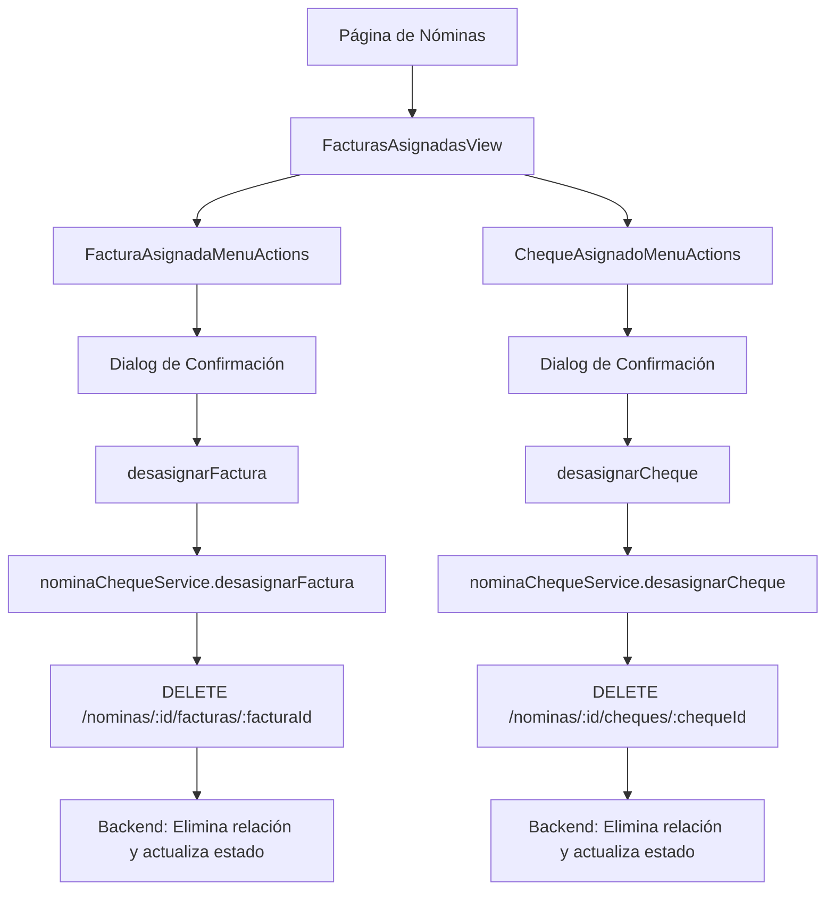

# Sistema de Gestión de Nóminas

## Descripción
Sistema implementado para gestionar cheques y facturas de las nóminas mediante menús de opciones "3 puntitos" en el detalle de nómina. Incluye funcionalidades de asignación y desasignación.

## Arquitectura del Sistema



## Tipos de Nóminas Soportadas

### 1. Nóminas de Cheques
- **Endpoint**: `DELETE /nominas/:id/cheques/:chequeId`
- **Acciones del Backend**:
  - Elimina la relación en `nomina_cheques`
  - Actualiza el cheque como no asignado
  - Actualiza las facturas asociadas al cheque

### 2. Nóminas Mixtas/Por Pagar
- **Endpoint**: `DELETE /nominas/:id/facturas/:facturaId`
- **Acciones del Backend**:
  - Elimina la relación en `nomina_facturas`
  - Actualiza la factura como no asignada

## Componentes Implementados

### 1. NominaItemMenuActions
- **Menú unificado** que detecta automáticamente el tipo de nómina
- **Lógica condicional**:
  - Si es nómina de cheques → muestra "Desasignar cheque"
  - Si es nómina mixta/por pagar → muestra "Desasignar factura"
  - Si la factura no tiene cheque asignado → muestra "Asignar cheque"
- Dialog de confirmación con detalles específicos según el tipo
- Funciones de asignación y desasignación apropiadas según el contexto

### 2. FacturasAsignadasView (Actualizado)
- Integración del menú unificado **solo en vista de tabla**
- Vista de tarjetas **solo visual** (sin interacciones de click)
- Vista de tabla **completa gestión** (con menús de opciones)
- Manejo de eventos de asignación y desasignación
- Detección automática del tipo de nómina

## Flujos de Gestión

### Flujo de Asignación de Cheque
1. **Usuario hace clic en "3 puntitos"** en una factura sin cheque asignado
2. **Se abre el menú de opciones** con la opción "Asignar cheque"
3. **Usuario hace clic en "Asignar cheque"**
4. **Se abre el modal** para asignar cheque a la factura
5. **Usuario completa la asignación** y confirma
6. **Se actualiza la UI** automáticamente
7. **Se muestra mensaje de éxito/error** al usuario

### Flujo de Desasignación
1. **Usuario hace clic en "3 puntitos"** en una factura o cheque
2. **Se abre el menú de opciones** con la opción "Desasignar"
3. **Usuario confirma la acción** en el dialog de confirmación
4. **Se ejecuta la función de desasignación** correspondiente
5. **Se actualiza la UI** automáticamente
6. **Se muestra mensaje de éxito/error** al usuario

## Características del Sistema

- ✅ **Menú unificado**: Un solo componente que detecta el tipo de nómina automáticamente
- ✅ **Lógica condicional**: Muestra la opción correcta según el tipo de nómina y estado
- ✅ **Gestión completa en tabla**: Los menús aparecen únicamente en la vista de tabla
- ✅ **Vista visual en tarjetas**: La vista de tarjetas es solo visual, sin interacciones
- ✅ **Asignación y desasignación**: Soporte completo para ambas operaciones
- ✅ **Confirmación de acciones**: Dialogs de confirmación antes de desasignar
- ✅ **Feedback visual**: Mensajes de éxito/error con Snackbar
- ✅ **Actualización automática**: La UI se actualiza sin necesidad de recargar
- ✅ **Manejo de errores**: Captura y muestra errores de manera elegante
- ✅ **Diseño consistente**: Sigue los principios de diseño del sistema

## Endpoints del Backend

### Desasignar Cheque
```
DELETE /api-beta/nominas/:nominaId/cheques/:chequeId
```

### Desasignar Factura
```
DELETE /api-beta/nominas/:nominaId/facturas/:facturaId
```

## Consideraciones de Seguridad

- Validación de permisos en el backend
- Confirmación de acciones críticas
- Manejo seguro de IDs de nóminas, cheques y facturas
- Logging de acciones de desasignación

## Mantenimiento

El sistema está diseñado para ser fácilmente mantenible:
- Componentes reutilizables
- Separación clara de responsabilidades
- Tipos TypeScript bien definidos
- Manejo centralizado de estado
